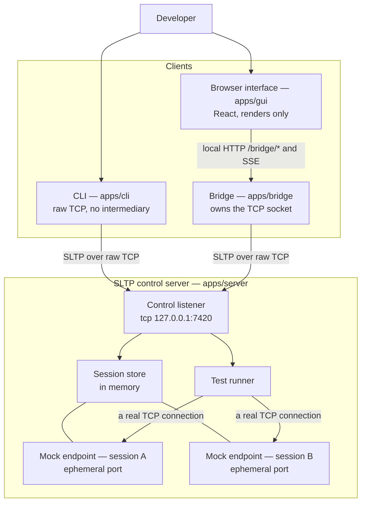

# SocketLens TCP

[](https://github.com/themistymoon/socketlens-tcp/actions/workflows/ci.yml)
[](LICENSE)
[](https://nodejs.org)

**A local developer tool for designing, mocking, testing, and debugging custom
application-layer protocols over raw TCP streams.**

TCP gives you a reliable, ordered stream of bytes and nothing else — it does not tell you
where one application message ends and the next begins. Getting that boundary wrong produces
bugs that surface only under load, on a slow link, or when two messages end up in the same
TCP segment. SocketLens TCP makes those cases reproducible on demand: stand up a mock
endpoint, write scenarios that deliberately fragment or coalesce messages, run them, and read
back the exact bytes that crossed the wire in both directions.

It implements its own protocol, **SLTP** (SocketLens Testing Protocol), over a raw TCP socket
using Node's built-in `node:net`. SLTP is not HTTP — messages are text-based, CRLF-delimited,
and length-framed, parsed by an incremental decoder in this repository. No HTTP, WebSocket, or
RPC framework appears anywhere in the protocol path.

**The protocol is the artefact.** SLTP's grammar, framing strategy, correlation mechanism, and
error semantics are what was designed here; the control server, CLI, interface, bridge, and
test suite exist to demonstrate that the protocol works and to make its behaviour observable.
Read [`docs/protocol-specification.md`](docs/protocol-specification.md) first if you only read
one document.

---

## Quick start

```bash
git clone https://github.com/themistymoon/socketlens-tcp.git
cd socketlens-tcp
npm ci
npm run build
```

**Start the control server** — it listens on `127.0.0.1:7420`:

```bash
npm run start:server
```

**Drive it from the CLI.** In a second terminal:

```bash
npm run cli -- ping --raw
npm run cli -- session create --name demo
npm run cli -- rule add --name pong --operation PING --status 200 --body '{"reply":"pong"}'
npm run cli -- run --operation PING --expect-status 200 --raw
npm run cli -- result list
```

`--raw` prints the exact bytes of every message in both directions. `npm run cli -- --help`
prints the full command reference, and `npm run cli -- repl` opens an interactive prompt on a
single reused TCP connection, which is what makes `Request-ID` correlation visible.

The two commands worth running first:

```bash
# one message, written as several separate socket writes
npm run cli -- run --operation PING --fragment 12,8,40 --raw

# how the server answers a message whose framing information is unusable
npm run cli -- raw --text 'SLTP/1.0 PING\r\nContent-Length: -5\r\n\r\n'
```

**Start the graphical interface** after `npm run build`:

```bash
npm run start:gui
```

That launches the loopback bridge, serves the built interface from `apps/gui/dist`, and opens
a browser at `http://127.0.0.1:7801`. For development with hot reload, `npm run dev` starts
the server, the bridge, and the Vite dev server together.

Requires Node.js >= 20.11.0 and npm 9+ for workspace support. Runs on Linux, macOS, and
Windows. Loopback only — nothing binds a routable interface.

---

## Highlights

- **A specified protocol, not an improvised one.** SLTP/1.0 has a start line, canonicalised
  headers, a `\r\n\r\n` delimiter, an explicit `Content-Length`, and documented operation and
  status registries.
- **Framing you can observe.** Scenarios write one message across many `socket.write()`
  calls, or many messages in one write. Every write and every read is recorded
  individually in the stored result.
- **A real mock endpoint per session.** Each session owns an ephemeral TCP listener on an
  OS-assigned port, so the writes cross a real kernel TCP stack instead of an in-process
  double. The scenario decides the write boundaries; the operating system decides the
  segment boundaries.
- **Failure modes as first-class features.** Timeouts, truncation mid-body, malformed
  `Content-Length`, and unmatched operations all have defined, documented outcomes.
- **Three clients, one protocol.** A CLI that speaks SLTP over raw TCP and is fully usable
  alone, a loopback bridge that owns a socket for the browser, and a React interface for
  visual inspection.

Mock rules are evaluated by priority descending then insertion order ascending, so matching
never depends on iteration luck. Every request carries a `Request-ID` that responses repeat,
so several requests may be in flight on one connection at once. The protocol and core
packages use the Node standard library only.

---

## A worked SLTP exchange

Every line ends with **CRLF**, the two bytes `0x0D 0x0A`. A bare CR or LF is a framing error,
not a lenient alternative. The header block ends with an empty line — `CRLF CRLF`, four bytes
— and everything after it is the body.

`Content-Length` counts **UTF-8 bytes of the body only**. Not the start line, not the headers,
not the delimiter, and not characters. The example below makes that concrete: the body is 17
characters but 29 bytes, because each Thai character encodes as three bytes.

**Request** — with `\r\n` shown explicitly at each line end:

```
SLTP/1.0 PING\r\n
Request-ID: req-1\r\n
Content-Type: application/json; charset=utf-8\r\n
Content-Length: 29\r\n
\r\n
{"echo":"สวัสดี"}
```

**Response** — on the same connection, echoing the `Request-ID` so the client can correlate
it:

```
SLTP/1.0 200 OK
Request-ID: req-1
Server: SocketLens-TCP/0.1.2
Timestamp: 2026-08-04T09:15:22.418Z
Content-Type: application/json; charset=utf-8
Content-Length: 125

{"message":"pong","protocol":"SLTP/1.0","serverTime":"2026-08-04T09:15:22.418Z","uptimeMs":18342,"echo":"สวัสดี"}
```

That body is 113 characters and 125 bytes. A decoder using `string.length` would wait forever
for twelve bytes that are never coming, then misinterpret the start of the following message.

`200 OK` is an SLTP status code, not an HTTP one. The numeric ranges are deliberately familiar
to aid debugging, but the meanings are SLTP's, and several codes have no HTTP counterpart —
`210 TEST PASSED`, `211 TEST FAILED`, and `410 NO MATCHING RULE` among them. `211 TEST FAILED`
is a 2xx on purpose: the exchange succeeded, and what it reports is a failed assertion. See
[`docs/status-codes.md`](docs/status-codes.md).

---

## Why framing is the core concern

TCP guarantees a reliable, ordered byte stream. That is the whole guarantee. In practice:

> one `write()` **≠** one `data` event **≠** one message

A single `write()` may be split across segments, bounded by path MTU and the congestion and
receive windows. Several `write()` calls may be merged into one segment — which is what
Nagle's algorithm does to small writes, and why example 05 pauses between fragments to keep
the kernel from reassembling them. The `data` event fires when bytes are available, not when a
message is complete, so a handler that parses each `data` event as one message is correct only
by accident, in the small fast local case that most manual testing exercises.

The only correct design is a buffer per connection plus a decoder that consumes as many
complete messages as the buffer currently holds and leaves the remainder for later.
[`docs/architecture.md`](docs/architecture.md) covers the buffering model, decoder poisoning,
and per-connection state in full.

SocketLens TCP makes this observable with two demonstrations, both ordinary TCP behaviour:

| Demonstration     | What it sends                                                                                                                  | Example                                                             |
| ----------------- | ------------------------------------------------------------------------------------------------------------------------------ | ------------------------------------------------------------------- |
| **Fragmentation** | **one** message in **seven** application writes, with cuts placed inside the CRLF delimiters and inside a multi-byte character | [`examples/05-fragmented-message`](examples/05-fragmented-message/) |
| **Coalescing**    | **two** messages in **one** application write, which the receiver must separate on `Content-Length` alone                      | [`examples/06-coalesced-messages`](examples/06-coalesced-messages/) |

Example 05 also includes a byte-at-a-time variant — one `write()` per byte, the pathological
case for any parser assuming a read contains a whole message. Examples 09 and 10 show the
other side of the contract: unusable framing information, and a stream that stops mid-body.

---

## Architecture



Three points are load-bearing.

**The CLI has no bridge.** It opens a `node:net` socket to the control port and speaks SLTP
directly. Everything the tool does is reachable from the command line alone.

**The bridge is a browser workaround, not a protocol layer.** A browser page cannot open a raw
TCP socket, so `apps/bridge` holds the real connection on its behalf and exposes a small
loopback surface: routes under `/bridge/*` (`connect`, `disconnect`, `status`, `request`,
`raw`) plus a Server-Sent Events stream at `/bridge/events`. The SLTP conversation is still
raw TCP — the bridge relays it and never re-frames it.

**Sessions own real listeners.** `CREATE_SESSION` starts a dedicated TCP mock endpoint on an
OS-assigned port. Because the test runner reaches it through an actual TCP connection rather
than an in-process call, the behaviour it records is genuine.

---

## Evaluation and measured performance

The distinguishing strength of this project is not speed. It is that the framing layer is
observable and its failure modes are reproducible on demand. The benchmark below is not the
headline — it exists to substantiate one design trade-off honestly.

That is worth stating plainly because the benchmark says so. Measured on loopback with a
single persistent connection and one request in flight — Windows, Node v26.5.1, AMD Ryzen 7
7840HS, 2000 round trips after 500 warm-up, **medians across 10 runs**:

| Payload | SLTP/1.0 (`node:net`) | HTTP/1.1 minimal (`node:net`) | HTTP/1.1 (`node:http`) |
| ------- | --------------------- | ----------------------------- | ---------------------- |
| empty   | 27,458 req/s          | **33,134 req/s**              | 12,387 req/s           |
| 128 B   | 23,501 req/s          | **30,221 req/s**              | 10,681 req/s           |
| 16 KiB  | 6,565 req/s           | **11,980 req/s**              | 6,581 req/s            |

**SLTP is slower than HTTP/1.1**, by a median 1.21× to 1.82× against an HTTP reader written in
the same minimal style — it lost 39 of 40 paired rounds, significant at every payload size.
Both benchmark implementations use comparable framing — a CRLF-delimited header block plus an
explicit `Content-Length` — so the framing strategy does not explain the gap. (That is a
statement about the two implementations measured, not a claim that the protocols are
equivalent; they differ in semantics, routing, and body transfer.) What explains it is that
the SLTP decoder validates every header name and value against a grammar, rejects duplicate
single-valued headers, enforces four size limits, and checks the operation registry. A tool
for diagnosing framing bugs has to reject an ambiguous message rather than guess at it, and
that is the price.

Against Node's general-purpose `node:http` stack the purpose-built implementation is a median
1.83×–2.22× faster at payloads up to 1 KiB, and at 16 KiB there is **no consistent winner**
(4 of 10 rounds, p = 0.754). Where the win exists it measures a library, not a protocol, and
it must not be read as SLTP being faster than HTTP/1.1 in general — the like-for-like
comparison above shows the opposite.

Worst min-max spread was 53.9%, so the conclusion rests on a paired sign test over rounds
rather than on the size of the gap. Loopback numbers do not predict LAN or WAN behaviour, and
byte counts are application bytes excluding Ethernet, IP, and TCP headers.

```bash
npm run benchmark -- --runs 10  # reproduce; 10 runs recommended
npm run benchmark               # quicker, 6 runs (the default)
npm run wireshark:demo          # labelled traffic for a packet capture
```

Full claim-by-claim evaluation, including what HTTP/1.1 does better and the trade-offs
accepted: [`docs/evaluation.md`](docs/evaluation.md). Methodology and caveats:
[`benchmarks/README.md`](benchmarks/README.md). Capture procedure:
[`docs/wireshark-capture.md`](docs/wireshark-capture.md).

---

## Repository layout

| Path                                      | Contents                                                                                                                                                                 |
| ----------------------------------------- | ------------------------------------------------------------------------------------------------------------------------------------------------------------------------ |
| [`packages/protocol`](packages/protocol/) | SLTP/1.0 wire format: constants, headers, encoder, incremental decoder, operation and status registries, validation. Node standard library only, and browser-importable. |
| [`packages/core`](packages/core/)         | Domain logic: session store, mock endpoint, rule matching, scenario parsing, assertions, test runner, TCP client, logging.                                               |
| [`apps/server`](apps/server/)             | The SLTP control server: TCP listener, per-connection decoding state, operation handlers.                                                                                |
| [`apps/cli`](apps/cli/)                   | The command-line client. Speaks SLTP over raw TCP directly; includes a REPL.                                                                                             |
| [`apps/bridge`](apps/bridge/)             | Loopback HTTP and SSE relay that owns a TCP socket on behalf of the browser.                                                                                             |
| [`apps/gui`](apps/gui/)                   | React interface for sessions, rules, scenarios, and message inspection.                                                                                                  |
| [`docs`](docs/)                           | Requirements, architecture, protocol specification, status codes, test plan and results, evaluation, packet capture, guides, and the Thai-language report material.      |
| [`examples`](examples/)                   | Eleven runnable scenario bundles plus the runner that checks them.                                                                                                       |
| [`benchmarks`](benchmarks/)               | SLTP versus HTTP/1.1 measurement suite, with its methodology and recorded results.                                                                                       |
| [`tests`](tests/)                         | Vitest suites: protocol, core, CLI, server integration, and interface logic tests.                                                                                       |

## Documentation

| Document                                                               | Contents                                                                                                         |
| ---------------------------------------------------------------------- | ---------------------------------------------------------------------------------------------------------------- |
| [`docs/requirements.md`](docs/requirements.md)                         | Functional and non-functional requirements, and the scope boundary for v0.1.                                     |
| [`docs/architecture.md`](docs/architecture.md)                         | System context, workspace dependency direction, the buffering model, concurrency, and numbered design decisions. |
| [`docs/protocol-specification.md`](docs/protocol-specification.md)     | Normative SLTP/1.0 wire format: grammar, headers, framing rules, and operation registry.                         |
| [`docs/protocol-examples.md`](docs/protocol-examples.md)               | Byte-level worked exchanges, including fragmented and coalesced traffic.                                         |
| [`docs/status-codes.md`](docs/status-codes.md)                         | The full status registry with phrases, categories, meanings, and permitted contexts.                             |
| [`docs/test-plan.md`](docs/test-plan.md)                               | Test cases mapped to requirement identifiers.                                                                    |
| [`docs/test-results.md`](docs/test-results.md)                         | Recorded outcomes of executing the test plan.                                                                    |
| [`docs/evaluation.md`](docs/evaluation.md)                             | Claim-by-claim evaluation, measured benchmark results, and a fair HTTP/1.1 comparison.                           |
| [`docs/wireshark-capture.md`](docs/wireshark-capture.md)               | Capturing SLTP on loopback, Windows first, and what a capture does and does not prove.                           |
| [`docs/user-guide.md`](docs/user-guide.md)                             | Task-oriented guide to the CLI and the graphical interface.                                                      |
| [`docs/developer-guide.md`](docs/developer-guide.md)                   | Building, testing, and extending the codebase, including the full script reference.                              |
| [`docs/assignment-report-th.md`](docs/assignment-report-th.md)         | รายงานโครงงาน — the project report, in Thai.                                                                     |
| [`docs/presentation-outline-th.md`](docs/presentation-outline-th.md)   | โครงร่างการนำเสนอ — presentation outline, in Thai.                                                               |
| [`docs/demo-script-th.md`](docs/demo-script-th.md)                     | สคริปต์การสาธิต — live demonstration script, in Thai.                                                            |
| [`docs/anticipated-questions-th.md`](docs/anticipated-questions-th.md) | คำถามที่คาดว่าจะถูกถาม — anticipated questions and answers, in Thai.                                             |

[`docs/requirements.md`](docs/requirements.md) and
[`docs/architecture.md`](docs/architecture.md) are the two to start from.

---

## Development

| Script                   | What it does                                                                             |
| ------------------------ | ---------------------------------------------------------------------------------------- |
| `npm run verify`         | `format:check`, `lint`, `typecheck`, `test`, `build`. The gate to run before committing. |
| `npm run build`          | Compiles every TypeScript project reference, then builds the interface.                  |
| `npm test`               | Runs the Vitest suites once.                                                             |
| `npm run examples`       | Runs all eleven examples and checks each documented outcome.                             |
| `npm run benchmark`      | Measures SLTP against HTTP/1.1. Not part of `verify`.                                    |
| `npm run wireshark:demo` | Generates labelled loopback traffic for a packet capture.                                |
| `npm run dev`            | Starts the server, the bridge, and the Vite dev server together.                         |
| `npm run cli`            | Runs the compiled CLI. Pass arguments after `--`.                                        |

[`docs/developer-guide.md`](docs/developer-guide.md) documents every script, including the
`dev:*`, `start:*`, `lint:fix`, `format`, `clean`, and coverage variants.

**Testing.** Vitest resolves the workspace aliases to TypeScript **sources**, so `npm test`
never needs a prior build. Suites are organised by layer: `tests/protocol` for encoding,
decoding, and validation; `tests/core` for rule matching, assertions, and the session store;
`tests/cli` for argument parsing, dispatch, and rendering; `tests/server` for integration
tests that bind real TCP ports; `tests/gui` for interface logic. Because the integration tests
use genuine sockets, the timeout ceiling in [`vitest.config.ts`](vitest.config.ts) is
generous.

**Examples.** `npm run examples` starts its own control server on an OS-assigned port, so it
will not collide with one already on 7420, and leaves nothing behind. Add `-- --list` for
names or `-- --only 6` to run one. Each example is also a plain bundle you can drive through
the CLI:

```bash
npm run cli -- run --file examples/06-coalesced-messages/bundle.json --raw
```

Three examples deliberately do not pass plainly: 04 fails so a mismatch report can be read, 08
times out, and 10 disconnects mid-body — the latter two asserted as their expected outcomes.
The runner records each documented outcome individually, so example 04 would fail the run if it
ever started passing. See [`examples/README.md`](examples/README.md).

---

## Limitations in v0.1

Deliberate boundaries for this release, not oversights.

- **In-memory only, no persistence.** Stopping the server discards every session, rule, and
  result. Use `result export --out <file>` first to keep results.
- **No authentication or authorisation.** No accounts, no access control. The bridge relays
  commands onto a real TCP socket with no credentials of any kind.
- **Loopback only.** The control server, mock endpoints, and bridge bind `127.0.0.1`. The
  bridge refuses a non-loopback `--host` outright rather than warning. Do not expose these
  ports. See [`SECURITY.md`](SECURITY.md).
- **Text-based protocol only.** No binary framing mode, no TLS, no compression. Header values
  are printable US-ASCII; anything needing Unicode belongs in the body, which is always UTF-8.
- **One protocol implemented, not a universal client.** Framing, rules, and assertions are
  SLTP/1.0-specific. The escape hatch is raw bytes — `raw --text` and a scenario's
  `request.raw` put arbitrary octets on the wire, but the reply is still framed and asserted
  as SLTP. Targets must be loopback or a host named with `--allow-target`.
- **Bounded by design.** A message over the configured limit is fatal for its connection,
  because a stream whose framing has been lost cannot be resynchronised at a message boundary.

---

## Origin

SocketLens TCP was originally developed as **Project 1: Socket Programming** for **01418351
Computer Communications and Cloud Computing Principles** at **Kasetsart University**.

The assignment asked for a client-server application over a custom application-layer protocol
of the author's own design. That constraint shaped the project: the protocol is specified
before it is implemented, every status code carries a documented meaning rather than an
inherited one, and TCP's behaviour as a byte stream is demonstrated on demand rather than
asserted in prose. The Thai-language coursework material is kept alongside the technical
documentation in [`docs/`](docs).

Development has continued past what the coursework required, and the repository is maintained
as an open-source project under the MIT licence. It is not affiliated with or endorsed by
Kasetsart University.

**Independent project.** This is an independent educational and open-source project, written
to study protocol design and TCP stream handling. It is **not affiliated with, endorsed by, or
derived from any other product named "SocketLens"**. Any similarity in name is coincidental.

## Licence

MIT. Copyright 2026 Natthakit Jantawong. See [`LICENSE`](LICENSE) for the full text.
