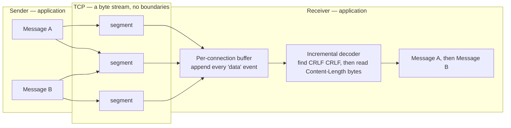
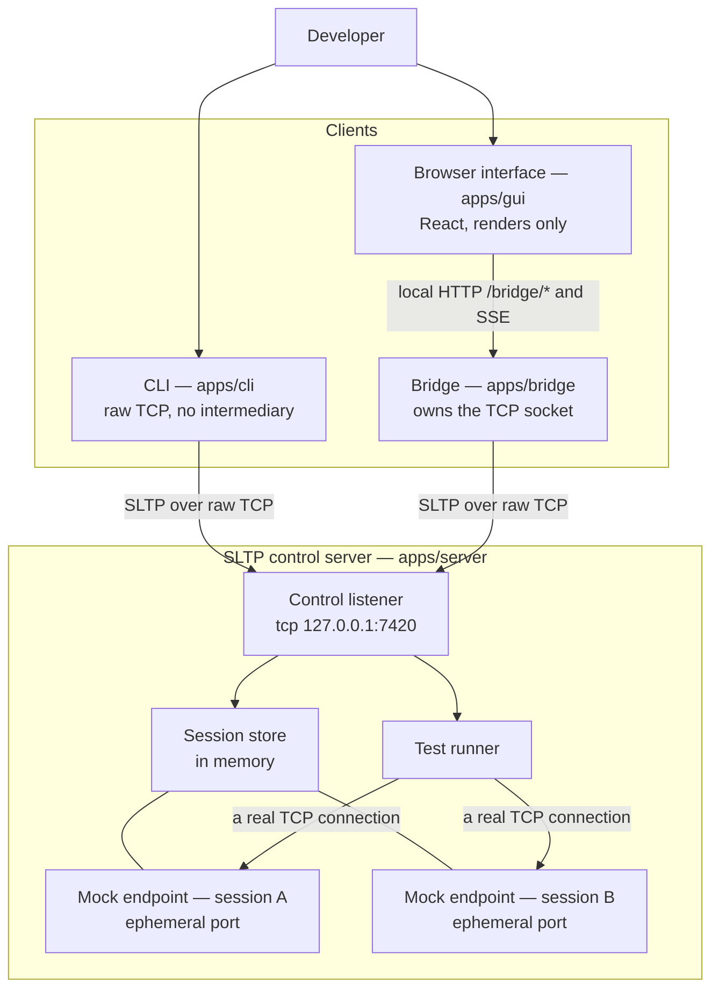

# SocketLens TCP

**A local developer tool for designing, mocking, testing, and debugging custom application-layer protocols over raw TCP streams.**

Version 0.1.0 · MIT licence · Node.js >= 20.11.0

If you build a protocol directly on TCP, you inherit a problem that HTTP libraries normally
hide from you: TCP gives you a reliable, ordered stream of bytes and nothing else. It does
not tell you where one application message ends and the next begins. That boundary is
yours to define, and getting it wrong produces bugs that only appear under load, on a slow
link, or when two messages happen to leave in the same packet. SocketLens TCP exists to
make those cases reproducible on demand. It implements its own application-layer protocol,
**SLTP** (SocketLens Testing Protocol), over a raw TCP socket using Node's built-in
`node:net`, and it lets you stand up a mock endpoint, write scenarios that deliberately
fragment or coalesce messages, run them, and read back the exact bytes that crossed the
wire in both directions.

> **Independent project.** This is an independent educational and open-source project,
> written to study protocol design and TCP stream handling. It began as coursework — see
> [Origin](#origin) — and is **not affiliated with, endorsed by, or derived from any other
> product named "SocketLens"**. Any similarity in name is coincidental.

SLTP is not HTTP. There is no HTTP, WebSocket, or RPC framework anywhere in the protocol
path: messages are text-based, CRLF-delimited, and length-framed, and they are parsed by
an incremental decoder in this repository. The one place local HTTP appears is
`apps/bridge`, which exists solely because a browser cannot open a raw TCP socket — see
[Architecture](#architecture) below.

---

## Highlights

- **A real custom protocol.** SLTP/1.0 has a start line, canonicalised headers, a
  `\r\n\r\n` header delimiter, an explicit `Content-Length`, a documented operation
  registry, and its own status registry. The wire format is specified, not improvised.
- **Framing you can observe.** Scenarios can write one message as many TCP writes, or many
  messages as one TCP write. Both are legal TCP behaviour, and both are recorded segment
  by segment in the stored result.
- **A real mock endpoint per session.** Each session owns its own ephemeral TCP listener on
  an OS-assigned port. The test runner connects to it over a genuine TCP connection, so
  fragmentation and coalescing are real rather than simulated in-process.
- **Deterministic mock rules.** Rules are evaluated by priority descending, then by
  insertion order ascending, so the matching outcome never depends on iteration luck.
- **Three clients, one protocol.** A TCP control server, a command-line client that speaks
  SLTP over raw TCP directly and is fully usable without the graphical interface, and a
  React interface for inspecting traffic visually.
- **Request-ID correlation.** Every request carries a `Request-ID` and every response
  repeats it, so several requests may be in flight on one connection at once without
  relying on strict ordering.
- **Failure modes as first-class features.** Timeouts, truncation mid-body, malformed
  `Content-Length`, and unmatched operations all have defined, documented outcomes.
- **Runnable examples.** Eleven scenario bundles, each demonstrating one property, all
  checked by a single command.
- **No runtime dependencies in the protocol path.** The protocol and core packages use the
  Node standard library only; React and Vite are confined to the graphical client.

---

## Requirements

| Requirement | Detail                                             |
| ----------- | -------------------------------------------------- |
| Node.js     | >= 20.11.0                                         |
| npm         | v9 or newer, for workspace support                 |
| Platform    | Linux, macOS, or Windows                           |
| Network     | Loopback only. Nothing binds a routable interface. |

## Installation

```bash
git clone <repository-url> socketlens-tcp
cd socketlens-tcp
npm install
npm run build
```

`npm run build` compiles the TypeScript project references (`build:ts`) and then builds the
React interface (`build:gui`). The `start:*` and `cli` scripts run compiled output from
`dist`, so build once before using them. The `dev:*` scripts run from source instead and
need no prior build step.

---

## Quick start

### 1. Start the control server

```bash
npm run start:server
```

It listens on `127.0.0.1:7420` by default. During development, use `npm run dev:server`
instead to get a watching rebuild.

### 2. Drive it from the command line

The CLI is the primary client. In a second terminal:

```bash
npm run cli -- ping --raw
npm run cli -- session create --name demo
npm run cli -- rule add --name pong --operation PING --status 200 --body '{"reply":"pong"}'
npm run cli -- rule list
npm run cli -- run --operation PING --expect-status 200 --raw
npm run cli -- result list
```

`--raw` prints the exact bytes of every message in both directions. `npm run cli -- --help`
prints the full command reference, and `npm run cli -- repl` opens an interactive prompt
that reuses a single TCP connection, which is what makes `Request-ID` correlation visible.

The two commands worth running first:

```bash
# one message, written as several TCP segments
npm run cli -- run --operation PING --fragment 12,8,40 --raw

# how the server answers a message whose framing information is unusable
npm run cli -- raw --text 'SLTP/1.0 PING\r\nContent-Length: -5\r\n\r\n'
```

### 3. Start the graphical interface

After `npm run build`:

```bash
npm run start:gui
```

That launches the loopback bridge, serves the built interface from `apps/gui/dist`, and
opens a browser at `http://127.0.0.1:7801`. For development with hot reload, use
`npm run dev` — it starts the server, the bridge, and the Vite dev server together — or
`npm run dev:gui` if a server is already running.

---

## A worked SLTP exchange

Every line of an SLTP message ends with **CRLF**, the two bytes `0x0D 0x0A`. A bare CR or a
bare LF is a framing error, not a lenient alternative. The header block is terminated by an
empty line, which on the wire is `CRLF CRLF` — four bytes. Everything after those four
bytes is the body, and its length is given by `Content-Length`.

`Content-Length` counts **UTF-8 bytes of the body only**. It does not count the start line,
the headers, or the delimiter, and it does not count characters. The example below makes
the distinction concrete: the body is 17 characters long but 29 bytes, because each Thai
character encodes as three bytes in UTF-8.

**Request** — the client writes these bytes, with `\r\n` shown explicitly at each line end:

```
SLTP/1.0 PING\r\n
Request-ID: req-1\r\n
Content-Type: application/json; charset=utf-8\r\n
Content-Length: 29\r\n
\r\n
{"echo":"สวัสดี"}
```

Read as text, that is:

```
SLTP/1.0 PING
Request-ID: req-1
Content-Type: application/json; charset=utf-8
Content-Length: 29

{"echo":"สวัสดี"}
```

**Response** — the server replies on the same connection, echoing the `Request-ID` so the
client can correlate it:

```
SLTP/1.0 200 OK
Request-ID: req-1
Server: SocketLens-TCP/0.1.0
Timestamp: 2026-08-04T09:15:22.418Z
Content-Type: application/json; charset=utf-8
Content-Length: 125

{"message":"pong","protocol":"SLTP/1.0","serverTime":"2026-08-04T09:15:22.418Z","uptimeMs":18342,"echo":"สวัสดี"}
```

The response body is 113 characters and 125 bytes, again because of the multi-byte Thai
text. A decoder that used `string.length` here would wait forever for twelve bytes that are
never coming, and would then misinterpret the start of the following message. Counting
bytes is not a detail; it is the framing contract.

The `200 OK` above is an SLTP status code, not an HTTP one. The numeric ranges are
deliberately familiar to aid debugging, but the meanings are defined by SLTP, and several
codes have no HTTP counterpart at all — `210 TEST PASSED`, `211 TEST FAILED`, and
`410 NO MATCHING RULE` among them. `211 TEST FAILED` is a 2xx on purpose: the SLTP exchange
succeeded, and what it is reporting is a failed assertion. See
[`docs/status-codes.md`](docs/status-codes.md).

---

## Why message framing is the core concern

TCP guarantees a **reliable, ordered byte stream**. That is the whole guarantee. It does not
preserve application message boundaries, and nothing in the socket API restores them. In
practice:

> one `write()` **≠** one `data` event **≠** one message

A single `write()` may be split across several segments by the sender's stack, by path MTU,
or by Nagle's algorithm interacting with delayed acknowledgements. Several `write()` calls
may be merged into one segment. The receiver's `data` event fires when bytes are available,
not when a message is complete, so a handler that parses each `data` event as one message is
correct only by accident — and only in the small, fast, local case that most manual testing
exercises.



Note that segment 2 in that diagram carries the tail of message A and the head of message
B. No code operating on a single read can tell those apart, because at that layer there is
nothing to tell apart. The only correct design is the one on the right: a buffer per
connection, and a decoder that consumes as many complete messages as the buffer currently
holds and leaves the remainder for later.

SocketLens TCP makes this observable with two headline demonstrations, both of which are
ordinary TCP behaviour:

| Demonstration     | What it sends                                                                                                              | Example                                                             |
| ----------------- | -------------------------------------------------------------------------------------------------------------------------- | ------------------------------------------------------------------- |
| **Fragmentation** | **one** message in **seven** TCP writes, with the cuts placed inside the CRLF delimiters and inside a multi-byte character | [`examples/05-fragmented-message`](examples/05-fragmented-message/) |
| **Coalescing**    | **two** messages in **one** TCP write, which the receiver must separate on `Content-Length` alone                          | [`examples/06-coalesced-messages`](examples/06-coalesced-messages/) |

Example 05 also includes a byte-at-a-time variant: the same request written with one
`write()` per byte, which is the pathological case for any parser that assumes a read
contains a whole message. Examples 09 and 10 show the other side of the contract — what
happens when the framing information is unusable, or when the stream simply stops in the
middle of a body.

---

## Architecture



Two points in that picture are load-bearing.

**The CLI has no bridge.** It opens a `node:net` socket to the control port and speaks SLTP
directly. Everything the tool does is reachable from the command line alone.

**The bridge is a browser workaround, not a protocol layer.** A page in a browser cannot
open a raw TCP socket, so `apps/bridge` holds the real TCP connection on the browser's
behalf and exposes a deliberately small loopback surface: HTTP routes under `/bridge/*`
(`connect`, `disconnect`, `status`, `request`, `raw`) plus a Server-Sent Events stream at
`/bridge/events` that pushes protocol traffic to the interface as it happens. The SLTP
conversation itself is still raw TCP. The bridge does not replace, wrap, or re-frame SLTP —
it relays it, and no HTTP framing ever touches the protocol.

**Sessions own real listeners.** `CREATE_SESSION` starts a dedicated TCP mock endpoint for
that session on an operating-system-assigned port. Because the test runner reaches it
through an actual TCP connection rather than an in-process call, the fragmentation and
coalescing behaviour it records is genuine.

---

## Repository layout

| Path                                      | Contents                                                                                                                                                                 |
| ----------------------------------------- | ------------------------------------------------------------------------------------------------------------------------------------------------------------------------ |
| [`packages/protocol`](packages/protocol/) | SLTP/1.0 wire format: constants, headers, encoder, incremental decoder, operation and status registries, validation. Node standard library only, and browser-importable. |
| [`packages/core`](packages/core/)         | Domain logic: session store, mock endpoint, rule matching, scenario parsing, assertions, test runner, TCP client, logging.                                               |
| [`apps/server`](apps/server/)             | The SLTP control server: TCP listener, per-connection decoding state, operation handlers.                                                                                |
| [`apps/cli`](apps/cli/)                   | The command-line client. Speaks SLTP over raw TCP directly; includes a REPL.                                                                                             |
| [`apps/bridge`](apps/bridge/)             | Loopback HTTP and SSE relay that owns a TCP socket on behalf of the browser.                                                                                             |
| [`apps/gui`](apps/gui/)                   | React interface for sessions, rules, scenarios, and message inspection.                                                                                                  |
| [`docs`](docs/)                           | Requirements, architecture, protocol specification, status codes, test plan and results, guides, and the Thai-language report material.                                  |
| [`examples`](examples/)                   | Eleven runnable scenario bundles plus the runner that checks them.                                                                                                       |
| [`tests`](tests/)                         | Vitest suites: protocol, core, CLI, and server integration tests.                                                                                                        |
| [`scripts`](scripts/)                     | `clean.mjs` and `dev-gui.mjs`, the development launcher.                                                                                                                 |

---

## Documentation

| Document                                                               | Contents                                                                                                         |
| ---------------------------------------------------------------------- | ---------------------------------------------------------------------------------------------------------------- |
| [`docs/requirements.md`](docs/requirements.md)                         | Functional and non-functional requirements, and the scope boundary for v0.1.                                     |
| [`docs/architecture.md`](docs/architecture.md)                         | System context, workspace dependency direction, the buffering model, concurrency, and numbered design decisions. |
| [`docs/protocol-specification.md`](docs/protocol-specification.md)     | Normative SLTP/1.0 wire format: grammar, headers, framing rules, and operation registry.                         |
| [`docs/protocol-examples.md`](docs/protocol-examples.md)               | Byte-level worked exchanges, including fragmented and coalesced traffic.                                         |
| [`docs/status-codes.md`](docs/status-codes.md)                         | The full status registry with phrases, categories, meanings, and permitted contexts.                             |
| [`docs/test-plan.md`](docs/test-plan.md)                               | Test cases mapped to requirement identifiers.                                                                    |
| [`docs/test-results.md`](docs/test-results.md)                         | Recorded outcomes of executing the test plan.                                                                    |
| [`docs/user-guide.md`](docs/user-guide.md)                             | Task-oriented guide to the CLI and the graphical interface.                                                      |
| [`docs/developer-guide.md`](docs/developer-guide.md)                   | Building, testing, and extending the codebase.                                                                   |
| [`docs/assignment-report-th.md`](docs/assignment-report-th.md)         | รายงานโครงงาน — the project report, in Thai.                                                                     |
| [`docs/presentation-outline-th.md`](docs/presentation-outline-th.md)   | โครงร่างการนำเสนอ — presentation outline, in Thai.                                                               |
| [`docs/demo-script-th.md`](docs/demo-script-th.md)                     | สคริปต์การสาธิต — live demonstration script, in Thai.                                                            |
| [`docs/anticipated-questions-th.md`](docs/anticipated-questions-th.md) | คำถามที่คาดว่าจะถูกถาม — anticipated questions and answers, in Thai.                                             |

Some of these documents are being written alongside the code and may be incomplete at the
moment you read this. [`docs/requirements.md`](docs/requirements.md) and
[`docs/architecture.md`](docs/architecture.md) are the two to start from.

---

## Scripts

All scripts are run from the repository root.

| Script                  | What it does                                                                                         |
| ----------------------- | ---------------------------------------------------------------------------------------------------- |
| `npm run build`         | `build:ts` followed by `build:gui`.                                                                  |
| `npm run build:ts`      | Compiles every TypeScript project reference.                                                         |
| `npm run build:gui`     | Builds the React interface with Vite.                                                                |
| `npm run clean`         | Removes build output and caches.                                                                     |
| `npm run start:server`  | Runs the compiled SLTP control server.                                                               |
| `npm run start:gui`     | Runs the compiled bridge, serving `apps/gui/dist`, and opens a browser.                              |
| `npm run cli`           | Runs the compiled CLI. Pass arguments after `--`.                                                    |
| `npm run dev`           | Starts the server, the bridge, and the Vite dev server together.                                     |
| `npm run dev:server`    | Runs the server from source with watch-mode reload.                                                  |
| `npm run dev:cli`       | Runs the CLI from source.                                                                            |
| `npm run dev:bridge`    | Runs the bridge from source.                                                                         |
| `npm run dev:gui`       | Starts the bridge and the Vite dev server, without a server.                                         |
| `npm run examples`      | Runs all eleven examples and checks each documented outcome.                                         |
| `npm test`              | Runs the Vitest suites once.                                                                         |
| `npm run test:watch`    | Runs Vitest in watch mode.                                                                           |
| `npm run test:coverage` | Runs the suites with V8 coverage reporting.                                                          |
| `npm run lint`          | Runs ESLint across the repository.                                                                   |
| `npm run lint:fix`      | Runs ESLint with `--fix`.                                                                            |
| `npm run format`        | Formats the repository with Prettier.                                                                |
| `npm run format:check`  | Checks formatting without writing.                                                                   |
| `npm run typecheck`     | Type-checks every project reference, and the test suite.                                             |
| `npm run verify`        | `format:check`, `lint`, `typecheck`, `test`, then `build`. The single gate to run before committing. |

---

## Testing

```bash
npm test              # run every suite once
npm run test:watch    # re-run on change
npm run test:coverage # with coverage reporting
```

Vitest resolves the workspace aliases to TypeScript **sources**, so `npm test` never
requires a prior build. Suites live in [`tests`](tests/) and are organised by layer:
`tests/protocol` for encoding, incremental decoding, and validation; `tests/core` for rule
matching, assertions, the session store, and scenario validation; `tests/cli` for argument
parsing, dispatch, help, and rendering; and `tests/server` for integration tests that bind
real TCP ports and exercise concurrency and full scenario runs. Because those integration
tests use genuine sockets, the timeout ceiling is set generously in
[`vitest.config.ts`](vitest.config.ts).

For a full pre-commit check, run `npm run verify`.

## Examples

```bash
npm run examples              # run all eleven and verify each outcome
npm run examples -- --list    # numbers and names
npm run examples -- --only 6  # run just one
```

The runner starts its own control server on an OS-assigned port, so it will not collide
with a server already running on 7420, and it leaves nothing behind. Each example is also a
plain bundle file you can drive through the CLI:

```bash
npm run start:server                                                    # terminal 1
npm run cli -- session create --name demo                               # terminal 2
npm run cli -- run --file examples/06-coalesced-messages/bundle.json --raw
```

`run` installs the bundle's rules into the current session before executing its scenarios.
Three examples deliberately do not produce a plain pass: example 04 fails, so that a
mismatch report can be read; example 08 times out, asserted as the expected outcome; and
example 10 disconnects mid-body, asserted as the expected outcome. The runner records the
documented outcome for each scenario individually, so example 04 would make the run fail if
it ever started passing. See [`examples/README.md`](examples/README.md) for the full table.

---

## Limitations in v0.1

These are deliberate boundaries for this release, not oversights.

- **In-memory storage only.** Sessions, rules, and results live in the server process.
- **No persistence.** Stopping the server discards every session, rule, and stored result.
  Use `result export --out <file>` first if you want to keep results.
- **No authentication or authorisation.** There are no accounts and no access control. The
  bridge relays commands onto a real TCP socket with no credentials of any kind.
- **Loopback only.** The control server, the mock endpoints, and the bridge bind
  `127.0.0.1`. The bridge refuses a non-loopback `--host` outright rather than warning,
  because binding a routable interface would hand an unauthenticated socket to the network.
  Do not expose any of these ports.
- **Text-based protocol only.** SLTP/1.0 has no binary framing mode, no TLS, and no
  compression. Header values are printable US-ASCII; anything needing Unicode belongs in
  the body, which is always UTF-8.
- **One protocol.** The tool tests SLTP. It is not a general client for arbitrary
  third-party protocols.
- **Bounded by design.** A message over the configured limit is fatal for its connection,
  because a stream whose framing has been lost cannot be resynchronised at a message
  boundary.

---

## Origin

SocketLens TCP was originally developed as **Project 1: Socket Programming** for
**01418351 Computer Communications and Cloud Computing Principles** at **Kasetsart
University**.

The assignment asked for a client-server application over a custom application-layer
protocol of the author's own design. That constraint shaped the project: the protocol is
specified before it is implemented, every status code carries a documented meaning rather
than an inherited one, and the behaviour of TCP as a byte stream is demonstrated on demand
rather than asserted in prose. The Thai-language coursework material is kept alongside the
technical documentation in [`docs/`](docs) — the project report, the presentation outline,
the demonstration script, and the anticipated questions.

Development has continued past what the coursework required, and the repository is
maintained as an open-source project under the MIT licence. It is not affiliated with or
endorsed by Kasetsart University.

---

## Licence

MIT. Copyright 2026 Natthakit Jantawong. See [`LICENSE`](LICENSE) for the full text.
