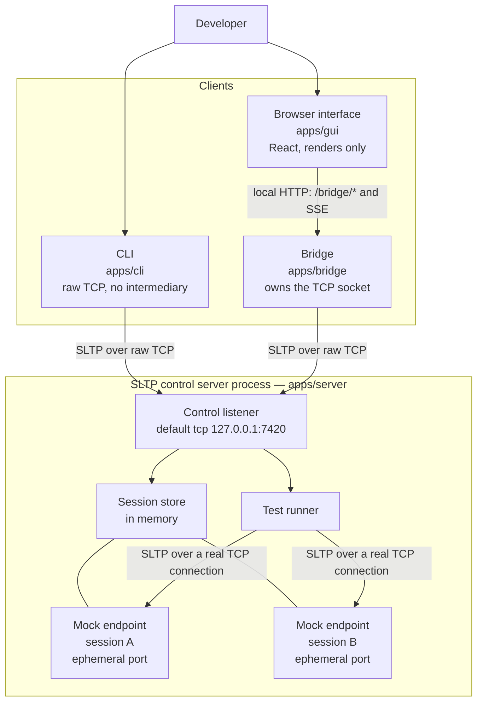
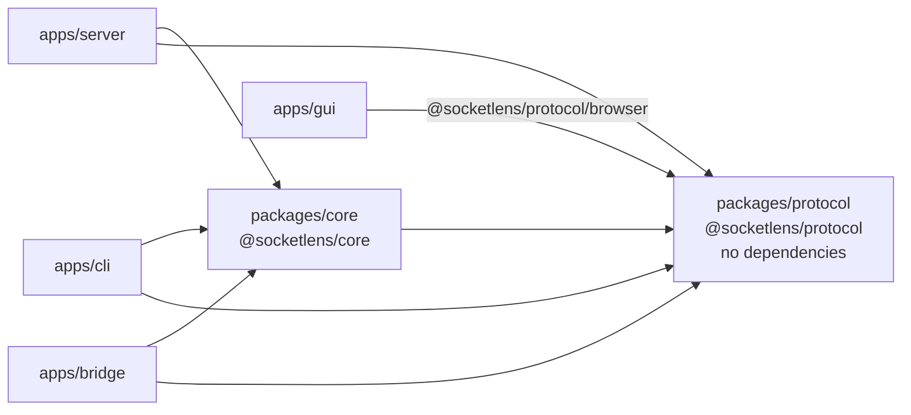
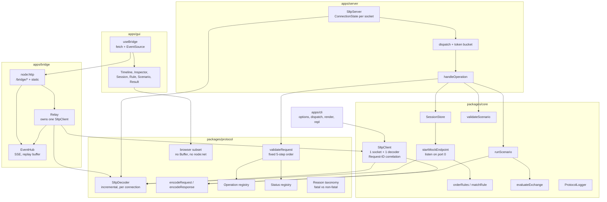
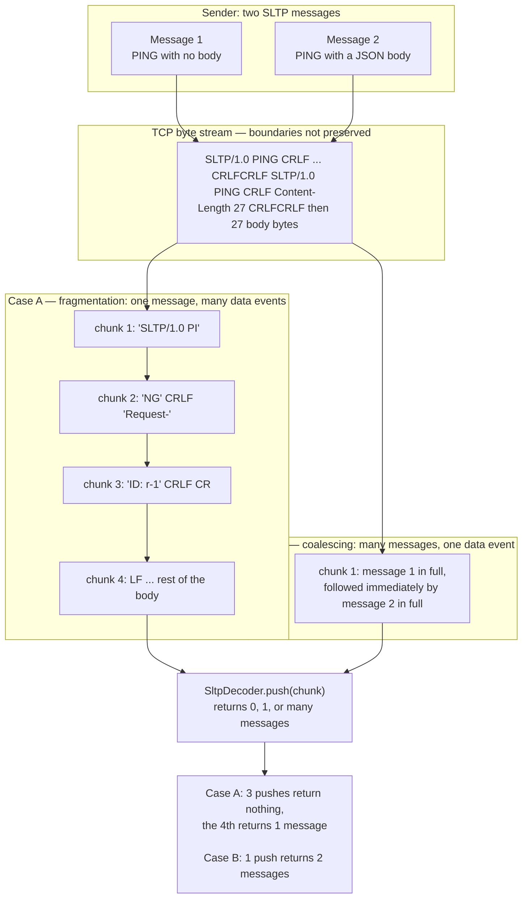
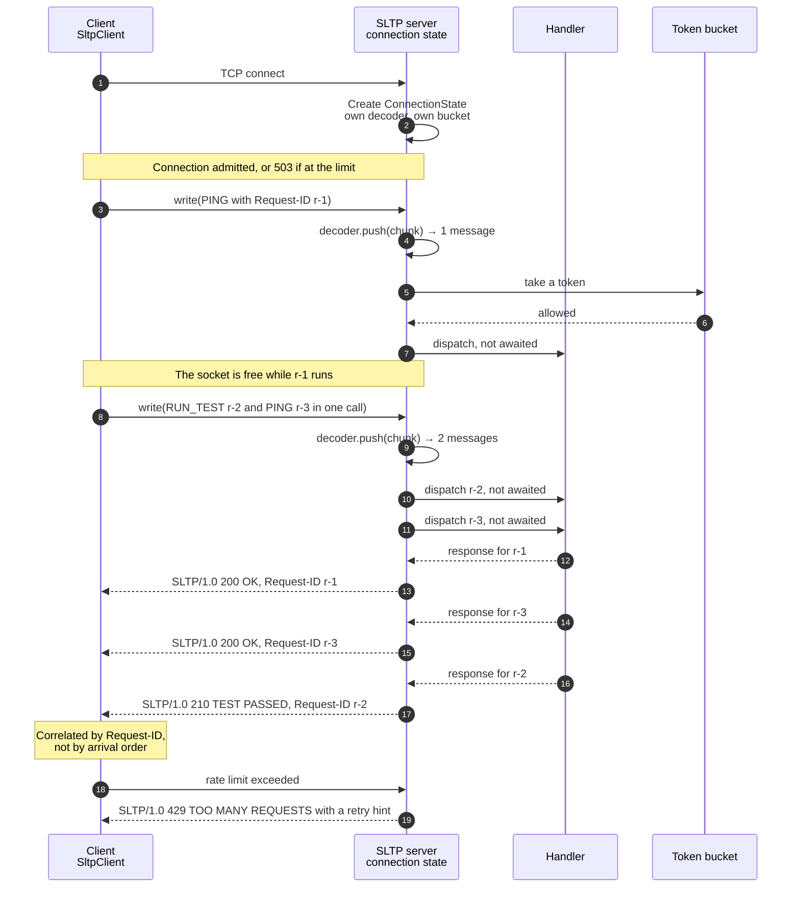
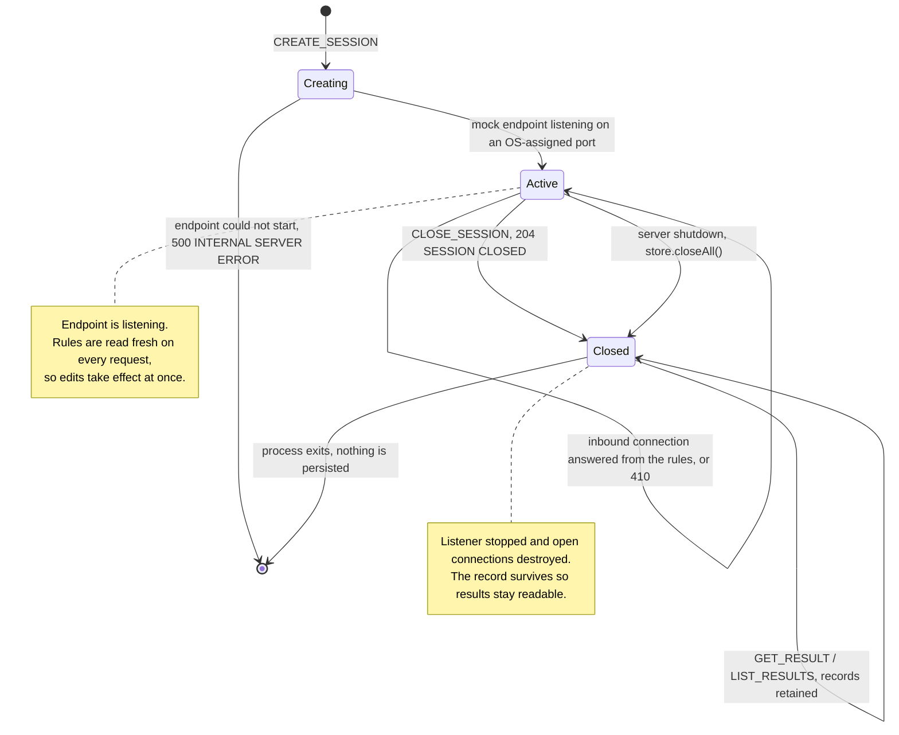
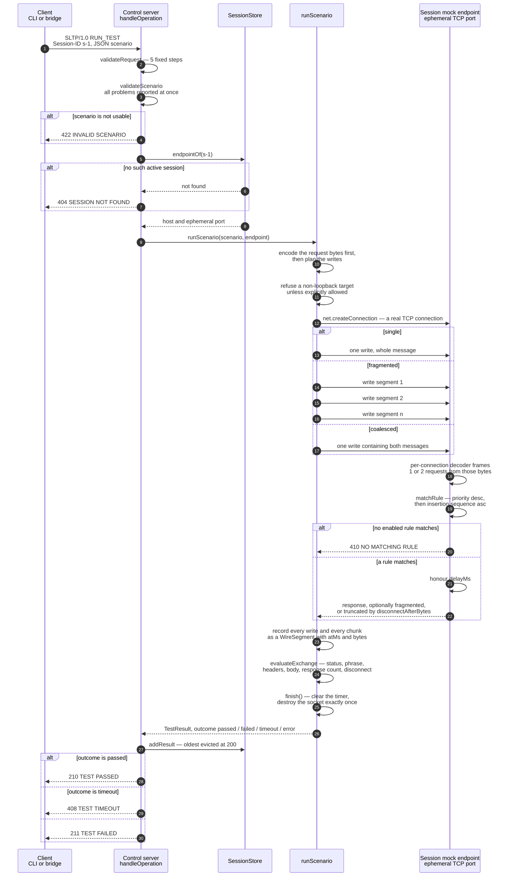
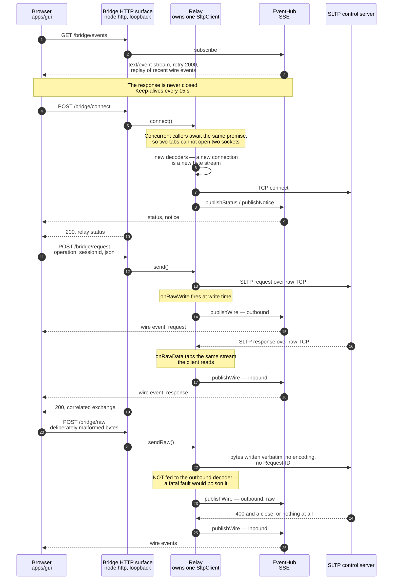

# SocketLens TCP — Architecture

Version 0.1.0. This document describes how SocketLens TCP is put together and why. It is
the companion to [`docs/requirements.md`](./requirements.md); requirement identifiers such
as FR-4 or NFR-2 refer to that document.

The protocol under study is **SLTP/1.0**, carried over **raw TCP** via `node:net`. It is
not HTTP and is never layered on HTTP. The bridge described in §8 does expose a small
local HTTP surface, but that surface carries commands _about_ SLTP; no HTTP framing ever
touches an SLTP message.

---

## 1. System context

SocketLens TCP is a set of processes on one machine. The control server owns every
session; each session owns a private TCP mock endpoint; three clients drive the server.

Two things in that picture are load-bearing:

1. **The CLI has no bridge.** It opens a `node:net` socket to the control port and speaks
   SLTP directly (FR-58). The bridge exists only because a browser cannot do that.
2. **The test runner connects to the mock endpoint over a genuine TCP connection** rather
   than calling into it in-process (FR-46). That is what makes fragmentation and
   coalescing real rather than simulated.

---

## 2. Workspaces

The repository is an npm-workspaces monorepo with six workspaces, built with TypeScript
project references (`tsc -b`).

| Workspace           | Package                | Why it exists                                                                                                                                                                                                                                                                                                |
| ------------------- | ---------------------- | ------------------------------------------------------------------------------------------------------------------------------------------------------------------------------------------------------------------------------------------------------------------------------------------------------------ |
| `packages/protocol` | `@socketlens/protocol` | The SLTP wire format itself: constants, header handling, the encoder, the incremental decoder, the operation registry, the status registry, the reason taxonomy, request validation, and formatting helpers. It knows nothing about sessions, rules, or tests. Its browser subset is a separate entry point. |
| `packages/core`     | `@socketlens/core`     | Everything that is protocol-aware but transport-role-agnostic: the SLTP client, the session store, the mock endpoint, rule matching, scenario validation, assertions, the test runner, result and bundle serialisation, identifiers, and the logger. Shared by every executable.                             |
| `apps/server`       | `@socketlens/server`   | The control listener, per-connection state, rate limiting, dispatch, operation handlers, shutdown, and the server CLI entry point.                                                                                                                                                                           |
| `apps/cli`          | `@socketlens/cli`      | Argument parsing, command dispatch, rendering, and the REPL. Speaks SLTP over raw TCP directly.                                                                                                                                                                                                              |
| `apps/bridge`       | `@socketlens/bridge`   | The loopback relay that owns a real TCP socket for the browser, the SSE event hub, and a six-route HTTP surface.                                                                                                                                                                                             |
| `apps/gui`          | `@socketlens/gui`      | The React interface. Renders message projections; never parses bytes.                                                                                                                                                                                                                                        |

### 2.1 Dependency direction

Dependencies point one way only, from the outside in. Nothing in `packages/` imports
anything from `apps/`.

| From                      | To                               | Nature                                                                                                                                           |
| ------------------------- | -------------------------------- | ------------------------------------------------------------------------------------------------------------------------------------------------ |
| `core`                    | `protocol`                       | Runtime dependency.                                                                                                                              |
| `server`, `cli`, `bridge` | `core`, `protocol`               | Runtime dependencies.                                                                                                                            |
| `gui`                     | `protocol` (browser entry point) | Runtime dependency, values only.                                                                                                                 |
| `gui`                     | `core`                           | **Types only**, resolved through a Vite alias to `packages/core/src/models.ts`. The GUI declares no runtime dependency on `core` and takes none. |

The root `tsconfig.json` references the projects in build order: `protocol`, `core`,
`server`, `cli`, `bridge`, `gui`.

Only `apps/gui` has runtime dependencies at all — React and React DOM. `protocol`, `core`,
`server`, `cli` and `bridge` have none (NFR-19). The HTTP surface in the bridge is written
against `node:http` directly for the same reason: six routes do not justify a framework.

---

## 3. Components

---

## 4. Why the protocol parser lives in one shared package

There are three clients — CLI, bridge, graphical interface — plus a control server and a
per-session mock endpoint. Every one of them must turn a stream of bytes into messages.
All of them use the same `SltpDecoder` and the same encoder from `packages/protocol`
(NFR-2). None of them re-implements framing.

The reason is not code-reuse tidiness. It is that **a duplicated parser is a parser that
diverges**, and every divergence in this particular system is invisible until it produces
a wrong answer:

- **Correctness is the product.** SocketLens TCP exists to show what really crossed the
  wire. If the bridge's parser disagreed with the server's about where a message ends, the
  timeline would show something the server never saw, and the tool would be lying about the
  exact thing it claims to reveal.
- **Framing bugs are conditional, not deterministic.** A parser that assumes one `data`
  event is one message works flawlessly on loopback with small messages and fails under
  fragmentation. Three parsers means three chances for that assumption to survive
  unnoticed in a code path nobody exercises with a 1-byte-at-a-time delivery.
- **The registries are the specification.** Operations, statuses and reason codes are
  single closed registries. Duplicating them would make it possible for the CLI to accept a
  status the server never emits, and would let documentation drift from behaviour (NFR-28).
- **The test suite exercises one implementation deeply** rather than three shallowly. The
  decoder test file alone covers complete messages, single messages split across segments
  down to one byte at a time, several messages arriving in one segment, multi-byte UTF-8
  characters split across chunks, and more than twenty distinct invalid-framing cases. That
  depth is affordable exactly once.

The browser is the one place that cannot import the decoder, because `Buffer` and
`node:net` do not exist there. Rather than write a second parser for the browser, the
package exposes `@socketlens/protocol/browser`: a subset of pure TypeScript over strings,
numbers and plain objects, containing the constants, the registries and the view types, and
deliberately **excluding** the encoder and the decoder. The browser therefore renders
`SltpMessageView` projections produced by the bridge's decoder — the same decoder the
server runs (FR-73).

---

## 5. The buffering model

### 5.1 What TCP does not give you

TCP delivers a reliable, ordered stream of bytes. It does not deliver messages. The
application's `write()` boundaries are not preserved, and the receiving `data` events
reflect kernel buffering, path MTU, Nagle's algorithm, scheduling and load — not the
sender's intent.

Both cases are ordinary. Neither is an error. A decoder that cannot handle both is wrong.

### 5.2 The decoder contract

`SltpDecoder` in `packages/protocol/src/decoder.ts` is the correctness core of the system.

- `push(chunk)` appends the chunk to an internal `Buffer` and returns an array of decode
  events — **zero, one, or many** (FR-3). It never assumes a chunk contains a whole
  message, and never assumes it contains only one.
- `end()` reports leftover bytes as a truncated message, so a peer that died mid-message
  is diagnosed rather than silently ignored (FR-9).
- Draining proceeds in strict order: find the `CRLF CRLF` delimiter, parse the header
  block, resolve `Content-Length`, wait for the whole body, decode the body as UTF-8 only
  once every byte is present, consume exactly the message's byte count, and loop.
- The delimiter search resumes from a retained offset, backed off by three bytes so that a
  delimiter straddling a chunk boundary is still found. This keeps scanning linear in the
  number of bytes received rather than quadratic in the number of chunks (NFR-10).
- Decoding the body only when complete is what makes a multi-byte UTF-8 character split
  across two TCP segments harmless (FR-5).
- A fatal framing fault **poisons** the decoder: the stream is desynchronised, so no
  further message from it can be trusted, and the decoder refuses to emit any (FR-10). The
  caller closes the connection.

A `decodeSingleMessage` helper exists for tests and documentation. Its own documentation
says never to use it on a live socket, because it embodies exactly the assumption the rest
of the system rejects (NFR-1).

### 5.3 Why per-connection state is mandatory

The decoder's header comment states the rule directly: each connection MUST own exactly one
decoder instance, because sharing one between connections would interleave two byte streams
and corrupt both (FR-4).

The failure mode is not subtle but it is easy to reach. Suppose two clients are connected
and both are mid-message:

- Client A has sent `SLTP/1.0 PING` and the first half of its header block.
- Client B has sent `SLTP/1.0 CREATE_SESSION` and the first half of _its_ header block.

With one shared buffer, B's bytes are appended after A's partial bytes. The decoder finds a
delimiter that spans both, parses a header block that neither client sent, and produces a
message that never existed — or a framing error attributed to the wrong connection. Both
streams are now unrecoverable, and neither client did anything wrong.

Per-connection state is therefore not an optimisation; it is a correctness requirement. It
appears in five places, and in every one the decoder is created per connection and
discarded with it:

| Location                             | Instances                                                                                                                                                                                                       |
| ------------------------------------ | --------------------------------------------------------------------------------------------------------------------------------------------------------------------------------------------------------------- |
| `apps/server/src/server.ts`          | One decoder inside each `ConnectionState`.                                                                                                                                                                      |
| `packages/core/src/mock-endpoint.ts` | One decoder per inbound connection, `expect: 'request'`.                                                                                                                                                        |
| `packages/core/src/client.ts`        | One decoder per client, recreated on every `connect()`.                                                                                                                                                         |
| `apps/bridge/src/relay.ts`           | Two decoders — one for bytes written, one for bytes received — both recreated on each new connection, because a new connection is a new byte stream and leftover partial bytes would corrupt its first message. |
| `packages/core/src/test-runner.ts`   | One decoder per scenario connection.                                                                                                                                                                            |

The bridge adds a second rule for the same reason. Bytes written by `sendRaw` are
deliberately **not** fed to the outbound decoder: they may be malformed on purpose, and a
fatal fault would poison the framing state and corrupt the display of every well-formed
request afterwards (FR-70). They are published verbatim instead.

---

## 6. Concurrency and connection lifecycle

### 6.1 Per-connection state on the server

`SltpServer` keeps a `ConnectionState` for every accepted socket, holding its identifier,
its socket, **its own decoder**, its own rate-limit token bucket, its in-flight request
count, a `closeWhenIdle` flag, and a request counter. Nothing in that record is shared.

Admission control runs before anything else: a connection arriving when the server is
already at its maximum (default 64), or while the server is shutting down, receives
`503 SERVER UNAVAILABLE` and is closed (FR-24).

### 6.2 Multiple simultaneous clients

Each connection is independent end to end: separate framing state, separate rate limiting,
separate error handling. The integration suite drives this directly — several connections
at once with isolated sessions, and interleaved requests from many clients that must stay
correctly correlated.

Within a connection, dispatch is concurrent. A decoded request is handed to the handler
without awaiting the previous one, so a slow `RUN_TEST` does not block a `PING` that
arrives behind it on the same socket (FR-20). Responses are matched by `Request-ID`, not by
arrival order, which is what makes out-of-order completion safe (FR-15). The client side
mirrors this: `SltpClient` keeps a map of pending requests keyed by `Request-ID` and
resolves each when its response is framed.

### 6.3 Isolating a client's faults from the server

Every failure mode is confined to the connection that caused it (FR-21, NFR-5):

| Fault                                  | Response                      | Connection                                                                           |
| -------------------------------------- | ----------------------------- | ------------------------------------------------------------------------------------ |
| Malformed start line                   | `400 BAD REQUEST`             | Closed — fatal framing fault, the stream cannot be resynchronised.                   |
| Duplicate `Content-Length`             | `400 BAD REQUEST`             | Closed — the message's extent is ambiguous, so the server refuses to guess.          |
| `Content-Length` over the limit        | `413 MESSAGE TOO LARGE`       | Closed.                                                                              |
| Unregistered operation                 | `501 OPERATION NOT SUPPORTED` | **Stays open** — framing was fine, only the semantics were wrong.                    |
| Body that is not JSON                  | `400 BAD REQUEST`             | **Stays open** — same reason.                                                        |
| Handler throws                         | `500 INTERNAL SERVER ERROR`   | Stays open. The exception never reaches the process (FR-22).                         |
| Socket `error`, including `ECONNRESET` | none                          | Handled on that socket's own error handler; other connections are untouched.         |
| Client vanishes mid-message            | none                          | On close, the decoder reports the truncated remainder; the connection is cleaned up. |

The distinction in that table is the whole point of separating fatal from non-fatal reasons
(NFR-4). A semantic error is answerable — the peer and the server still agree on where
messages begin and end. A framing error is not: the only honest action is to answer, say so
in the response, and close.

### 6.4 Graceful and abrupt disconnect

**Graceful.** `SltpClient.close()` sets a closing flag, calls `socket.end()` to half-close,
and waits for the socket's `close` event, force-destroying after 1 s if the peer never
completes the handshake. The server's `endSocket` does the same on its side (FR-26). The
closing flag is what lets the close handler report "the client closed the connection"
rather than "the server closed the connection" — the same event, two different meanings to
the user (NFR-7).

**Abrupt.** When the socket closes for any reason, the client drains its decoder with
`end()`. If bytes remain, the pending requests are rejected with `Connection closed
mid-message` and the framing detail attached; otherwise with `Connection closed before
request <id> received a response.` Either way **every** in-flight request is settled and
the pending map is cleared, so no caller waits forever. A fatal framing fault from the
server takes the same path through `failAll`, then destroys the socket.

The mock endpoint treats `ECONNRESET` as normal, because scenarios deliberately abort
connections; it logs it against the connection and carries on.

### 6.5 Resource cleanup and graceful shutdown

Every asynchronous resource has exactly one owner (NFR-6):

- The mock endpoint tracks its open sockets in a set, removes each on `close`, and destroys
  all of them when the endpoint stops.
- The test runner funnels every completion path — success, failure, timeout, transport
  error, deliberate disconnect — through a single `finish()` that clears the timer and
  destroys the socket exactly once (FR-53).
- Timers that merely wait are `unref()`ed, so a pending request timeout, a raw-collection
  window, or the bridge's SSE keep-alive never holds the process open on its own.
- The bridge detaches its raw-data, raw-write and close watchers whenever the connection
  ends or is replaced, and clears the map of captured request views — bounded deliberately,
  because a request that times out is never collected.
- The `EventHub` drops a subscriber whose write fails rather than letting one dead browser
  tab break publication to the others (NFR-8).

Server shutdown is ordered (FR-25):

1. Stop accepting; further connections get `503`.
2. Wait for in-flight handlers, up to a grace period (2 s by default).
3. `store.closeAll()` — stop every session's mock endpoint and destroy its connections.
4. Destroy any sockets still open.
5. Await the listener's close callback, then resolve.

`SIGINT` and `SIGTERM` trigger this; a second signal exits immediately with code 130. The
bridge shuts down in its own order, and the order matters: the event hub is closed _first_,
because an attached browser tab holds an open SSE response and `server.close()` would
otherwise wait for it forever.

---

## 7. Sessions, mock endpoints, and test execution

### 7.1 The session model

A session is a named container for mock rules and results. It is created on the control
connection, but it is not merely a record: **creating a session starts a real TCP listener**
(FR-27).

`SessionStore.createSession` calls `startMockEndpoint`, which calls
`server.listen(0, '127.0.0.1')`. Port `0` asks the operating system for an ephemeral port.
The endpoint must be listening _before_ the session is announced to the caller, so the
address reported in the `201 SESSION CREATED` response is already reachable.

Everything is in memory (FR-32, in-scope §4.1 of the requirements): a `Map` of session
records, bounded at 32 sessions, 128 rules per session, and 200 results per session with
oldest-first eviction. Nothing is persisted between runs. That is a deliberate scope
decision, not an omission.

`CLOSE_SESSION` stops the endpoint and destroys its open connections but **retains the
session record**, so results recorded before the close remain readable (FR-31).

### 7.2 Why the endpoint is ephemeral and per-session

| Property               | Consequence                                                                                                                                                                                                                     |
| ---------------------- | ------------------------------------------------------------------------------------------------------------------------------------------------------------------------------------------------------------------------------- |
| **Per session**        | Two sessions cannot interfere. Their rule sets, their connections and their framing state are separate. Sessions can run concurrently without coordination.                                                                     |
| **OS-assigned port**   | No fixed port to collide on, so parallel sessions and parallel test runs work without a port registry. The test harness relies on this: every test gets its own server and its own endpoints on ephemeral ports.                |
| **A real listener**    | `RUN_TEST` drives real socket writes into a real listener. Fragmentation, coalescing, inter-fragment delay and mid-message disconnect are genuine transport behaviour, not a simulation inside one process's memory (FR-46).    |
| **Loopback only**      | The endpoint binds `127.0.0.1` unconditionally (NFR-12).                                                                                                                                                                        |
| **Relaxed validation** | The port already identifies the session, so the endpoint does not require `Session-ID` and accepts operation tokens SLTP does not define — a mock must be able to answer operations the specification never registered (FR-29). |

Response writes on one endpoint connection are serialised through a promise chain, so a
rule with a 200 ms delay cannot have its reply overtaken by a later rule's immediate one
(FR-41).

### 7.3 The test-execution path

`RUN_TEST` is the operation that ties the system together.

Three details are worth stating plainly.

**Bytes first, then the connection.** `runScenario` encodes the payload before opening the
socket. Encoding failures are then reported as scenario problems rather than as transport
errors, and the write plan is known before any byte moves.

**`single` and `coalesced` both write once.** The difference is what is in the buffer.
`coalesced` puts two complete messages in one `write()` — because coalescing _is_ precisely
the case where two messages share one write. When a secondary request is present in
coalesced mode, the runner expects **two** responses from that single write (FR-48). Two
responses arriving from one write is the observable proof that TCP does not preserve message
boundaries. The server-side counterpart is tested directly: two coalesced requests in one
TCP write produce two responses.

**Everything observable is recorded.** Each write and each inbound chunk becomes a
`WireSegment` carrying its byte count, its bytes, and its offset in milliseconds. The stored
result keeps the raw bytes sent, the raw bytes received, the segment list, the segment
counts in each direction, and the number of complete responses framed (FR-49, FR-50). That
is the evidence the CLI's raw view and the GUI's timeline render.

---

## 8. The bridge

### 8.1 Why it exists

A browser cannot open a raw TCP socket. There is no API for it, by design. The graphical
client therefore cannot speak SLTP itself.

The bridge closes that gap. It is a small Node process that **holds one real
`SltpClient`** — the same client the CLI uses, over the same `node:net` socket — and exposes
it to the browser as a handful of loopback HTTP endpoints (FR-65).

What this does _not_ mean is worth stating precisely, because it is the claim most easily
misread:

- HTTP here is a **local control surface between two processes on one machine**, carrying
  commands _about_ SLTP: connect, disconnect, send this request, write these raw bytes,
  what is the status.
- The SLTP conversation itself — the protocol under study — is **raw TCP throughout**,
  between the bridge and the control server, framed by the same decoder the server and CLI
  use.
- **No HTTP framing ever touches an SLTP message** (FR-66).
- The bridge is not a translation layer or a protocol gateway. It re-implements nothing:
  every request is built by the shared encoder and every response is framed by the shared
  incremental decoder.

### 8.2 The HTTP surface

Six routes, written directly against `node:http`:

| Route                | Method | Purpose                                                                                   |
| -------------------- | ------ | ----------------------------------------------------------------------------------------- |
| `/bridge/events`     | GET    | Server-Sent Events stream of wire, status and notice events.                              |
| `/bridge/status`     | GET    | Current relay state: connected, target address, connection id, last error, requests sent. |
| `/bridge/connect`    | POST   | Open the TCP connection to the SLTP server.                                               |
| `/bridge/disconnect` | POST   | Close it.                                                                                 |
| `/bridge/request`    | POST   | Send one SLTP request and return the correlated exchange.                                 |
| `/bridge/raw`        | POST   | Write bytes verbatim, with no encoding and no correlation.                                |

Anything else under `/bridge/` is a 404. Anything outside it is served from the static
asset directory when `--static` was given, with an `index.html` fallback for client-side
routing and a refusal for any path that resolves outside the directory (NFR-15).

The bridge binds only a loopback interface, and refuses a non-loopback `--host` outright
rather than warning: it relays onto an unauthenticated TCP socket, and binding a routable
interface would hand that socket to the network. It also refuses cross-origin requests, so
that a hostile page cannot drive the user's TCP socket through their own browser (FR-72,
NFR-13).

### 8.3 Why Server-Sent Events and not WebSocket

WebSocket is forbidden by this project's constraints. SSE is what is used instead, and it
is a good fit rather than a consolation:

- SSE is **not another protocol**. It is an ordinary HTTP response with the media type
  `text/event-stream` that is simply never closed. No upgrade handshake, no framing layer,
  no dependency.
- The traffic here is **one-directional**. The browser sends commands as ordinary POSTs and
  receives a stream of wire events. WebSocket's duplex channel would be unused in one
  direction.
- Reconnection is built in. The stream sends `retry: 2000`, and the browser's `EventSource`
  reconnects on its own.
- A newly attached tab is not blank: the hub replays up to 250 recent events. `status`
  events are excluded from the replay buffer, because a connection state is a snapshot
  rather than a history and replaying a stale one would show a connection that has since
  dropped; a fresh status is published instead. A keep-alive every 15 s, on an `unref`ed
  timer, stops an idle stream being dropped (FR-68).

Event names are `wire`, `status` and `notice`.

### 8.4 Ordering, correlation, and honest timelines

Two subtleties in the relay exist to keep the displayed conversation truthful:

- **Requests are published at write time**, via `onRawWrite`, not after `send()` resolves.
  A response can arrive before the awaiting caller resumes, so publishing later would place
  every response ahead of the request that caused it (FR-69). The view captured at write
  time is stashed by `Request-ID` and collected when the exchange completes, so the bytes
  are never decoded twice.
- **Raw bytes bypass the outbound decoder** and are published verbatim, because they are
  malformed on purpose and would poison the framing state (FR-70). The server's answer to
  them, if any, arrives through the ordinary inbound tap — it carries no `Request-ID`, so
  there is nothing to correlate it against.

---

## 9. Design decisions

Each decision below records what was chosen, why, and what was rejected.

### D-1 — Raw TCP with a custom framed protocol, not HTTP

**Chosen.** SLTP/1.0 over `node:net`, framed by CRLF-delimited headers and
`Content-Length`.

**Why.** The entire subject of the tool is the gap between a byte stream and a message
stream. HTTP hides that gap behind a library; using it would remove the thing being taught
and observed. The server's own usage text says it plainly: the server speaks SLTP over raw
TCP only, and there is no HTTP interface.

**Rejected.** HTTP with a JSON body — no visible framing problem, so no tool. WebSocket —
forbidden by project constraints, and it also hides framing. A length-prefixed binary
protocol — efficient, but the bytes would not be readable in a terminal, which defeats the
purpose of showing them.

### D-2 — One shared protocol package

**Chosen.** `packages/protocol`, imported by everything, with a browser-safe subset as a
separate entry point.

**Why.** See §4. Divergence between parsers would make the tool lie about the exact thing
it exists to reveal, and framing bugs surface only under conditions that duplicated code
paths rarely exercise.

**Rejected.** A parser per client — three chances for the "one read is one message"
assumption to survive. Copying the decoder into the browser — impossible without `Buffer`,
and it would create the divergence the design forbids. Publishing the parser as an external
dependency — needless indirection for a single repository.

### D-3 — Incremental per-connection decoding, never per-read decoding

**Chosen.** `push(chunk)` returns zero, one, or many messages; every connection owns one
decoder; a fatal fault poisons that decoder.

**Why.** The only model that is correct under both fragmentation and coalescing. Sharing
state between connections interleaves two byte streams and corrupts both (§5.3).

**Rejected.** Decode-per-`data`-event — wrong the first time a message spans two segments.
A shared global buffer — corrupts on the first concurrent pair of partial messages.
Resynchronising after a framing fault by scanning for the next plausible start line — the
offsets are unknown, so it would invent messages out of body content; closing the
connection is the only honest response.

### D-4 — A real TCP mock endpoint per session on an ephemeral port

**Chosen.** Every session calls `listen(0)` on loopback and gets a private listener.

**Why.** Fragmentation and coalescing must be genuine transport behaviour, not a
simulation. An in-process mock would prove nothing about TCP. An ephemeral port removes
port collisions, which is what makes concurrent sessions and parallel tests work.

**Rejected.** One shared mock endpoint with session routing — reintroduces cross-session
interference and needs a `Session-ID` on every mock request. A fixed port per session —
collides under parallel runs. In-memory function calls instead of sockets — fast, but
incapable of demonstrating the phenomenon the tool exists for.

### D-5 — In-memory storage only

**Chosen.** Sessions, rules and results live in the server process, bounded, with
oldest-first eviction of results.

**Why.** A protocol-inspection tool's artefacts are ephemeral by nature, and a database
would add operational weight, a schema to migrate, and a dependency, for state whose useful
lifetime is one debugging session. Portability is provided instead by versioned JSON
bundles and result exports, which are files the user controls.

**Rejected.** SQLite or an embedded store — a runtime dependency and a migration burden for
no user-visible gain in v0.1. Unbounded in-memory growth — a long-running server would
consume memory without limit. Writing every result to disk automatically — surprising, and
the user may not want it.

### D-6 — Deterministic rule ordering, priority descending then insertion sequence ascending

**Chosen.** `orderRules` sorts by priority descending, then by insertion sequence
ascending; the first enabled match wins; the ordering is reported to clients by
`LIST_RULES`.

**Why.** A mock whose behaviour depends on iteration order is untestable and untrustworthy.
Insertion sequence as the tie-break gives a stable, explainable answer to "why did that rule
win?", and pairs with the match trace that records why each other rule was rejected.

**Rejected.** Insertion order alone — no way to override a broad rule with a narrow one.
Specificity scoring — clever, but the score is invisible to the user and hard to predict.
Last-match-wins — makes rules order-dependent in a way that surprises on edit.

### D-7 — A loopback bridge for the browser, over SSE

**Chosen.** A separate process owns the TCP socket; six local HTTP routes carry commands;
wire events are pushed over SSE.

**Why.** A browser cannot open a raw TCP socket, and the graphical client must not
re-implement the protocol. Making the browser a pure renderer of `SltpMessageView`
projections keeps exactly one framing implementation in the system. SSE is an ordinary HTTP
response with a media type, needs no dependency, reconnects on its own, and matches the
one-directional nature of the event feed. WebSocket is forbidden here in any case (§8.3).

**Rejected.** WebSocket — forbidden, and duplex is unneeded. Polling `/bridge/status` —
loses events and shows a lagging, reordered timeline. A TCP-over-HTTP tunnel — would put
SLTP bytes inside HTTP, which is precisely the claim this project must not make. Running
the protocol in the browser — impossible without raw sockets.

### D-8 — Request-ID correlation instead of strict request/response ordering

**Chosen.** Every response carries the `Request-ID` of its request; several requests may be
in flight on one connection; dispatch is concurrent.

**Why.** SLTP does not promise that a slow operation's response precedes a fast one's.
Head-of-line blocking on a single socket would make a 5-second `RUN_TEST` freeze an
interactive session, and the bridge deliberately keeps one connection so that this
behaviour is visible in the interface.

**Rejected.** One request in flight at a time — simple, but blocks. One connection per
request — hides the multiplexing behaviour and multiplies connection setup. Matching by
arrival order — silently wrong the first time an operation completes out of order.

### D-9 — Failing a whole connection only on framing faults

**Chosen.** Fatal reasons close the connection; everything else answers and stays open.

**Why.** After a framing fault the peers no longer agree on where messages begin, so
nothing read afterwards means anything. A semantic error carries no such consequence, and
closing the connection over a typo'd operation would make the tool hostile to
experimentation — which is exactly what a REPL and a raw-byte command are for.

**Rejected.** Closing on any error — punishes the ordinary case. Never closing — leaves the
peer talking into a desynchronised stream and producing nonsense diagnostics.

### D-10 — Loopback-only posture and an explicit target allow-list

**Chosen.** Mock endpoints bind loopback unconditionally; the bridge refuses a non-loopback
bind and cross-origin requests; the test runner refuses non-loopback targets unless the
operator allowed them at server start with `--allow-target`.

**Why.** The runner opens arbitrary TCP connections and writes arbitrary bytes. Without a
restriction that is a network probe. The default refusal makes the tool useless for that
purpose while remaining fully useful for its own (NFR-14, NFR-16).

**Rejected.** Allowing any target by default — turns a testing tool into a scanning tool.
Warning instead of refusing — a warning does not prevent anything. Removing the ability to
target another host entirely — would prevent the legitimate case of testing a real local
peer, which the explicit allow-list supports under operator control.

### D-11 — No runtime dependencies outside the graphical client

**Chosen.** `protocol`, `core`, `server`, `cli` and `bridge` depend on nothing at runtime.
The bridge's HTTP surface is written against `node:http`; both argument parsers are
hand-written.

**Why.** The subject matter is `node:net` and byte handling; a framework would obscure it.
The surfaces are genuinely small — six HTTP routes, a flat flag grammar — and each flag is
documented next to the code that reads it. A zero-dependency tool is also trivially
auditable, which matters for something that opens sockets.

**Rejected.** Express for the bridge — a dependency tree for six routes. An argument-parsing
library — a dependency for a grammar that fits on a screen, and it would not produce the
"did you mean" hints the CLI gives for mistyped flags.

### D-12 — TypeScript project references, tests against source

**Chosen.** Composite builds with `tsc -b` in dependency order; Vitest resolves workspace
imports to TypeScript sources via aliases.

**Why.** Project references give each workspace one compilation and give dependents real
declaration files, which is what enforces the dependency direction in §2.1 rather than
merely documenting it. Running tests against source means `npm test` needs no prior build
and a failing test points at the line you edited.

**Rejected.** A single flat `tsconfig` — no enforced boundaries between workspaces. Testing
the built output — a build step before every test run, and stack traces in generated code.
A bundler for the Node packages — no benefit for code that is executed by Node directly.

---

## 10. Related documents

| Document                                                        | Contents                                                    |
| --------------------------------------------------------------- | ----------------------------------------------------------- |
| [`docs/requirements.md`](./requirements.md)                     | Functional and non-functional requirements, scope for v0.1. |
| [`docs/protocol-specification.md`](./protocol-specification.md) | Normative SLTP/1.0 wire format.                             |
| [`docs/status-codes.md`](./status-codes.md)                     | The status registry with phrases and contexts.              |
| [`docs/protocol-examples.md`](./protocol-examples.md)           | Byte-level worked examples.                                 |
| [`docs/test-plan.md`](./test-plan.md)                           | Test cases mapped to requirement identifiers.               |
| [`docs/user-guide.md`](./user-guide.md)                         | Task-oriented guide to the CLI and the interface.           |
| [`docs/developer-guide.md`](./developer-guide.md)               | Building, testing and extending the codebase.               |
