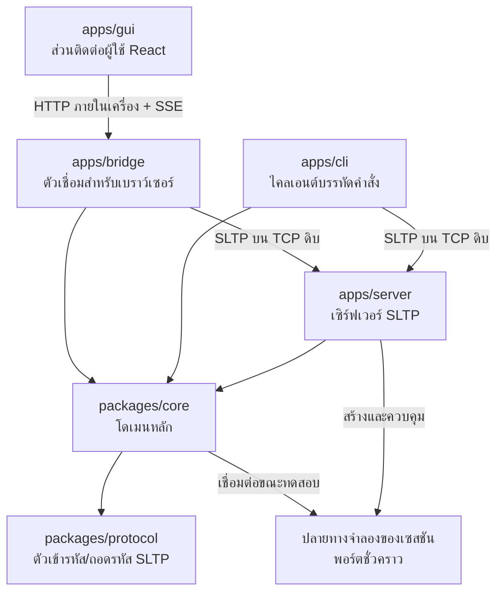
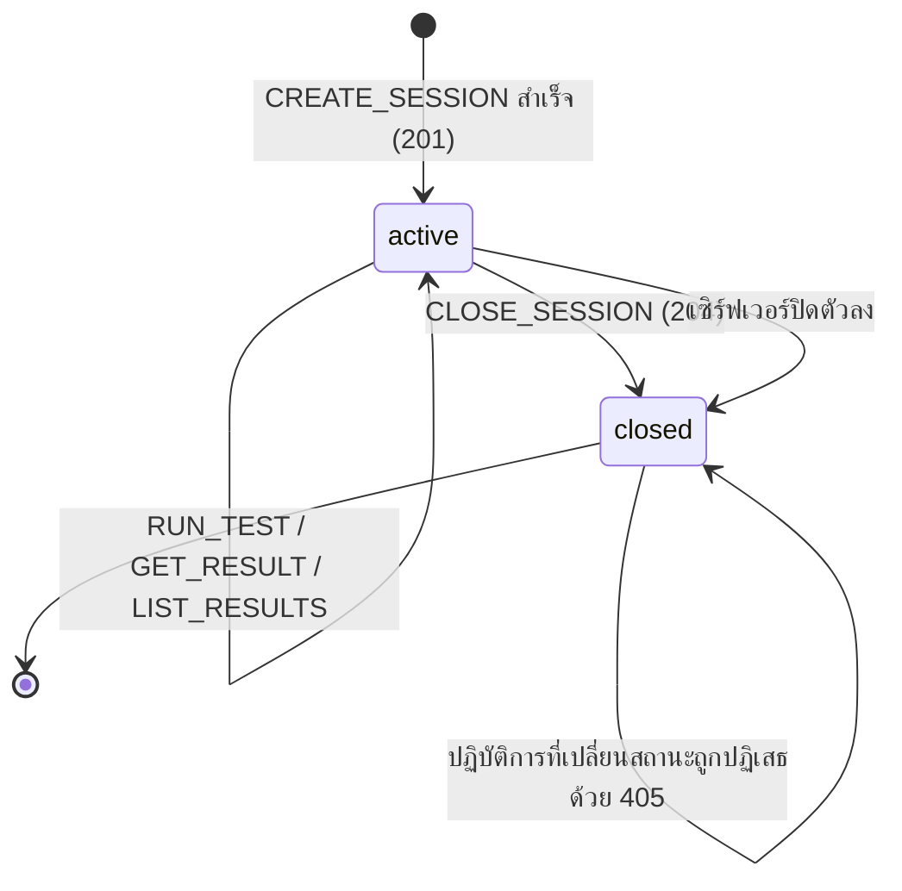

# รายงานโครงงาน SocketLens TCP

**รายวิชา** 01418351 Computer Communications and Cloud Computing Principles
**สถาบัน** มหาวิทยาลัยเกษตรศาสตร์
**งานที่ได้รับมอบหมาย** โครงงานที่ 1 การเขียนโปรแกรมซ็อกเก็ต (Project 1: Socket Programming)
**ชื่อโครงงาน** SocketLens TCP
**โปรโตคอลที่ออกแบบเอง** SLTP — SocketLens Testing Protocol เวอร์ชัน 1.0
**ผู้จัดทำ** Natthakit Jantawong
**รุ่นของซอฟต์แวร์** 0.1.2

> เอกสารฉบับนี้เป็นรายงานภาษาไทยของโครงงาน เนื้อหาทุกส่วนอ้างอิงจากซอร์สโค้ดจริงที่ทำงานได้
> เอกสารอ้างอิงเชิงเทคนิคฉบับเต็มเป็นภาษาอังกฤษอยู่ที่ [protocol-specification.md](protocol-specification.md),
> [architecture.md](architecture.md), [status-codes.md](status-codes.md) และ [test-plan.md](test-plan.md)

---

## สารบัญ

1. [แอปพลิเคชันนี้คืออะไร](#1-แอปพลิเคชันนี้คืออะไร)
2. [ใช้ทำอะไร](#2-ใช้ทำอะไร)
3. [วัตถุประสงค์ของโครงงาน](#3-วัตถุประสงค์ของโครงงาน)
4. [คุณลักษณะสำคัญ](#4-คุณลักษณะสำคัญ)
5. [สถาปัตยกรรมของระบบ](#5-สถาปัตยกรรมของระบบ)
6. [ฝั่งไคลเอนต์และฝั่งเซิร์ฟเวอร์คือใคร](#6-ฝั่งไคลเอนต์และฝั่งเซิร์ฟเวอร์คือใคร)
7. [ใช้ TCP หรือ UDP](#7-ใช้-tcp-หรือ-udp)
8. [เหตุผลที่เลือกโพรโทคอลขนส่งนี้](#8-เหตุผลที่เลือกโพรโทคอลขนส่งนี้)
9. [เหตุผลที่ไม่เลือกอีกทางเลือกหนึ่ง](#9-เหตุผลที่ไม่เลือกอีกทางเลือกหนึ่ง)
10. [ความน่าเชื่อถือของการส่งข้อมูล](#10-ความน่าเชื่อถือของการส่งข้อมูล-reliability)
11. [การรักษาลำดับข้อมูล](#11-การรักษาลำดับข้อมูล-ordering)
12. [การควบคุมอัตราการไหลของข้อมูล](#12-การควบคุมอัตราการไหลของข้อมูล-flow-control)
13. [การควบคุมความคับคั่ง](#13-การควบคุมความคับคั่ง-congestion-control)
14. [การออกแบบโปรโตคอล SLTP โดยรวม](#14-การออกแบบโปรโตคอล-sltp-โดยรวม)
15. [รูปแบบข้อความคำขอ](#15-รูปแบบข้อความคำขอ-request-message)
16. [รูปแบบข้อความตอบกลับ](#16-รูปแบบข้อความตอบกลับ-response-message)
17. [รายการปฏิบัติการทั้งหมด](#17-รายการปฏิบัติการทั้งหมด)
18. [รหัสสถานะและข้อความสถานะทั้งหมด](#18-รหัสสถานะและข้อความสถานะทั้งหมด)
19. [วงจรชีวิตของเซสชัน](#19-วงจรชีวิตของเซสชัน)
20. [การกำหนดขอบเขตข้อความ](#20-การกำหนดขอบเขตข้อความ-message-framing)
21. [การจัดการข้อผิดพลาด](#21-การจัดการข้อผิดพลาด)
22. [ข้อพิจารณาด้านความปลอดภัย](#22-ข้อพิจารณาด้านความปลอดภัย)
23. [ข้อจำกัด วิธีการทดสอบ ผลที่คาดหวัง และการพัฒนาต่อ](#23-ข้อจำกัด-วิธีการทดสอบ-ผลที่คาดหวัง-และการพัฒนาต่อ)
24. [จุดเด่นของโครงงาน การวัดประสิทธิภาพ และการจับแพ็กเก็ต](#24-จุดเด่นของโครงงาน-การวัดประสิทธิภาพ-และการจับแพ็กเก็ต)

---

## 1. แอปพลิเคชันนี้คืออะไร

SocketLens TCP เป็นเครื่องมือสำหรับนักพัฒนาที่ทำงานบนเครื่องภายใน (local developer tool) ใช้สำหรับ
**ออกแบบ จำลอง ทดสอบ และตรวจสอบโปรโตคอลชั้นแอปพลิเคชันที่สร้างขึ้นเองบนสตรีมไบต์ของ TCP**

หัวใจของโครงงานคือโปรโตคอลชั้นแอปพลิเคชันที่ออกแบบขึ้นเองชื่อ **SLTP (SocketLens Testing Protocol)**
ซึ่งวิ่งอยู่บนซ็อกเก็ต TCP โดยตรงผ่านมอดูล `node:net` ที่ติดมากับ Node.js

จุดที่ต้องเน้นให้ชัดคือ **SLTP ไม่ใช่ HTTP** และไม่ได้สร้างทับ HTTP, WebSocket, gRPC หรือเฟรมเวิร์ก RPC ใด ๆ
ระบบเปิดซ็อกเก็ต TCP เอง อ่านไบต์ดิบเอง ประกอบข้อความเอง และตีความเอง ทั้งหมด
รูปแบบข้อความของ SLTP ได้รับแรงบันดาลใจจากโปรโตคอลข้อความที่มนุษย์อ่านได้ เช่น การใช้บรรทัดเริ่มต้น
ส่วนหัว บรรทัดว่าง และเนื้อความ แต่ไวยากรณ์ ปฏิบัติการ และรหัสสถานะทั้งหมดเป็นของ SLTP เอง

**ส่วนใดคือผลงานหลักของโครงงาน**

ต้องแยกให้ชัดตั้งแต่ต้น เพราะโครงงานนี้มีทั้งโพรโทคอลและซอฟต์แวร์

| ส่วน                                                                                          | สถานะในโครงงาน                                           |
| --------------------------------------------------------------------------------------------- | -------------------------------------------------------- |
| **SLTP** — ไวยากรณ์ กลไกกำหนดขอบเขต การจับคู่คำขอ-คำตอบ ทะเบียนรหัสสถานะ พฤติกรรมเมื่อผิดพลาด | **ผลงานหลัก** เป็นสิ่งที่โครงงานนี้ออกแบบและนิยามขึ้นเอง |
| เซิร์ฟเวอร์ควบคุมและปลายทางจำลอง                                                              | เครื่องมือ ทำให้ทดสอบโพรโทคอลบน TCP จริงได้              |
| ไคลเอนต์ CLI                                                                                  | เครื่องมือ ทำให้เห็นไบต์จริงและรหัสสถานะจริง             |
| ตัวเชื่อมและหน้าเว็บ                                                                          | เครื่องมือ มีเพราะเบราว์เซอร์เปิดซ็อกเก็ต TCP เองไม่ได้  |
| ชุดทดสอบอัตโนมัติและตัวอย่าง 11 ชุด                                                           | หลักฐาน ยืนยันว่าโพรโทคอลทำงานถูกต้องตามที่นิยามไว้      |

ซอฟต์แวร์ทั้งหมดมีอยู่เพื่อ **พิสูจน์ว่าโพรโทคอลทำงานถูกต้อง** ไม่ใช่เพื่อเป็นผลิตภัณฑ์
ความสวยงามของหน้าเว็บและประสบการณ์ผู้ใช้จึงไม่ใช่ประเด็นของรายงานฉบับนี้

โครงงานนี้เป็นโครงงานอิสระเพื่อการศึกษาและเป็นซอฟต์แวร์โอเพนซอร์ส **ไม่มีความเกี่ยวข้องกับผลิตภัณฑ์อื่น
ที่ใช้ชื่อว่า SocketLens แต่อย่างใด**

---

## 2. ใช้ทำอะไร

ปัญหาที่เครื่องมือนี้ต้องการแก้คือ **การเขียนโปรแกรมบน TCP นั้นผิดพลาดได้ง่ายในจุดที่มองไม่เห็น**

นักพัฒนาจำนวนมากเขียนโค้ดอ่านข้อมูลจากซ็อกเก็ตในลักษณะนี้

```js
socket.on('data', (chunk) => {
  const message = JSON.parse(chunk.toString()); // สมมติว่า chunk คือหนึ่งข้อความพอดี
  handle(message);
});
```

โค้ดข้างต้นทำงานได้ดีบนเครื่องตัวเองในการทดสอบเบื้องต้น แล้วไปพังในสภาพแวดล้อมจริง เพราะสมมติฐานที่ว่า
"หนึ่งเหตุการณ์ `data` เท่ากับหนึ่งข้อความ" นั้น **TCP ไม่เคยรับประกันไว้เลย**

SocketLens TCP ทำให้ความผิดพลาดประเภทนี้ปรากฏให้เห็นได้ในทันที ความสามารถแต่ละข้อ
**ไม่ได้มีไว้เป็นฟีเจอร์ของโปรแกรม** แต่มีไว้เพื่อบังคับให้พฤติกรรมของโพรโทคอลข้อหนึ่งปรากฏ
และตรวจสอบได้

| ความสามารถที่ใช้ทดสอบ                                 | ตรวจสอบพฤติกรรมใดของโพรโทคอล                                                              |
| ----------------------------------------------------- | ----------------------------------------------------------------------------------------- |
| เซสชันที่แยกจากกันโดยสมบูรณ์                          | ความหมายของสถานะและเซสชัน และการที่แต่ละการเชื่อมต่อมีสถานะการกำหนดขอบเขตของตัวเอง (FR-4) |
| กฎจำลองการตอบกลับ                                     | ทำให้กำหนดคำตอบได้แน่นอน จึงเปรียบเทียบผลคาดหวังกับผลจริงได้                              |
| **แบ่งข้อความออกเป็นหลายส่วน โดยกำหนดขนาดเองได้**     | การถอดรหัสแบบเพิ่มทีละส่วนต้องประกอบข้อความคืนได้ทุกจุดตัด (FR-3)                         |
| **รวมหลายข้อความไว้ในการเขียนครั้งเดียว**             | TCP ไม่รักษาขอบเขตข้อความ ผู้รับต้องแยกด้วย `Content-Length` เอง                          |
| ความหน่วงระหว่างส่วนย่อยและก่อนตอบกลับ                | ป้องกันไม่ให้เคอร์เนลรวมการเขียนกลับเข้าด้วยกัน และทดสอบการหมดเวลา                        |
| ข้อความรูปแบบผิด และ `Content-Length` ที่ใช้การไม่ได้ | การตรวจสอบการกำหนดขอบเขตอย่างเข้มงวด และการแยกความผิดพลาดที่ร้ายแรง (FR-6, FR-7)          |
| ตัดการเชื่อมต่อกลางคันขณะข้อความยังไม่จบ              | พฤติกรรมเมื่อข้อความไม่สมบูรณ์และสตรีมหยุดกลางทาง                                         |
| เปรียบเทียบผลคาดหวังกับผลจริง                         | ความหมายของการควบคุมการทดสอบผ่านโพรโทคอล (`210` เทียบกับ `211`)                           |
| ดูข้อความทั้งแบบไบต์ดิบและแบบที่แจงแล้ว               | ตรวจสอบได้ว่าไบต์บนสายตรงกับที่ไวยากรณ์ระบุไว้จริง                                        |

ทุกแถวในตารางนี้อ่านจากขวาไปซ้ายได้ กล่าวคือ **ข้อกำหนดของโพรโทคอลเป็นตัวกำหนดว่าเครื่องมือ
ต้องทำอะไรได้** ไม่ใช่เลือกทำฟีเจอร์ตามความน่าสนใจ

กลุ่มผู้ใช้เป้าหมายคือนักพัฒนาที่ต้องสร้างหรือดูแลโปรโตคอลไบนารีหรือโปรโตคอลข้อความบน TCP เอง
เช่น โปรโตคอลภายในองค์กร โปรโตคอลของอุปกรณ์ IoT หรือโปรโตคอลของเกม รวมถึงผู้ที่กำลังเรียนรู้เรื่อง
การเขียนโปรแกรมเครือข่ายและต้องการเห็นพฤติกรรมของ TCP ด้วยตาตนเอง

---

## 3. วัตถุประสงค์ของโครงงาน

1. **ออกแบบโปรโตคอลชั้นแอปพลิเคชันขึ้นเองอย่างครบถ้วน** ตั้งแต่ไวยากรณ์ของข้อความ วิธีกำหนดขอบเขตข้อความ
   ชุดปฏิบัติการ ชุดรหัสสถานะ ไปจนถึงลำดับการตรวจสอบความถูกต้องและพฤติกรรมเมื่อเกิดข้อผิดพลาด
2. **พิสูจน์ให้เห็นเชิงประจักษ์ว่า TCP เป็นสตรีมไบต์ที่เชื่อถือได้และรักษาลำดับ แต่ไม่รักษาขอบเขตของข้อความ
   ระดับแอปพลิเคชัน** ซึ่งเป็นแนวคิดหลักที่โครงงานนี้ต้องการสื่อ
3. **สร้างตัวถอดรหัสแบบเพิ่มทีละส่วน (incremental decoder) ที่ถูกต้องจริง** สามารถรับมือกับการแบ่งข้อความ
   ที่ตำแหน่งใดก็ได้ รวมถึงการแบ่งกลางตัวอักษร UTF-8 แบบหลายไบต์
4. **แสดงกิจกรรมของโปรโตคอลให้มองเห็นได้** ทั้งฝั่งไคลเอนต์และฝั่งเซิร์ฟเวอร์ต้องพิมพ์ข้อความที่รับส่งจริง
   ออกมาให้ตรวจสอบได้
5. **รองรับไคลเอนต์หลายรายพร้อมกัน** โดยที่ข้อผิดพลาดของไคลเอนต์รายหนึ่งต้องไม่ทำให้เซิร์ฟเวอร์ล้ม
6. **จัดทำเอกสารที่สอดคล้องกับการทำงานจริง** ตัวอย่างข้อความทุกตัวอย่างในเอกสารต้องถูกต้องตามการทำงานจริง
   ของโปรแกรม และมีสคริปต์ตรวจสอบอัตโนมัติคอยยืนยัน

---

## 4. คุณลักษณะสำคัญ

แยกเป็นสองส่วนโดยเจตนา เพราะส่วนแรกคือผลงานของโครงงาน ส่วนที่สองคือเครื่องมือที่ใช้พิสูจน์ส่วนแรก

### 4.1 คุณลักษณะของโพรโทคอล SLTP — ส่วนนี้คือผลงานหลัก

| คุณลักษณะ               | รายละเอียด                                                                                |
| ----------------------- | ----------------------------------------------------------------------------------------- |
| ข้อความที่มนุษย์อ่านได้ | ข้อความเป็นข้อความล้วน ส่วนหัวเป็น US-ASCII ที่พิมพ์ได้ ตรวจสอบบนสายได้โดยไม่ต้องมีตัวถอด |
| กำหนดขอบเขตสองชั้น      | ตัวคั่นส่วนหัว `\r\n\r\n` บอกจุดจบของส่วนหัว และ `Content-Length` บอกความยาวเนื้อความ     |
| นับความยาวเป็นไบต์      | `Content-Length` คือความยาวหน่วยไบต์แบบ UTF-8 ไม่ใช่จำนวนอักขระ                           |
| ถอดรหัสแบบเพิ่มทีละส่วน | รับไบต์เท่าใดก็ได้ คืนข้อความ 0, 1 หรือหลายข้อความ และเก็บเศษที่เหลือไว้ต่อ               |
| จับคู่ด้วย `Request-ID` | คำตอบส่งค่าเดิมกลับ จึงมีคำขอค้างหลายรายการบนการเชื่อมต่อเดียวได้โดยไม่พึ่งลำดับ          |
| ทะเบียนปิด              | 13 ปฏิบัติการ และ 23 รหัสสถานะ ที่นิยามความหมายและบริบทไว้ครบทุกรหัส                      |
| แยกความผิดพลาดสองระดับ  | ความผิดพลาดที่กู้คืนได้เปิดการเชื่อมต่อไว้ ที่ร้ายแรงตอบเหตุผลแล้วปิด                     |
| เหตุผลที่โปรแกรมอ่านได้ | ส่วนหัว `Reason` มาจากทะเบียนปิด ไม่ต้องจับคู่ข้อความเพื่อวินิจฉัย                        |
| ขีดจำกัดที่ระบุชัด      | ข้อความ 1 MiB, บล็อกส่วนหัว 16 KiB, บรรทัดเริ่มต้น 1 KiB, ส่วนหัว 64 รายการ               |
| ลำดับการจับคู่กฎแน่นอน  | เรียงตามความสำคัญจากมากไปน้อย หากเท่ากันจึงเรียงตามลำดับการเพิ่ม                          |

### 4.2 คุณลักษณะของเครื่องมือ — ส่วนนี้มีไว้พิสูจน์ส่วนที่ 4.1

| คุณลักษณะ               | รายละเอียด และสิ่งที่ทำให้พิสูจน์ได้                                                       |
| ----------------------- | ------------------------------------------------------------------------------------------ |
| ปลายทางจำลองเป็นของจริง | แต่ละเซสชันเปิดพอร์ต TCP จริงที่ระบบปฏิบัติการจัดสรรให้ ทำให้การเขียนวิ่งผ่านสแตก TCP จริง |
| แยกเซสชันออกจากกัน      | แต่ละเซสชันมีกฎ ผลการทดสอบ และปลายทางของตนเอง ทดสอบพร้อมกันได้โดยไม่รบกวนกัน               |
| ใช้ตัวแจงร่วมกัน        | ไคลเอนต์ทุกตัวใช้ตัวเข้ารหัสและตัวถอดรหัสชุดเดียวกัน ไม่มีการเขียนซ้ำ (NFR-2)              |
| ไคลเอนต์สามแบบ          | CLI พูด SLTP บน TCP โดยตรง ตัวเชื่อมถือซ็อกเก็ตแทนเบราว์เซอร์ หน้าเว็บเป็นเพียงตัวแสดงผล   |
| รองรับหลายไคลเอนต์      | ทำงานแบบขับเคลื่อนด้วยเหตุการณ์ ไม่ใช้เธรดเสริม ความผิดพลาดของรายหนึ่งไม่กระทบรายอื่น      |
| แสดงไบต์จริงได้         | `--raw` พิมพ์ไบต์ทุกไบต์ทั้งสองทิศทาง ทำให้เทียบกับไวยากรณ์ที่นิยามไว้ได้                  |

---

## 5. สถาปัตยกรรมของระบบ

ระบบแบ่งออกเป็นหกส่วนย่อยในรูปแบบ monorepo



| ส่วนย่อย            | หน้าที่                                                                                         |
| ------------------- | ----------------------------------------------------------------------------------------------- |
| `packages/protocol` | นิยามไวยากรณ์ SLTP ตัวเข้ารหัส ตัวถอดรหัสแบบเพิ่มทีละส่วน ทะเบียนปฏิบัติการ และทะเบียนรหัสสถานะ |
| `packages/core`     | แบบจำลองโดเมน ที่เก็บเซสชัน การจับคู่กฎ ตัวรันการทดสอบ และไคลเอนต์ SLTP ที่ใช้ร่วมกัน           |
| `apps/server`       | เซิร์ฟเวอร์ TCP ที่รับการเชื่อมต่อ ตรวจสอบคำขอ และตอบกลับ                                       |
| `apps/cli`          | ไคลเอนต์บรรทัดคำสั่ง ใช้งานได้ครบถ้วนโดยไม่ต้องมีส่วนติดต่อกราฟิก                               |
| `apps/bridge`       | ถือการเชื่อมต่อ TCP แทนเบราว์เซอร์ และส่งเหตุการณ์ต่อให้หน้าเว็บ                                |
| `apps/gui`          | ส่วนติดต่อผู้ใช้แบบกราฟิกด้วย React และ Vite                                                    |

### เหตุใดจึงต้องมีตัวเชื่อม (bridge)

เบราว์เซอร์ **ไม่สามารถเปิดซ็อกเก็ต TCP ดิบได้** ด้วยข้อจำกัดด้านความปลอดภัยของตัวเบราว์เซอร์เอง
หากต้องการให้ส่วนติดต่อกราฟิกทำงานได้จึงต้องมีกระบวนการภายในเครื่องทำหน้าที่ถือซ็อกเก็ตแทน

`apps/bridge` จึงเปิดเซิร์ฟเวอร์ HTTP บน loopback เพื่อ **ให้บริการไฟล์หน้าเว็บและรับคำสั่งจากหน้าเว็บ**
แล้วแปลงคำสั่งเหล่านั้นเป็นข้อความ SLTP ที่ส่งบน TCP ดิบไปยังเซิร์ฟเวอร์อีกทอดหนึ่ง

จุดสำคัญที่ต้องเน้นคือ **HTTP ในที่นี้ไม่ได้เป็นโปรโตคอลหลักระหว่างไคลเอนต์กับเซิร์ฟเวอร์**
แต่เป็นเพียงช่องทางระหว่างหน้าเว็บกับกระบวนการตัวเชื่อมบนเครื่องเดียวกันเท่านั้น
การสื่อสาร SLTP ที่แท้จริงยังคงเป็น TCP ดิบเสมอ และไคลเอนต์บรรทัดคำสั่งซึ่งเป็นไคลเอนต์หลักของโครงงาน
ก็เชื่อมต่อ TCP โดยตรงโดยไม่ผ่านตัวเชื่อมเลย

สำหรับช่องทางส่งเหตุการณ์จากตัวเชื่อมกลับไปยังหน้าเว็บ ระบบเลือกใช้ **Server-Sent Events**
เพราะ WebSocket เป็นสิ่งต้องห้ามในโครงงานนี้ ขณะที่ SSE เป็น HTTP ธรรมดาที่ใช้ชนิดเนื้อหา
`text/event-stream` และไม่ต้องพึ่งไลบรารีภายนอกใด ๆ

---

## 6. ฝั่งไคลเอนต์และฝั่งเซิร์ฟเวอร์คือใคร

ระบบนี้มีความสัมพันธ์แบบไคลเอนต์-เซิร์ฟเวอร์อยู่ **สองระดับซ้อนกัน** ซึ่งต้องแยกให้ชัด

### ระดับที่หนึ่ง: การเชื่อมต่อควบคุม

| บทบาท       | ใครทำหน้าที่                                                           |
| ----------- | ---------------------------------------------------------------------- |
| เซิร์ฟเวอร์ | กระบวนการ `apps/server` ที่รอรับการเชื่อมต่อบนพอร์ต 7420 (ค่าเริ่มต้น) |
| ไคลเอนต์    | ไคลเอนต์บรรทัดคำสั่ง หรือกระบวนการตัวเชื่อมที่ทำงานแทนส่วนติดต่อกราฟิก |

ไคลเอนต์เป็นฝ่ายเริ่มการเชื่อมต่อและเป็นฝ่ายส่งคำขอเสมอ เซิร์ฟเวอร์เป็นฝ่ายรอรับและตอบกลับ
บนการเชื่อมต่อควบคุมนี้เองที่ปฏิบัติการอย่าง `CREATE_SESSION`, `ADD_RULE` และ `RUN_TEST` ถูกส่ง

### ระดับที่สอง: การเชื่อมต่อทดสอบ

เมื่อสร้างเซสชัน เซิร์ฟเวอร์จะเปิด **ปลายทาง TCP จำลองประจำเซสชันนั้น** บนพอร์ตที่ระบบปฏิบัติการจัดสรรให้

| บทบาท       | ใครทำหน้าที่                                                 |
| ----------- | ------------------------------------------------------------ |
| เซิร์ฟเวอร์ | ปลายทางจำลองของเซสชัน ซึ่งตอบกลับตามกฎจำลองที่ผู้ใช้กำหนด    |
| ไคลเอนต์    | ตัวรันการทดสอบ ซึ่งเปิดการเชื่อมต่อใหม่ไปยังปลายทางจำลองนั้น |

การออกแบบเช่นนี้มีเหตุผลสำคัญ คือทำให้การแบ่งข้อความและการรวมข้อความ **เกิดขึ้นบนซ็อกเก็ต TCP จริง**
ไม่ใช่การจำลองภายในหน่วยความจำ เมื่อผู้ใช้สั่งให้ส่งข้อความหนึ่งข้อความด้วยการเขียนเจ็ดครั้ง
ระบบก็เรียก `socket.write()` เจ็ดครั้งจริง ๆ และปลายทางก็ต้องประกอบข้อความคืนจากไบต์ที่ทยอยมาถึงจริง ๆ

---

## 7. ใช้ TCP หรือ UDP

โครงงานนี้ใช้ **TCP** เท่านั้น โดยใช้ผ่านมอดูล `node:net` ซึ่งเป็นมอดูลมาตรฐานของ Node.js
ไม่มีส่วนใดของระบบใช้ UDP

---

## 8. เหตุผลที่เลือกโพรโทคอลขนส่งนี้

การเลือก TCP ในโครงงานนี้ไม่ใช่การเลือกตามความเคยชิน แต่มีเหตุผลรองรับดังนี้

**ประการที่หนึ่ง — สิ่งที่ต้องการศึกษาอยู่ที่ TCP เอง**
วัตถุประสงค์หลักของโครงงานคือการแสดงให้เห็นว่า TCP เป็นสตรีมไบต์ที่ไม่รักษาขอบเขตข้อความ
ปัญหานี้เป็นปัญหาเฉพาะของโปรโตคอลแบบสตรีม หากใช้ UDP ปัญหานี้จะหายไปทันที
และโครงงานก็จะสูญเสียแก่นของเนื้อหาไป

**ประการที่สอง — ข้อความของโปรโตคอลมีความยาวไม่จำกัดแน่นอน**
เนื้อความของ SLTP อาจมีขนาดตั้งแต่ศูนย์ไบต์ไปจนถึง 1 MiB ตามขีดจำกัดที่กำหนดไว้
ข้อความที่ใหญ่กว่าหน่วยส่งข้อมูลสูงสุดของเครือข่ายย่อมต้องถูกแบ่งอยู่แล้ว
TCP จัดการการแบ่งและการประกอบคืนให้โดยอัตโนมัติ

**ประการที่สาม — จำเป็นต้องได้รับข้อมูลครบถ้วนและตามลำดับ**
หากส่วนหัวของข้อความสูญหายไปเพียงส่วนเดียว ผู้รับจะไม่สามารถรู้ได้เลยว่าเนื้อความจบตรงไหน
และจะไม่สามารถกู้ตำแหน่งเริ่มต้นของข้อความถัดไปได้ TCP รับประกันทั้งความครบถ้วนและลำดับให้แล้ว

**ประการที่สี่ — รูปแบบการสื่อสารเป็นแบบคำขอและคำตอบที่มีสถานะต่อเนื่อง**
เซสชัน กฎจำลอง และผลการทดสอบ ล้วนเป็นสถานะที่ผูกกับการเชื่อมต่อหนึ่ง ๆ
การเชื่อมต่อที่คงอยู่ของ TCP จึงเข้ากับรูปแบบนี้โดยธรรมชาติ

**ประการที่ห้า — เป็นเครื่องมือที่ทำงานบนเครื่องเดียว**
ระบบทำงานบน loopback ทั้งหมด ต้นทุนการสร้างการเชื่อมต่อแบบสามทาง (three-way handshake) ของ TCP
ในบริบทนี้แทบไม่มีนัยสำคัญ ข้อเสียเรื่องความหน่วงของ TCP จึงไม่เป็นประเด็น

---

## 9. เหตุผลที่ไม่เลือกอีกทางเลือกหนึ่ง

UDP ไม่เหมาะกับโครงงานนี้ด้วยเหตุผลต่อไปนี้

**UDP รักษาขอบเขตข้อความอยู่แล้ว** ซึ่งฟังดูเหมือนข้อดี แต่ในบริบทของโครงงานนี้กลับเป็นเหตุผลที่ทำให้
ไม่ควรเลือก เพราะ UDP เป็นโปรโตคอลแบบดาตาแกรม หนึ่งดาตาแกรมที่ส่งไปคือหนึ่งดาตาแกรมที่ได้รับ
ปัญหาการกำหนดขอบเขตข้อความซึ่งเป็นหัวใจของโครงงานจะไม่เกิดขึ้นเลย และตัวถอดรหัสแบบเพิ่มทีละส่วน
ซึ่งเป็นงานทางเทคนิคที่สำคัญที่สุดของโครงงานก็จะไม่มีความจำเป็น

**UDP ไม่รับประกันความครบถ้วน** ดาตาแกรมอาจสูญหายโดยไม่มีการแจ้งเตือน หากต้องการความน่าเชื่อถือ
จะต้องเขียนกลไกตอบรับ กลไกส่งซ้ำ และกลไกจับเวลาขึ้นมาเองทั้งหมด ซึ่งเท่ากับสร้าง TCP ขึ้นมาใหม่
โดยมีคุณภาพต่ำกว่าของเดิม

**UDP ไม่รับประกันลำดับ** ดาตาแกรมอาจมาถึงสลับลำดับกัน หากคำตอบของการทดสอบมาถึงก่อนคำขอ
ผลการเปรียบเทียบที่คาดหวังกับที่เกิดขึ้นจริงย่อมไร้ความหมาย

**UDP ไม่มีการควบคุมการไหลและการควบคุมความคับคั่ง** ผู้ส่งสามารถส่งข้อมูลท่วมผู้รับได้โดยไม่มีอะไรยับยั้ง

**UDP จำกัดขนาดข้อความในทางปฏิบัติ** ดาตาแกรมที่ใหญ่เกินหน่วยส่งข้อมูลสูงสุดจะถูกแบ่งที่ชั้น IP
และหากชิ้นส่วนใดสูญหาย ดาตาแกรมทั้งก้อนจะใช้การไม่ได้ ทำให้ข้อความขนาด 1 MiB แทบเป็นไปไม่ได้

สรุปคือ หากเลือก UDP จะต้องสร้างกลไกของ TCP ขึ้นมาใหม่เกือบทั้งหมดเพื่อให้ระบบทำงานได้
ในขณะที่สูญเสียประเด็นทางวิชาการที่โครงงานต้องการนำเสนอไปพร้อมกัน
UDP ถูกระบุไว้เป็นแนวทางพัฒนาในอนาคตในฐานะ **หัวข้อเปรียบเทียบ** เท่านั้น ไม่ใช่สิ่งทดแทน

---

## 10. ความน่าเชื่อถือของการส่งข้อมูล (Reliability)

**ความหมายทั่วไป** TCP รับประกันว่าไบต์ทุกไบต์ที่ผู้ส่งเขียนลงซ็อกเก็ตจะไปถึงผู้รับครบถ้วน
หากไม่ครบ การเชื่อมต่อจะถูกตัดพร้อมรายงานข้อผิดพลาด กลไกเบื้องหลังประกอบด้วยหมายเลขลำดับ
การตอบรับ การจับเวลาส่งซ้ำ และการตรวจสอบความถูกต้องด้วย checksum

**ความหมายสำหรับ SocketLens TCP โดยเฉพาะ**

ความน่าเชื่อถือของ TCP ทำให้ระบบสามารถ **ตั้งสมมติฐานที่ปลอดภัยข้อหนึ่ง** ได้ นั่นคือ
เมื่อระบุ `Content-Length: 249` แล้วรอจนได้รับครบ 249 ไบต์ ระบบมั่นใจได้ว่านั่นคือเนื้อความที่ถูกต้อง
ไม่มีไบต์ใดหายไปกลางทางและไม่มีไบต์แปลกปลอมแทรกเข้ามา ตัวถอดรหัสจึงไม่ต้องมีกลไกตรวจสอบ
ความเสียหายของข้อมูลหรือกลไกขอข้อมูลซ้ำเลย

ประเด็นสำคัญที่ต้องเข้าใจให้ถูกต้องคือ **ความน่าเชื่อถือรับประกันเรื่องไบต์ ไม่ได้รับประกันเรื่องข้อความ**
TCP รับรองว่าไบต์ทั้ง 249 ไบต์จะมาถึง แต่ไม่ได้บอกว่าจะมาถึงพร้อมกันในการอ่านครั้งเดียว
อาจมาถึงเป็นสามสิบครั้งก็ได้ ความรับผิดชอบในการรู้ว่าข้อความจบตรงไหนจึงตกเป็นของชั้นแอปพลิเคชัน
ซึ่งก็คือหน้าที่ของ `Content-Length` ใน SLTP นั่นเอง

กรณีเดียวที่ระบบต้องรับมือกับความไม่ครบถ้วนคือ **การตัดการเชื่อมต่อกลางคัน** ซึ่งไม่ใช่ความล้มเหลว
ของความน่าเชื่อถือ แต่เป็นการสิ้นสุดการเชื่อมต่อ ระบบตรวจจับกรณีนี้และรายงานว่าเป็นข้อความที่ถูกตัดทอน
(truncated message) แทนที่จะพยายามแจงข้อมูลที่ไม่สมบูรณ์ ตัวอย่างที่ 10 สาธิตกรณีนี้ทั้งสองทิศทาง

---

## 11. การรักษาลำดับข้อมูล (Ordering)

**ความหมายทั่วไป** TCP รับประกันว่าไบต์จะถูกส่งมอบให้แอปพลิเคชันตามลำดับเดียวกับที่ผู้ส่งเขียนลงไป
แม้แพ็กเก็ตจะเดินทางมาถึงสลับลำดับกัน TCP ก็จะจัดเรียงใหม่ในบัฟเฟอร์ก่อนส่งมอบขึ้นไป

**ความหมายสำหรับ SocketLens TCP โดยเฉพาะ**

การรักษาลำดับคือสิ่งที่ทำให้ **การกำหนดขอบเขตด้วยความยาวเป็นไปได้ตั้งแต่แรก**
ตัวถอดรหัสของ SLTP อาศัยข้อเท็จจริงว่าไบต์จะมาตามลำดับ จึงสามารถทำงานเป็นขั้นตอนได้ดังนี้

1. สะสมไบต์ลงในบัฟเฟอร์
2. ค้นหาตัวคั่นส่วนหัว `\r\n\r\n`
3. แจงบรรทัดเริ่มต้นและส่วนหัวเพื่ออ่านค่า `Content-Length`
4. รอจนกระทั่งมีไบต์ครบตามจำนวนที่ระบุ
5. ส่งออกข้อความที่สมบูรณ์หนึ่งข้อความ แล้วตัดไบต์ที่ใช้ไปแล้วออกจากบัฟเฟอร์
6. วนกลับไปข้อ 2 เพื่อตรวจว่ามีข้อความถัดไปอยู่ในบัฟเฟอร์อีกหรือไม่

หากลำดับไม่ถูกรักษาไว้ ขั้นตอนทั้งหมดนี้จะใช้ไม่ได้เลย เพราะไบต์ของเนื้อความอาจมาถึงก่อนส่วนหัว
ที่บอกความยาวของมัน

การรักษาลำดับยังส่งผลถึงระดับข้อความด้วย เมื่อส่งสองข้อความในการเขียนครั้งเดียว (ตัวอย่างที่ 6)
ปลายทางจะได้รับไบต์ของข้อความแรกก่อนข้อความที่สองเสมอ กฎจำลองสองข้อจึงถูกจับคู่ตามลำดับที่ถูกต้อง
และคำตอบทั้งสองก็ถูกส่งกลับตามลำดับเดียวกัน

อย่างไรก็ตาม ระบบ **ไม่ได้พึ่งพาลำดับเพียงอย่างเดียว** ในการจับคู่คำขอกับคำตอบ
ทุกคำขอมีส่วนหัว `Request-ID` และคำตอบจะสะท้อนค่าเดิมกลับมา ทำให้ไคลเอนต์สามารถส่งคำขอหลายรายการ
พร้อมกันบนการเชื่อมต่อเดียวและจับคู่คำตอบได้ถูกต้องแม้เซิร์ฟเวอร์จะตอบไม่เรียงตามลำดับที่ได้รับ
ซึ่งมีการทดสอบยืนยันไว้ในชุดทดสอบ

---

## 12. การควบคุมอัตราการไหลของข้อมูล (Flow Control)

**ความหมายทั่วไป** การควบคุมการไหลป้องกันไม่ให้ผู้ส่งที่เร็วส่งข้อมูลท่วมผู้รับที่ช้ากว่า
TCP ใช้กลไกหน้าต่างรับ (receive window) โดยผู้รับแจ้งกลับไปว่าตนยังรับได้อีกกี่ไบต์
หากบัฟเฟอร์ของผู้รับเต็ม ผู้รับจะประกาศหน้าต่างเป็นศูนย์และผู้ส่งต้องหยุดส่งจนกว่าจะมีที่ว่าง

**ความหมายสำหรับ SocketLens TCP โดยเฉพาะ**

ใน Node.js กลไกนี้ปรากฏออกมาในรูปของ **แรงดันย้อนกลับ (backpressure)**
เมื่อเรียก `socket.write()` แล้วได้ค่าคืนเป็น `false` นั่นหมายความว่าบัฟเฟอร์ภายในเต็มแล้ว
และควรหยุดเขียนจนกว่าจะเกิดเหตุการณ์ `drain`

สำหรับเครื่องมือที่ทำงานบน loopback และมีขีดจำกัดข้อความที่ 1 MiB สถานการณ์ที่หน้าต่างรับเต็มจริง ๆ
แทบไม่เกิดขึ้น แต่การควบคุมการไหลยังคงมีความสำคัญต่อโครงงานนี้ในสองแง่มุม

**แง่มุมที่หนึ่ง — เป็นสาเหตุหนึ่งที่ทำให้ข้อความถูกแบ่ง**
เมื่อผู้รับอ่านข้อมูลช้า ข้อมูลจะค้างอยู่ในบัฟเฟอร์และถูกส่งมอบเป็นชิ้นเล็กหลายชิ้น
นี่คือสาเหตุหนึ่งในโลกจริงที่ทำให้เกิดสถานการณ์แบบเดียวกับที่ตัวอย่างที่ 5 จำลองขึ้นมาโดยเจตนา

**แง่มุมที่สอง — เป็นสาเหตุหนึ่งที่ทำให้ข้อความถูกรวม**
ในทางกลับกัน หากแอปพลิเคชันอ่านข้อมูลช้ากว่าที่ข้อมูลมาถึง เมื่ออ่านครั้งเดียวก็อาจได้ข้อมูล
ของหลายข้อความติดกันมา ซึ่งตรงกับสถานการณ์ในตัวอย่างที่ 6

ระบบยังมี **การจำกัดอัตราคำขอในระดับแอปพลิเคชัน** แยกต่างหากจากการควบคุมการไหลของ TCP
โดยใช้กลไกถังโทเคน (token bucket) แยกตามการเชื่อมต่อ หากไคลเอนต์ส่งคำขอถี่เกินกำหนด
เซิร์ฟเวอร์จะตอบด้วยรหัส `429 TOO MANY REQUESTS` พร้อมส่วนหัว `Retry-After`
กลไกนี้ทำงานคนละชั้นกับหน้าต่างรับของ TCP และมีไว้เพื่อจำกัดการใช้ทรัพยากรของเซิร์ฟเวอร์

---

## 13. การควบคุมความคับคั่ง (Congestion Control)

**ความหมายทั่วไป** การควบคุมความคับคั่งป้องกันไม่ให้ผู้ส่งส่งข้อมูลท่วม **เครือข่าย**
ซึ่งต่างจากการควบคุมการไหลที่ป้องกันไม่ให้ท่วม **ผู้รับ** TCP ใช้อัลกอริทึมอย่าง slow start,
congestion avoidance, fast retransmit และ fast recovery โดยตีความการสูญหายของแพ็กเก็ต
ว่าเป็นสัญญาณของความคับคั่ง แล้วลดอัตราการส่งลง

**ความหมายสำหรับ SocketLens TCP โดยเฉพาะ**

ต้องกล่าวอย่างตรงไปตรงมาว่า ในสภาพการใช้งานปกติของเครื่องมือนี้ **การควบคุมความคับคั่งแทบไม่มีบทบาท**
เพราะการสื่อสารทั้งหมดเกิดขึ้นบนอินเทอร์เฟซ loopback ซึ่งไม่มีการสูญหายของแพ็กเก็ต ไม่มีเราเตอร์
ไม่มีคิวที่ล้น และมีแบนด์วิดท์สูงมาก การกล่าวอ้างว่าโครงงานนี้สาธิตการควบคุมความคับคั่งจึงเป็นการกล่าวเกินจริง

อย่างไรก็ตาม การควบคุมความคับคั่งยังเกี่ยวข้องกับโครงงานในเชิงแนวคิดที่สำคัญ

**อัลกอริทึมของ Nagle** เป็นกลไกที่เกี่ยวข้องโดยตรงและสังเกตเห็นได้จริง อัลกอริทึมนี้พยายามลดจำนวน
แพ็กเก็ตขนาดเล็กโดยการรวมข้อมูลที่เขียนติดกันหลายครั้งไว้ในแพ็กเก็ตเดียว **นี่คือสาเหตุที่พบบ่อยที่สุด
ในโลกจริงที่ทำให้หลายข้อความถูกรวมมาถึงพร้อมกัน** และเป็นเหตุผลที่ตัวอย่างที่ 5 ต้องกำหนดค่า
`interFragmentDelayMs: 25` เพราะหากเขียนติดกันโดยไม่หน่วงเวลา เคอร์เนลอาจรวมส่วนย่อยทั้งเจ็ดส่วน
กลับเข้าเป็นแพ็กเก็ตเดียว ทำให้การสาธิตการแบ่งข้อความไม่เกิดผลตามที่ตั้งใจ

**ผลกระทบต่อการออกแบบโปรโตคอล** เมื่อโปรแกรมถูกนำไปใช้งานบนเครือข่ายจริง การควบคุมความคับคั่ง
จะทำให้รูปแบบการมาถึงของข้อมูลเปลี่ยนไปอย่างมาก ช่วง slow start จะทำให้ข้อความถูกแบ่งเป็นชิ้นเล็ก ๆ
มากกว่าปกติ ข้อสรุปเชิงออกแบบจึงชัดเจนว่า **โปรแกรมต้องไม่ตั้งสมมติฐานใด ๆ เกี่ยวกับขนาดของข้อมูล
ที่ได้รับในแต่ละครั้ง** ซึ่งเป็นข้อสรุปเดียวกับที่โครงงานนี้ต้องการสื่อทั้งหมด

---

## 14. การออกแบบโปรโตคอล SLTP โดยรวม

SLTP เป็นโปรโตคอลแบบข้อความ (text-based) กำหนดขอบเขตด้วยความยาว วิ่งบนการเชื่อมต่อ TCP เดียว

### หลักการออกแบบ

| หลักการ             | เหตุผล                                                                    |
| ------------------- | ------------------------------------------------------------------------- |
| มนุษย์อ่านได้       | เพื่อให้ผู้เรียนและผู้ใช้ตรวจสอบไบต์บนสายด้วยตาได้โดยตรง                  |
| กำหนดขอบเขตชัดเจน   | ตัวคั่นส่วนหัวบวกความยาวที่ระบุชัด ทำให้ผู้รับรู้แน่นอนว่าข้อความจบตรงไหน |
| นับเป็นไบต์เสมอ     | หลีกเลี่ยงความกำกวมของการเข้ารหัสอักขระ                                   |
| ระบุตัวตนของคำขอ    | ทุกคำขอมี `Request-ID` เพื่อให้จับคู่คำตอบได้แม้ตอบไม่เรียงลำดับ          |
| ล้มเหลวอย่างปลอดภัย | เมื่อขอบเขตข้อความไม่อาจทราบได้ ต้องปิดการเชื่อมต่อ ไม่ใช่เดา             |

### โครงสร้างข้อความ

ข้อความ SLTP ทุกข้อความประกอบด้วยสี่ส่วนตามลำดับนี้

```
บรรทัดเริ่มต้น CRLF
ส่วนหัว CRLF          (มีศูนย์บรรทัดขึ้นไป)
CRLF                  (บรรทัดว่าง คือตัวคั่นระหว่างส่วนหัวกับเนื้อความ)
เนื้อความ              (มีหรือไม่มีก็ได้ ความยาวตาม Content-Length)
```

- ทุกบรรทัดจบด้วย **CRLF** (`\r\n`) การใช้ CR เดี่ยวหรือ LF เดี่ยวถือเป็นความผิดพลาดของการกำหนดขอบเขต
- ข้อความที่มีเนื้อความ **ต้อง** มีส่วนหัว `Content-Length`
- `Content-Length` คือ **ความยาวหน่วยไบต์แบบ UTF-8 ของเนื้อความ ไม่ใช่จำนวนอักขระ**
- ทุกคำขอ **ต้อง** มีส่วนหัว `Request-ID`
- ปฏิบัติการที่ต้องใช้เซสชัน **ต้อง** มีส่วนหัว `Session-ID`
- เนื้อความที่มีโครงสร้าง **ควร** ใช้ `Content-Type: application/json; charset=utf-8`

### ขีดจำกัดที่บังคับใช้จริง

| ขีดจำกัด             | ค่าเริ่มต้น            |
| -------------------- | ---------------------- |
| ขนาดข้อความทั้งหมด   | 1 MiB (1,048,576 ไบต์) |
| ขนาดบล็อกส่วนหัว     | 16,384 ไบต์            |
| ขนาดบรรทัดเริ่มต้น   | 1,024 ไบต์             |
| จำนวนส่วนหัว         | 64 รายการ              |
| เวลารอคำตอบเริ่มต้น  | 5,000 มิลลิวินาที      |
| ความหน่วงจำลองสูงสุด | 60,000 มิลลิวินาที     |

ขีดจำกัดเหล่านี้มีไว้เพื่อจำกัดการใช้หน่วยความจำ เนื่องจากบนสตรีมไบต์นั้นคู่สนทนาอาจไม่ส่งตัวคั่นปิดท้ายมาเลย
การเกินขีดจำกัดถือเป็นความผิดพลาดร้ายแรงที่ต้องปิดการเชื่อมต่อเสมอ เพราะไม่สามารถหาจุดเริ่มต้น
ของข้อความถัดไปได้อีก

---

## 15. รูปแบบข้อความคำขอ (Request Message)

### ไวยากรณ์ของบรรทัดเริ่มต้น

```
SLTP/1.0 <ชื่อปฏิบัติการ>
```

ชื่อปฏิบัติการต้องเป็นอักษรตัวพิมพ์ใหญ่ ตัวเลข และขีดล่างเท่านั้น ตัวพิมพ์เล็กถือว่าไม่ถูกต้อง

### ตัวอย่างคำขอที่ไม่มีเนื้อความ

```
SLTP/1.0 PING\r\n
Request-ID: req-1\r\n
\r\n
```

### ตัวอย่างคำขอที่มีเนื้อความ

ตัวอย่างนี้เป็นไบต์จริงที่ระบบส่งออกไปในการทดสอบ

```
SLTP/1.0 CREATE_SESSION\r\n
Request-ID: req-1\r\n
Content-Type: application/json; charset=utf-8\r\n
Content-Length: 60\r\n
\r\n
{"name":"gui-smoke","description":"browser data-path check"}
```

เนื้อความมีความยาว 60 ไบต์ และเนื่องจากเป็นอักขระ ASCII ทั้งหมด จำนวนอักขระจึงเท่ากับจำนวนไบต์พอดี

### ส่วนหัวที่มีความหมายเฉพาะ

| ส่วนหัว          | บังคับ                          | ความหมาย                                            |
| ---------------- | ------------------------------- | --------------------------------------------------- |
| `Request-ID`     | ใช่ ทุกคำขอ                     | ตัวระบุคำขอ ใช้จับคู่กับคำตอบ ห้ามซ้ำในข้อความเดียว |
| `Session-ID`     | เฉพาะปฏิบัติการที่ต้องใช้เซสชัน | ระบุเซสชันเป้าหมาย                                  |
| `Content-Length` | เมื่อมีเนื้อความ                | ความยาวเนื้อความหน่วยไบต์                           |
| `Content-Type`   | ควรมีเมื่อมีเนื้อความ           | ชนิดของเนื้อความ                                    |

ค่าของ `Request-ID` และ `Session-ID` ต้องตรงกับรูปแบบ `^[A-Za-z0-9._:-]{1,64}$`

ส่วนหัว `Content-Length`, `Content-Type`, `Request-ID` และ `Session-ID` เป็นส่วนหัวที่มีค่าเดียว
หากปรากฏซ้ำจะถูกปฏิเสธ

---

## 16. รูปแบบข้อความตอบกลับ (Response Message)

### ไวยากรณ์ของบรรทัดเริ่มต้น

```
SLTP/1.0 <รหัสสถานะ> <ข้อความสถานะ>
```

รหัสสถานะเป็นตัวเลขสามหลักในช่วง 100 ถึง 599 ข้อความสถานะเป็นข้อความ ASCII ที่ต้องไม่ว่างเปล่า

### ตัวอย่างคำตอบจริง

ตัวอย่างนี้เป็นไบต์จริงที่เซิร์ฟเวอร์ตอบกลับมาในการทดสอบ

```
SLTP/1.0 201 SESSION CREATED\r\n
Session-ID: ses-2\r\n
Request-ID: req-1\r\n
Server: SocketLens-TCP/0.1.2\r\n
Timestamp: 2026-08-04T08:16:42.838Z\r\n
Content-Type: application/json; charset=utf-8\r\n
Content-Length: 249\r\n
\r\n
{"session":{"id":"ses-2","name":"gui-smoke", ... }}
```

สังเกตว่า `Request-ID` ในคำตอบมีค่าเท่ากับของคำขอ นี่คือกลไกการจับคู่ที่กล่าวถึงในหัวข้อที่ 11

### ตัวอย่างคำตอบที่เนื้อความมีอักขระหลายไบต์

ตัวอย่างนี้แสดงให้เห็นเหตุผลที่ `Content-Length` ต้องนับเป็นไบต์

```
SLTP/1.0 200 OK\r\n
Content-Type: application/json; charset=utf-8\r\n
Content-Length: 49\r\n
\r\n
{"message":"pong","note":"ตอบกลับ"}
```

เนื้อความนี้มี **35 อักขระ** แต่มีความยาว **49 ไบต์** เพราะอักษรไทยเจ็ดตัวในคำว่า `ตอบกลับ`
ใช้พื้นที่ตัวละ 3 ไบต์ในการเข้ารหัสแบบ UTF-8 รวมเป็น 21 ไบต์ ขณะที่อักขระ ASCII อีก 28 ตัว
ใช้ตัวละ 1 ไบต์ เมื่อรวมกันจึงได้ 28 + 21 = 49 ไบต์

หากใช้จำนวนอักขระ (35) เป็นค่า `Content-Length` ผู้รับจะอ่านเนื้อความขาดไป 14 ไบต์
และ 14 ไบต์ที่เหลือจะถูกตีความผิดว่าเป็นจุดเริ่มต้นของข้อความถัดไป ส่งผลให้สตรีมเสียหายทั้งหมด
นี่คือความผิดพลาดคลาสสิกที่โครงงานนี้ต้องการเน้นย้ำ

---

## 17. รายการปฏิบัติการทั้งหมด

SLTP นิยามปฏิบัติการไว้ทั้งหมด 13 รายการ

| ปฏิบัติการ       | ต้องใช้เซสชัน | หน้าที่                                                   | สถานะที่ตอบเมื่อสำเร็จ |
| ---------------- | :-----------: | --------------------------------------------------------- | ---------------------- |
| `PING`           |      ไม่      | ตรวจสอบว่าเซิร์ฟเวอร์ยังตอบสนอง                           | 200 OK                 |
| `SERVER_INFO`    |      ไม่      | รายงานข้อมูลเซิร์ฟเวอร์ ทะเบียนปฏิบัติการ และทะเบียนสถานะ | 200 OK                 |
| `CREATE_SESSION` |      ไม่      | สร้างเซสชันใหม่พร้อมปลายทางจำลองประจำเซสชัน               | 201 SESSION CREATED    |
| `GET_SESSION`    |      ใช่      | อ่านรายละเอียดของเซสชันหนึ่ง                              | 200 OK                 |
| `LIST_SESSIONS`  |      ไม่      | แสดงรายการเซสชันทั้งหมด                                   | 200 OK                 |
| `ADD_RULE`       |      ใช่      | เพิ่มกฎจำลองการตอบกลับ                                    | 212 RULE ADDED         |
| `UPDATE_RULE`    |      ใช่      | แก้ไขกฎที่มีอยู่                                          | 213 RULE UPDATED       |
| `DELETE_RULE`    |      ใช่      | ลบกฎ                                                      | 214 RULE DELETED       |
| `LIST_RULES`     |      ใช่      | แสดงกฎทั้งหมดตามลำดับการประเมินจริง                       | 200 OK                 |
| `RUN_TEST`       |      ใช่      | รันสถานการณ์ทดสอบหนึ่งชุด                                 | 210 หรือ 211           |
| `GET_RESULT`     |      ใช่      | อ่านผลการทดสอบหนึ่งรายการ                                 | 200 OK                 |
| `LIST_RESULTS`   |      ใช่      | แสดงสรุปผลการทดสอบทั้งหมดในเซสชัน                         | 200 OK                 |
| `CLOSE_SESSION`  |      ใช่      | ปิดเซสชันและคืนทรัพยากร                                   | 204 SESSION CLOSED     |

### โครงสร้างของสถานการณ์ทดสอบใน `RUN_TEST`

`RUN_TEST` เป็นปฏิบัติการที่ซับซ้อนที่สุด เนื้อความของคำขอบรรจุสถานการณ์ทดสอบซึ่งกำหนดได้ดังนี้

| ฟิลด์                                                       | ความหมาย                                                                                |
| ----------------------------------------------------------- | --------------------------------------------------------------------------------------- |
| `name`                                                      | ชื่อสถานการณ์                                                                           |
| `request`                                                   | คำขอที่จะส่ง ระบุเป็นโครงสร้าง (`operation`, `headers`, `body`) หรือเป็นไบต์ดิบ (`raw`) |
| `transmission.mode`                                         | `single`, `fragmented` หรือ `coalesced`                                                 |
| `transmission.fragmentSizes`                                | ขนาดของแต่ละส่วนย่อยเป็นไบต์                                                            |
| `transmission.fragmentCount`                                | จำนวนส่วนย่อยเท่า ๆ กัน ใช้เมื่อไม่ระบุขนาดเอง                                          |
| `transmission.interFragmentDelayMs`                         | ความหน่วงระหว่างการเขียนแต่ละส่วน                                                       |
| `transmission.coalesceWith`                                 | ข้อความที่สองที่จะส่งรวมไปในการเขียนครั้งเดียวกัน                                       |
| `transmission.disconnectAfterBytes`                         | ตัดการเชื่อมต่อหลังส่งไปแล้วกี่ไบต์                                                     |
| `timeoutMs`                                                 | เวลารอคำตอบ                                                                             |
| `expect.statusCode`                                         | รหัสสถานะที่คาดหวัง                                                                     |
| `expect.statusPhrase`                                       | ข้อความสถานะที่คาดหวัง                                                                  |
| `expect.headers`                                            | ส่วนหัวที่คาดหวัง                                                                       |
| `expect.body` / `expect.bodyContains` / `expect.jsonSubset` | เนื้อความที่คาดหวัง                                                                     |
| `expect.timeout`                                            | คาดหวังว่าจะหมดเวลา                                                                     |
| `expect.disconnect`                                         | คาดหวังว่าจะถูกตัดการเชื่อมต่อกลางคัน                                                   |

### โครงสร้างของกฎจำลอง

| ฟิลด์                                          | ความหมาย                                                               |
| ---------------------------------------------- | ---------------------------------------------------------------------- |
| `id`, `name`, `enabled`, `priority`            | ตัวระบุ ชื่อ สถานะเปิดใช้ และลำดับความสำคัญ                            |
| `match.operation`                              | ปฏิบัติการที่ต้องตรงกัน ใช้ `*` เพื่อจับคู่ทุกปฏิบัติการ               |
| `match.headers`                                | ส่วนหัวที่ต้องมีและตรงค่า                                              |
| `match.body`                                   | เงื่อนไขเนื้อความ โหมด `exact`, `contains`, `json-subset` หรือ `regex` |
| `response.statusCode`, `response.statusPhrase` | สถานะที่จะตอบ                                                          |
| `response.headers`, `response.body`            | ส่วนหัวและเนื้อความที่จะตอบ                                            |
| `response.delayMs`                             | หน่วงก่อนตอบ ใช้สาธิตการหมดเวลา                                        |
| `response.fragment.sizes`                      | แบ่งคำตอบออกเป็นหลายการเขียน                                           |
| `response.disconnectAfterBytes`                | ตัดการเชื่อมต่อกลางคำตอบ                                               |

**ลำดับการประเมินกฎ** เรียงตาม `priority` จากมากไปน้อย หากเท่ากันจึงเรียงตามลำดับการเพิ่มจากก่อนไปหลัง
กฎแรกที่ตรงเงื่อนไขจะถูกใช้และหยุดการประเมินทันที ลำดับนี้แน่นอนและทำซ้ำได้เสมอ

---

## 18. รหัสสถานะและข้อความสถานะทั้งหมด

รหัสสถานะเหล่านี้ **เป็นของโปรโตคอล SLTP** แม้บางหมายเลขจะตรงกับหมายเลขที่คุ้นเคยในโปรโตคอลอื่น
แต่ความหมายในที่นี้นิยามขึ้นเองภายใต้บริบทของ SLTP รายละเอียดฉบับเต็มอยู่ใน
[status-codes.md](status-codes.md)

### กลุ่ม 2xx — สำเร็จ

| รหัส | ข้อความ           | ความหมายและบริบทที่ใช้                                           |
| ---- | ----------------- | ---------------------------------------------------------------- |
| 200  | `OK`              | คำขอสำเร็จตามปกติ ใช้กับปฏิบัติการอ่านข้อมูลทั่วไป               |
| 201  | `SESSION CREATED` | สร้างเซสชันสำเร็จ คำตอบมีรายละเอียดเซสชันและพอร์ตของปลายทางจำลอง |
| 202  | `TEST ACCEPTED`   | รับสถานการณ์ทดสอบไว้ดำเนินการแล้ว                                |
| 204  | `SESSION CLOSED`  | ปิดเซสชันและคืนทรัพยากรเรียบร้อย                                 |
| 210  | `TEST PASSED`     | รันการทดสอบสำเร็จ และทุกข้อที่ตรวจสอบเป็นไปตามที่คาดหวัง         |
| 211  | `TEST FAILED`     | รันการทดสอบสำเร็จ แต่มีอย่างน้อยหนึ่งข้อไม่เป็นไปตามที่คาดหวัง   |
| 212  | `RULE ADDED`      | เพิ่มกฎจำลองสำเร็จ                                               |
| 213  | `RULE UPDATED`    | แก้ไขกฎสำเร็จ                                                    |
| 214  | `RULE DELETED`    | ลบกฎสำเร็จ                                                       |

**เหตุใด 211 TEST FAILED จึงอยู่ในกลุ่ม 2xx**

ประเด็นนี้เป็นจุดที่มักถูกถามและต้องอธิบายให้ชัด รหัสสถานะของ SLTP อธิบาย **ผลของคำขอ SLTP**
ไม่ได้อธิบายผลของการทดสอบ เมื่อไคลเอนต์ส่ง `RUN_TEST` แล้วเซิร์ฟเวอร์รันสถานการณ์นั้นได้สำเร็จ
เก็บผลไว้ และตอบกลับมาอย่างครบถ้วน แปลว่า **คำขอ SLTP นั้นสำเร็จโดยสมบูรณ์**
การที่ผลการเปรียบเทียบออกมาไม่ตรงกับที่คาดหวังเป็นเพียง _เนื้อหาของคำตอบ_ ไม่ใช่ความล้มเหลวของโปรโตคอล

เปรียบเทียบให้เห็นภาพ การทดสอบที่ล้มเหลวก็เหมือนการวัดที่ได้ค่าไม่ตรงเป้า การวัดนั้นสำเร็จ
ส่วนค่าที่ได้เป็นอีกเรื่องหนึ่ง ในทางกลับกัน หากสถานการณ์ทดสอบเขียนมาผิดจนรันไม่ได้เลย
กรณีนั้นจึงจะเป็น `422 INVALID SCENARIO` ซึ่งอยู่ในกลุ่ม 4xx อย่างถูกต้อง

### กลุ่ม 4xx — ความผิดพลาดฝั่งไคลเอนต์

| รหัส | ข้อความ                 | ความหมายและบริบทที่ใช้                                                                                 |
| ---- | ----------------------- | ------------------------------------------------------------------------------------------------------ |
| 400  | `BAD REQUEST`           | ข้อความผิดรูปแบบ เช่น `Content-Length` ไม่ถูกต้อง ขาด `Request-ID` หรือเนื้อความไม่ใช่ JSON ที่ถูกต้อง |
| 404  | `SESSION NOT FOUND`     | ระบุ `Session-ID` ที่ไม่มีอยู่จริง                                                                     |
| 405  | `OPERATION NOT ALLOWED` | ปฏิบัติการนั้นใช้ไม่ได้ในสถานะปัจจุบัน เช่น สั่งงานเซสชันที่ปิดไปแล้ว                                  |
| 406  | `RULE NOT FOUND`        | อ้างถึงกฎที่ไม่มีอยู่                                                                                  |
| 407  | `RESULT NOT FOUND`      | อ้างถึงผลการทดสอบที่ไม่มีอยู่                                                                          |
| 408  | `TEST TIMEOUT`          | ไม่ได้รับคำตอบครบถ้วนภายในเวลาที่กำหนด และสถานการณ์ไม่ได้ระบุว่าคาดหวังการหมดเวลา                      |
| 409  | `RULE CONFLICT`         | กฎใหม่ขัดแย้งกับกฎเดิม เช่น ชื่อซ้ำ หรือเงื่อนไขตรงกันที่ลำดับความสำคัญเดียวกัน                        |
| 410  | `NO MATCHING RULE`      | ปลายทางจำลองไม่พบกฎที่เปิดใช้งานและตรงกับคำขอ                                                          |
| 413  | `MESSAGE TOO LARGE`     | ข้อความเกินขีดจำกัดขนาดที่กำหนดไว้                                                                     |
| 422  | `INVALID SCENARIO`      | โครงสร้างของสถานการณ์ทดสอบหรือกฎไม่ถูกต้องจนรันไม่ได้                                                  |
| 429  | `TOO MANY REQUESTS`     | ส่งคำขอถี่เกินอัตราที่กำหนด คำตอบมีส่วนหัว `Retry-After`                                               |

### กลุ่ม 5xx — ความผิดพลาดฝั่งเซิร์ฟเวอร์

| รหัส | ข้อความ                   | ความหมายและบริบทที่ใช้                                                        |
| ---- | ------------------------- | ----------------------------------------------------------------------------- |
| 500  | `INTERNAL SERVER ERROR`   | เกิดข้อผิดพลาดที่ไม่คาดคิดภายในเซิร์ฟเวอร์                                    |
| 501  | `OPERATION NOT SUPPORTED` | คำขอถูกต้องตามรูปแบบ แต่ระบุปฏิบัติการที่ไม่มีในทะเบียน                       |
| 503  | `SERVER UNAVAILABLE`      | เซิร์ฟเวอร์ไม่สามารถรับการเชื่อมต่อเพิ่มได้ เช่น ถึงขีดจำกัดจำนวนการเชื่อมต่อ |

---

## 19. วงจรชีวิตของเซสชัน



### ขั้นตอนโดยละเอียด

**การสร้าง** เมื่อได้รับ `CREATE_SESSION` เซิร์ฟเวอร์จะสร้างตัวระบุเซสชัน สร้างที่เก็บกฎและที่เก็บผล
ของเซสชันนั้น จากนั้น **เปิดปลายทาง TCP จำลองบนพอร์ตที่ระบบปฏิบัติการจัดสรรให้** แล้วตอบกลับด้วย
รหัส 201 พร้อมแจ้งโฮสต์และพอร์ตของปลายทางจำลองนั้น

**ระหว่างใช้งาน** เซสชันเก็บสถานะสามอย่าง คือ กฎจำลอง ผลการทดสอบ และปลายทางจำลอง
สถานะเหล่านี้ **แยกจากเซสชันอื่นโดยสมบูรณ์** ตัวระบุกฎมีขอบเขตอยู่ภายในเซสชัน
ดังนั้นสองเซสชันจึงสามารถมีกฎที่ใช้ตัวระบุเดียวกันได้โดยไม่เกิดความขัดแย้ง
ซึ่งตัวอย่างที่ 11 ได้สาธิตข้อเท็จจริงนี้ไว้

**การปิด** เมื่อได้รับ `CLOSE_SESSION` เซิร์ฟเวอร์จะปิดปลายทางจำลองและคืนทรัพยากร แล้วตอบด้วยรหัส 204
หลังจากนั้นปฏิบัติการที่เปลี่ยนแปลงสถานะจะถูกปฏิเสธด้วยรหัส 405 แต่ **ผลการทดสอบยังคงอ่านได้อยู่**
เพื่อให้ผู้ใช้ตรวจสอบผลย้อนหลังได้ ซึ่งมีการทดสอบยืนยันพฤติกรรมนี้ไว้

**ความสัมพันธ์กับการเชื่อมต่อ** เซสชันเป็นสถานะระดับตรรกะ ไม่ได้ผูกกับการเชื่อมต่อ TCP หนึ่งต่อหนึ่ง
การเชื่อมต่อหนึ่งสามารถทำงานกับหลายเซสชันได้ และเมื่อเซิร์ฟเวอร์ปิดตัวลง ปลายทางจำลองของทุกเซสชัน
จะถูกปิดตามไปด้วย

---

## 20. การกำหนดขอบเขตข้อความ (Message Framing)

หัวข้อนี้คือแก่นทางเทคนิคที่สำคัญที่สุดของโครงงาน

### ปัญหา

TCP ให้บริการ **สตรีมไบต์ที่เชื่อถือได้และรักษาลำดับ** เท่านั้น ไม่มีแนวคิดเรื่อง "ข้อความ" อยู่ในตัวมันเลย
ข้อเท็จจริงสามข้อต่อไปนี้เป็นสิ่งที่โปรแกรม **ห้ามตั้งสมมติฐานเป็นอันขาด**

1. การเรียก `socket.write()` หนึ่งครั้ง **ไม่ได้** ทำให้เกิดเหตุการณ์ `data` หนึ่งครั้งที่ปลายทาง
2. เหตุการณ์ `data` หนึ่งครั้ง **ไม่ได้** บรรจุข้อความที่สมบูรณ์หนึ่งข้อความ
3. เหตุการณ์ `data` หนึ่งครั้ง **ไม่ได้** บรรจุข้อความเพียงข้อความเดียว

### วิธีแก้ของ SLTP

SLTP ใช้กลไกสองชั้นประกอบกัน

1. **ตัวคั่นส่วนหัว** คือบรรทัดว่าง `\r\n\r\n` บอกว่าส่วนหัวจบตรงไหน
2. **ความยาวที่ระบุชัดเจน** คือ `Content-Length` บอกว่าเนื้อความยาวกี่ไบต์

เมื่อรวมกันแล้ว ผู้รับสามารถคำนวณตำแหน่งสิ้นสุดของข้อความได้อย่างแน่นอนโดยไม่ต้องเดา

### อัลกอริทึมของตัวถอดรหัส

ตัวถอดรหัสทำงานแยกกันต่อหนึ่งการเชื่อมต่อ โดยแต่ละการเชื่อมต่อมีบัฟเฟอร์ของตนเอง

```
เมื่อได้รับข้อมูลก้อนใหม่:
  1. ต่อข้อมูลก้อนใหม่เข้ากับบัฟเฟอร์เดิม
  2. วนซ้ำ:
       ก. ค้นหา "\r\n\r\n" ในบัฟเฟอร์
          ถ้าไม่พบ  -> ข้อมูลยังมาไม่ครบ ให้เก็บไว้รอก้อนถัดไป แล้วออกจากลูป
       ข. แจงบรรทัดเริ่มต้นและส่วนหัว
          ถ้าผิดรูปแบบ -> รายงานข้อผิดพลาด และปิดการเชื่อมต่อหากเป็นความผิดพลาดร้ายแรง
       ค. อ่านค่า Content-Length และตรวจสอบความถูกต้อง
       ง. ถ้าไบต์ในบัฟเฟอร์ยังไม่ครบตามความยาวที่ระบุ
          -> เก็บไว้รอก้อนถัดไป แล้วออกจากลูป
       จ. ส่งออกข้อความที่สมบูรณ์หนึ่งข้อความ
       ฉ. ตัดไบต์ที่ใช้ไปแล้วออกจากบัฟเฟอร์
       ช. วนกลับไปข้อ ก. เพราะอาจมีข้อความถัดไปอยู่ในบัฟเฟอร์แล้ว
```

จุดที่ต้องเน้นคือ **ขั้นตอน ช.** หากละเลยการวนกลับไปตรวจสอบซ้ำ ข้อความที่สองซึ่งมาพร้อมกันใน
ก้อนเดียวจะค้างอยู่ในบัฟเฟอร์และไม่ถูกประมวลผลจนกว่าจะมีข้อมูลก้อนใหม่มากระตุ้น ซึ่งอาจไม่มีวันมาถึงเลย

การดำเนินการทั้งหมดนี้ทำบน **Buffer** ไม่ใช่บนสตริง เพราะการแปลงไบต์เป็นสตริงก่อนที่ข้อมูลจะครบ
อาจทำให้อักขระ UTF-8 แบบหลายไบต์ที่ถูกแบ่งกลางตัวเสียหายอย่างถาวร

### กรณีที่ต้องรองรับและได้รับการทดสอบแล้ว

| กรณี                                     | ผลที่ต้องได้                                               |
| ---------------------------------------- | ---------------------------------------------------------- |
| ส่วนหัวถูกแบ่งข้ามก้อนข้อมูล             | ประกอบคืนได้ถูกต้อง                                        |
| เนื้อความถูกแบ่งข้ามก้อนข้อมูล           | ประกอบคืนได้ถูกต้อง                                        |
| ตัวคั่น `\r\n\r\n` ถูกแบ่งกลาง           | ประกอบคืนได้ถูกต้อง                                        |
| อักขระ UTF-8 หลายไบต์ถูกแบ่งกลางตัว      | ประกอบคืนได้ถูกต้อง ไม่มีอักขระเสียหาย                     |
| ส่งทีละหนึ่งไบต์ตลอดทั้งข้อความ          | ประกอบคืนได้ถูกต้อง                                        |
| หลายข้อความมาในก้อนเดียว                 | แยกออกได้ครบทุกข้อความ                                     |
| ข้อความสมบูรณ์ตามด้วยข้อความถัดไปบางส่วน | ส่งออกข้อความแรก และเก็บส่วนที่เหลือไว้                    |
| เนื้อความยาวศูนย์ไบต์                    | รับได้ตามปกติ                                              |
| `Content-Length` ไม่ใช่ตัวเลข            | ปฏิเสธด้วย 400 และปิดการเชื่อมต่อ                          |
| `Content-Length` ติดลบ                   | ปฏิเสธด้วย 400 และปิดการเชื่อมต่อ                          |
| `Content-Length` ซ้ำและขัดแย้งกัน        | ปฏิเสธด้วย 400 และปิดการเชื่อมต่อ                          |
| `Content-Length` เกินขีดจำกัด            | ปฏิเสธด้วย 413 และปิดการเชื่อมต่อ                          |
| ตัดการเชื่อมต่อก่อนข้อความจบ             | รายงานว่าเป็นข้อความที่ถูกตัดทอน ไม่แจงข้อมูลที่ไม่สมบูรณ์ |

### หลักฐานเชิงประจักษ์

ตัวอย่างที่ 5 ส่งข้อความยาว 134 ไบต์หนึ่งข้อความด้วยการเขียนเจ็ดครั้ง โดยจงใจตัดที่ตำแหน่งที่ยากที่สุด
ได้แก่ กลางโทเคนของเวอร์ชัน กลางชื่อส่วนหัว **ระหว่าง CR กับ LF** และ **หนึ่งไบต์ก่อนตัวคั่นส่วนหัวจะจบ**
ปลายทางยังคงประกอบเป็นข้อความเดียวได้ถูกต้อง อีกสถานการณ์หนึ่งส่งทีละหนึ่งไบต์รวม 134 ครั้ง
และให้ผลเช่นเดียวกัน

ตัวอย่างที่ 6 ส่งข้อความสองข้อความในการเขียนครั้งเดียว ปลายทางแยกออกเป็นสองข้อความและตอบกลับสองคำตอบ
ซึ่งพิสูจน์ว่าการแยกข้อความอาศัย `Content-Length` ไม่ใช่ขอบเขตของแพ็กเก็ต

การทดสอบจริงที่บันทึกไว้ระหว่างการพัฒนาแสดงผลดังนี้ ข้อความหนึ่งข้อความส่งด้วยการเขียน 9 ครั้ง
ครั้งละ 4 ไบต์ ปลายทางประกอบได้เป็น 1 ข้อความ และในกรณีรวมข้อความ การเขียน 1 ครั้งขนาด 72 ไบต์
ทำให้ปลายทางแยกได้เป็น 2 ข้อความและตอบกลับ 2 คำตอบ

---

## 21. การจัดการข้อผิดพลาด

### หลักการแบ่งประเภทความผิดพลาด

SLTP แบ่งความผิดพลาดออกเป็นสองประเภทตามเกณฑ์เดียว คือ
**หลังเกิดความผิดพลาดแล้ว ยังสามารถหาจุดเริ่มต้นของข้อความถัดไปในสตรีมได้หรือไม่**

**ประเภทที่หนึ่ง — ความผิดพลาดที่กู้คืนได้** ขอบเขตของข้อความยังทราบได้ตามปกติ
เซิร์ฟเวอร์ตอบข้อผิดพลาดกลับไปและ **เปิดการเชื่อมต่อไว้ต่อ**

| กรณี                              | สถานะที่ตอบ                 |
| --------------------------------- | --------------------------- |
| ขาดส่วนหัว `Request-ID`           | 400 BAD REQUEST             |
| ปฏิบัติการไม่มีในทะเบียน          | 501 OPERATION NOT SUPPORTED |
| เนื้อความไม่ใช่ JSON ที่ถูกต้อง   | 400 BAD REQUEST             |
| ระบุเซสชันที่ไม่มีอยู่            | 404 SESSION NOT FOUND       |
| โครงสร้างสถานการณ์ทดสอบไม่ถูกต้อง | 422 INVALID SCENARIO        |

**ประเภทที่สอง — ความผิดพลาดร้ายแรง** ขอบเขตของข้อความไม่อาจทราบได้อีกต่อไป
เซิร์ฟเวอร์ตอบข้อผิดพลาดกลับไปพร้อมส่วนหัว `Connection: close` แล้ว **ปิดการเชื่อมต่อ**

| กรณี                              | สถานะที่ตอบ           |
| --------------------------------- | --------------------- |
| `Content-Length` ไม่ใช่ตัวเลข     | 400 BAD REQUEST       |
| `Content-Length` ติดลบ            | 400 BAD REQUEST       |
| `Content-Length` ซ้ำและขัดแย้งกัน | 400 BAD REQUEST       |
| ข้อความเกินขีดจำกัดขนาด           | 413 MESSAGE TOO LARGE |
| บรรทัดเริ่มต้นผิดรูปแบบ           | 400 BAD REQUEST       |

**เหตุผลเบื้องหลังการปิดการเชื่อมต่อ** เมื่อค่า `Content-Length` ใช้การไม่ได้ ผู้รับจะไม่มีทางรู้ว่า
เนื้อความจบตรงไหน จึงไม่รู้ว่าข้อความถัดไปเริ่มตรงไหน หากพยายามเดาแล้วเดาผิด
ไบต์ของเนื้อความจะถูกตีความว่าเป็นบรรทัดเริ่มต้นของข้อความใหม่ ส่งผลให้เกิดข้อผิดพลาดต่อเนื่อง
ไปเรื่อย ๆ อย่างไม่มีที่สิ้นสุด สภาวะนี้เรียกว่า **decoder poisoning**
การปิดการเชื่อมต่อจึงเป็นทางเลือกเดียวที่ปลอดภัยและตรงไปตรงมา

### ลำดับการตรวจสอบความถูกต้อง

ลำดับนี้กำหนดไว้แน่นอนและมีการทดสอบยืนยัน เพื่อให้ข้อความแสดงข้อผิดพลาดคาดเดาได้

1. ตรวจการกำหนดขอบเขตและไวยากรณ์ระดับไบต์ (ความผิดพลาดที่นี่เป็นประเภทร้ายแรง)
2. ตรวจว่ามีส่วนหัว `Request-ID` และรูปแบบถูกต้อง
3. ตรวจว่าปฏิบัติการมีอยู่ในทะเบียน
4. ตรวจว่ามีส่วนหัว `Session-ID` เมื่อปฏิบัติการนั้นต้องการ และเซสชันมีอยู่จริง
5. ตรวจว่าเนื้อความเป็น JSON ที่ถูกต้องและมีโครงสร้างตามที่ปฏิบัติการกำหนด

ตัวอย่างเช่น คำขอที่ทั้งขาด `Request-ID` และระบุปฏิบัติการที่ไม่มีอยู่จริง จะได้รับรายงานว่าขาด
`Request-ID` เสมอ เพราะการตรวจข้อ 2 มาก่อนข้อ 3

### ความทนทานของเซิร์ฟเวอร์

ข้อกำหนดสำคัญคือ **ข้อผิดพลาดของไคลเอนต์รายหนึ่งต้องไม่กระทบไคลเอนต์รายอื่นและต้องไม่ทำให้เซิร์ฟเวอร์ล้ม**
ระบบบรรลุข้อกำหนดนี้ด้วยวิธีการต่อไปนี้

- ทุกการเชื่อมต่อมีบัฟเฟอร์และสถานะของตัวถอดรหัสเป็นของตนเอง ไม่ใช้ร่วมกัน
- ข้อผิดพลาดถูกจัดการภายในขอบเขตของการเชื่อมต่อนั้น ๆ
- มีการติดตั้งตัวรับเหตุการณ์ `error` บนทุกซ็อกเก็ต เพื่อไม่ให้ข้อผิดพลาดลอยขึ้นไปทำให้กระบวนการล้ม
- ทรัพยากรถูกคืนในเหตุการณ์ `close` ซึ่งเป็นเหตุการณ์เดียวที่รับประกันว่าจะเกิดขึ้นทั้งกรณีปิดปกติ
  และกรณีถูกตัดกะทันหัน
- คำขอที่ค้างอยู่จะถูกยุติพร้อมรายงานเหตุผลเมื่อการเชื่อมต่อปิดลง

ชุดทดสอบมีกรณีทดสอบที่ส่งข้อมูลผิดรูปแบบเข้าไปแล้วยืนยันว่าเซิร์ฟเวอร์ยังคงให้บริการไคลเอนต์อื่นได้ตามปกติ

---

## 22. ข้อพิจารณาด้านความปลอดภัย

โครงงานนี้ต้องระบุขอบเขตด้านความปลอดภัยอย่างตรงไปตรงมา

### สิ่งที่ระบบทำ

**ผูกกับ loopback เท่านั้น** ค่าเริ่มต้นของโฮสต์คือ `127.0.0.1` ระบบไม่ได้ออกแบบมาให้เปิดรับ
การเชื่อมต่อจากเครือข่ายภายนอก

**จำกัดขนาดข้อความ** ขีดจำกัดทั้งสี่ระดับที่กล่าวไว้ในหัวข้อที่ 14 ป้องกันไม่ให้คู่สนทนาที่ไม่ส่ง
ตัวคั่นปิดท้ายทำให้หน่วยความจำของเซิร์ฟเวอร์ถูกใช้จนหมด

**จำกัดอัตราคำขอ** กลไกถังโทเคนแยกตามการเชื่อมต่อ ป้องกันไม่ให้ไคลเอนต์รายเดียวใช้ทรัพยากรจนหมด
โดยตอบด้วยรหัส 429 เมื่อเกินอัตราที่กำหนด

**จำกัดจำนวนการเชื่อมต่อ** เมื่อถึงขีดจำกัด เซิร์ฟเวอร์ตอบด้วยรหัส 503 แทนที่จะรับไว้จนทรัพยากรหมด

**ป้องกันการแทรกข้อมูลในส่วนหัว** ตัวเข้ารหัสปฏิเสธค่าส่วนหัวที่มีอักขระ CR หรือ LF อยู่ภายใน
ซึ่งป้องกันการปลอมแปลงโครงสร้างข้อความ (header injection) และมีการทดสอบยืนยันไว้

**จำกัดปลายทางของการทดสอบ** สถานการณ์ทดสอบที่เล็งไปยังโฮสต์ที่ไม่ใช่ปลายทางสำหรับการพัฒนา
จะถูกปฏิเสธ ชุดทดสอบมีกรณีที่ยืนยันว่าคำขอที่เล็งไปยังที่อยู่สาธารณะภายนอกถูกปฏิเสธพร้อมข้อความ
ว่าไม่ใช่ปลายทางที่อนุญาต ข้อจำกัดนี้มีไว้เพื่อให้แน่ใจว่าเครื่องมือนี้ใช้ทดสอบระบบของผู้ใช้เองเท่านั้น

**ไม่บันทึกความลับ** ระบบพิมพ์ข้อความโปรโตคอลออกมาโดยตั้งใจ แต่ไม่มีการจัดการรหัสผ่านหรือบัญชีผู้ใช้
โครงงานนี้จึงไม่มีความลับใดให้รั่วไหล

### สิ่งที่ระบบไม่ทำ และเป็นข้อจำกัดที่ยอมรับไว้อย่างชัดเจน

- **ไม่มีการยืนยันตัวตน** ผู้ใดที่เชื่อมต่อกับพอร์ตได้ ย่อมสั่งงานได้ทุกปฏิบัติการ
- **ไม่มีการเข้ารหัสข้อมูล** ข้อความทั้งหมดเป็นข้อความล้วนบนสาย
- **ไม่มีการแบ่งสิทธิ์** ไม่มีแนวคิดเรื่องผู้ใช้หรือบทบาท

ข้อจำกัดทั้งสามข้อนี้ **เป็นการตัดสินใจเชิงออกแบบสำหรับรุ่น 0.1 ไม่ใช่ความบกพร่องที่มองข้าม**
เนื่องจากเป็นเครื่องมือที่ทำงานบนเครื่องของนักพัฒนาเอง การเพิ่มระบบยืนยันตัวตนจะทำให้ซับซ้อนขึ้น
โดยไม่ได้เพิ่มความปลอดภัยจริงในบริบทนี้ **ข้อสรุปเชิงปฏิบัติคือต้องไม่นำระบบนี้ไปเปิดรับ
การเชื่อมต่อจากเครือข่ายที่ไม่น่าเชื่อถือ**

### ขอบเขตที่ระบบไม่ครอบคลุมโดยเจตนา

เครื่องมือนี้เป็นเครื่องมือสำหรับพัฒนาและทดสอบโปรโตคอลเท่านั้น **ไม่มีและจะไม่มี** ความสามารถ
ในการสแกนเครือข่าย การเจาะระบบ การดักจับข้อมูลยืนยันตัวตน การดักฟังแพ็กเก็ต
หรือการโจมตีแบบปฏิเสธการให้บริการ การทดสอบทั้งหมดต้องเล็งไปยังสภาพแวดล้อมของ SocketLens TCP
บนเครื่องตนเอง หรือปลายทางสำหรับการพัฒนาที่ผู้ใช้กำหนดไว้อย่างชัดเจนเท่านั้น

---

## 23. ข้อจำกัด วิธีการทดสอบ ผลที่คาดหวัง และการพัฒนาต่อ

### ข้อจำกัดของรุ่น 0.1

| ข้อจำกัด                          | รายละเอียด                                                                            |
| --------------------------------- | ------------------------------------------------------------------------------------- |
| เก็บข้อมูลในหน่วยความจำเท่านั้น   | เซสชัน กฎ และผลการทดสอบหายไปเมื่อปิดเซิร์ฟเวอร์                                       |
| ไม่มีระบบยืนยันตัวตน              | ตามที่อธิบายในหัวข้อที่ 22                                                            |
| ทำงานบน loopback เท่านั้น         | ไม่ได้ออกแบบให้ใช้ข้ามเครื่อง                                                         |
| รองรับเฉพาะ TCP                   | ไม่รองรับ UDP หรือ QUIC                                                               |
| ส่วนติดต่อกราฟิกต้องพึ่งตัวเชื่อม | เพราะเบราว์เซอร์เปิดซ็อกเก็ต TCP เองไม่ได้                                            |
| ยังไม่มีการทดสอบส่วนติดต่อกราฟิก  | ตรรกะหลักอยู่ในแพ็กเกจที่ใช้ร่วมกันและมีการทดสอบแล้ว แต่ตัวคอมโพเนนต์ยังไม่มีชุดทดสอบ |
| การวัดประสิทธิภาพยังจำกัด         | วัดเฉพาะการเชื่อมต่อเดียวแบบเรียงลำดับบน loopback ดูหัวข้อ 24.5                       |

### วิธีการทดสอบ

การทดสอบแบ่งออกเป็นห้าระดับ รายละเอียดฉบับเต็มอยู่ใน [test-plan.md](test-plan.md)

| ระดับ                           | ขอบเขต                                                                              |
| ------------------------------- | ----------------------------------------------------------------------------------- |
| ทดสอบหน่วยของโปรโตคอล           | ตัวเข้ารหัส ตัวถอดรหัส และตัวตรวจสอบความถูกต้อง เน้นกรณีการกำหนดขอบเขตที่ยากทั้งหมด |
| ทดสอบหน่วยของโดเมนหลัก          | การจับคู่กฎ ลำดับของกฎ การประเมินผลคาดหวัง และที่เก็บเซสชัน                         |
| ทดสอบเชิงบูรณาการของเซิร์ฟเวอร์ | ใช้ซ็อกเก็ต TCP จริง ทดสอบวงจรชีวิตเซสชัน กฎ การทดสอบ และความทนทาน                  |
| ทดสอบไคลเอนต์บรรทัดคำสั่ง       | การแจงตัวเลือก การจัดรูปแบบผลลัพธ์ และการกำหนดเส้นทางคำสั่ง                         |
| ตรวจสอบตัวอย่างการใช้งาน        | รันตัวอย่างทั้ง 11 ชุดกับเซิร์ฟเวอร์จริงและตรวจว่าผลตรงกับที่เอกสารระบุ             |

จุดเด่นของวิธีการทดสอบคือ **ตัวอย่างในเอกสารถูกตรวจสอบโดยอัตโนมัติ** สคริปต์ตรวจสอบจะเปิดเซิร์ฟเวอร์
ของตัวเองบนพอร์ตที่ระบบจัดสรรให้ รันทุกสถานการณ์ และเปรียบเทียบผลกับสิ่งที่เอกสารอ้างไว้
หากเอกสารกับโปรแกรมไม่ตรงกันเมื่อใด สคริปต์จะจบด้วยรหัสข้อผิดพลาดทันที

### ผลที่คาดหวัง

| สิ่งที่ทดสอบ                                | ผลที่คาดหวัง                                             |
| ------------------------------------------- | -------------------------------------------------------- |
| ข้อความหนึ่งข้อความส่งด้วยการเขียนหลายครั้ง | ปลายทางประกอบได้เป็นหนึ่งข้อความ                         |
| สองข้อความส่งด้วยการเขียนครั้งเดียว         | ปลายทางแยกได้เป็นสองข้อความและตอบสองคำตอบ                |
| อักขระ UTF-8 หลายไบต์ถูกแบ่งกลางตัว         | ประกอบคืนได้ถูกต้อง ไม่มีอักขระเสียหาย                   |
| การทดสอบที่ผลตรงกับที่คาดหวัง               | ตอบ 210 TEST PASSED                                      |
| การทดสอบที่ผลไม่ตรงกับที่คาดหวัง            | ตอบ 211 TEST FAILED พร้อมรายงานว่าข้อใดไม่ตรง            |
| ค่า `Content-Length` ที่ผิดรูปแบบ           | ตอบ 400 BAD REQUEST และปิดการเชื่อมต่อ                   |
| การหน่วงเกินเวลาที่กำหนด                    | ตอบ 408 TEST TIMEOUT หรือผ่านหากระบุว่าคาดหวังการหมดเวลา |
| ไคลเอนต์สองรายทำงานพร้อมกัน                 | เซสชันแยกจากกัน และรายที่เร็วเสร็จก่อนรายที่ช้า          |
| ส่งข้อมูลผิดรูปแบบเข้าไป                    | เซิร์ฟเวอร์ยังให้บริการไคลเอนต์รายอื่นได้ตามปกติ         |

ผลการรันจริงบันทึกไว้ใน [test-results.md](test-results.md) โดยใช้ผลลัพธ์จากการรันคำสั่งจริงเท่านั้น

### แนวทางการพัฒนาต่อ

รายการต่อไปนี้ **ยังไม่ได้จัดทำในรุ่น 0.1** และระบุไว้เพื่อแสดงทิศทางในอนาคตเท่านั้น

- **การเก็บข้อมูลถาวร** บันทึกเซสชัน กฎ และผลการทดสอบลงฐานข้อมูล เพื่อให้เรียกดูย้อนหลังข้ามการรันได้
- **การยืนยันตัวตน** เพื่อรองรับกรณีที่ต้องการใช้งานข้ามเครื่องในเครือข่ายที่ควบคุมได้
- **รองรับ UDP เพื่อการเปรียบเทียบ** ให้ผู้เรียนเห็นความแตกต่างของโปรโตคอลแบบดาตาแกรมกับแบบสตรีม
  ซึ่งจะเสริมประเด็นหลักของโครงงานให้ชัดเจนยิ่งขึ้น
- **รองรับ QUIC** เพื่อศึกษาการกำหนดขอบเขตข้อความบนโปรโตคอลที่มีสตรีมหลายชุดในการเชื่อมต่อเดียว
- **การนำเข้าและส่งออกสถานการณ์ทดสอบที่สมบูรณ์ขึ้น** เพื่อแบ่งปันชุดทดสอบระหว่างทีม
- **ปลั๊กอินไวยากรณ์โปรโตคอล** ให้ผู้ใช้กำหนดรูปแบบข้อความของตนเองได้ ไม่จำกัดเฉพาะ SLTP
- **การผสานเข้ากับโปรแกรมแก้ไขโค้ด** เพื่อให้ทดสอบโปรโตคอลได้จากสภาพแวดล้อมการพัฒนาโดยตรง

---

## 24. จุดเด่นของโครงงาน การวัดประสิทธิภาพ และการจับแพ็กเก็ต

หัวข้อนี้เพิ่มขึ้นหลังได้รับคำแนะนำสามข้อ คือโพรโทคอลควรมีจุดเด่นที่ระบุได้ชัดเจน
หากอ้างเรื่องประสิทธิภาพต้องวัดและอธิบายให้ได้ และควรจับแพ็กเก็ตโพรโทคอลของตนเอง
ด้วย Wireshark เพื่อแสดงพฤติกรรมจริงบนสาย

### 24.1 จุดเด่นที่แท้จริง

**จุดเด่นของ SLTP ไม่ใช่ความเร็ว และไม่ใช่ความสามารถที่มากกว่าโพรโทคอลอื่น
แต่คือชั้นการกำหนดขอบเขตข้อความที่ตรวจสอบได้ทั้งหมด และความล้มเหลวที่สร้างซ้ำได้ตามสั่ง**

โพรโทคอลที่ทำงานบนสตรีมทุกตัวต้องแก้ปัญหาขอบเขตข้อความ แต่แทบไม่มีตัวไหนเปิดให้ผู้ใช้
**มองเห็น** การแก้ปัญหานั้น และแทบไม่มีตัวไหนเปิดให้ **สั่งให้เกิดกรณียาก** ได้ตามต้องการ
เครื่องมือนี้ทำให้นักพัฒนาระบุได้ว่า "ส่งข้อความนี้ด้วยการเขียนเจ็ดครั้ง โดยตัดตรงกลาง
ตัวคั่น CRLF" แล้วได้ผลกลับมาเป็นไบต์จริง จำนวนการเขียน จำนวนการอ่าน และจำนวนข้อความ
ที่ประกอบสำเร็จ

การจำแนกข้ออ้างแต่ละข้อว่าเป็นคุณลักษณะ เป็นคุณสมบัติเชิงโครงสร้าง เป็นผลการทดสอบอัตโนมัติ
เป็นผลการวัดจริง เป็นสิ่งที่ยอมแลก หรือเป็นข้อจำกัด อยู่ในเอกสาร [evaluation.md](evaluation.md)
ฉบับเต็ม

### 24.2 วิธีการวัดประสิทธิภาพ

วัดด้วยคำสั่ง `npm run benchmark` เทียบภาระงานเดียวกันคือรับคำขอที่มีเนื้อความ N ไบต์
แล้วส่งคืน N ไบต์เดิม โดยควบคุมเงื่อนไขให้เท่ากันทั้งสองฝ่าย

| เงื่อนไข        | ค่าที่ใช้                                                           |
| --------------- | ------------------------------------------------------------------- |
| ที่อยู่         | `127.0.0.1` พอร์ตที่ระบบจัดสรร จึงไม่ชนกับเซิร์ฟเวอร์ที่เปิดอยู่    |
| การเชื่อมต่อ    | หนึ่งการเชื่อมต่อใช้ซ้ำทุกคำขอ ไม่มีการจับมือใหม่ทุกรอบ             |
| ความขนาน        | ส่งทีละคำขอ เพราะ HTTP/1.1 ที่ไม่มี pipelining ทำได้ดีที่สุดเท่านี้ |
| Nagle           | ปิดด้วย `setNoDelay(true)` ทั้งสองฝ่าย                              |
| จำนวนรอบ        | วัด 2000 รอบ หลังอุ่นเครื่อง 500 รอบที่ไม่นับผล                     |
| จำนวนรอบการวัด  | 3 รอบ เพื่อให้เห็นความแปรปรวน                                       |
| การจับเวลา      | `process.hrtime.bigint()` ซึ่งเป็นนาฬิกาแบบ monotonic               |
| ขนาดเนื้อความ   | ว่าง, 128 B, 1 KiB และ 16 KiB                                       |
| ส่วนหัวของ HTTP | คงค่าเริ่มต้นของ `node:http` ไว้ รวมทั้ง `Date`                     |
| ส่วนหัวของ SLTP | มี `Request-ID` ทุกคำขอ ตามที่ไคลเอนต์จริงทำ                        |

**เหตุผลที่ต้องวัดสามแบบ ไม่ใช่สองแบบ** หากเทียบ SLTP กับ `node:http` เพียงอย่างเดียว
จะได้ผลที่ดูดีแต่ไม่ยุติธรรม เพราะ `node:http` เป็นสแตกสำหรับใช้งานทั่วไป มีการเรียก llhttp
สร้างอ็อบเจ็กต์สตรีมทุกคำขอ รองรับ chunked transfer coding และ trailers และจัดการ timeout
ของซ็อกเก็ต โค้ดขนาดร้อยบรรทัดที่เขียนเฉพาะกิจย่อมทำงานเร็วกว่า และข้อเท็จจริงนั้นไม่ได้
บอกอะไรเกี่ยวกับรูปแบบข้อมูลบนสายของทั้งสองโพรโทคอลเลย

จึงเพิ่มแบบที่สาม คือ HTTP/1.1 ที่เขียนขึ้นเองแบบมินิมอลด้วยสไตล์เดียวกับฝั่ง SLTP
เพื่อแยกให้ออกว่าอะไรเป็นผลของ **การออกแบบโพรโทคอล** และอะไรเป็นผลของ **ไลบรารี**

### 24.3 ผลการวัดจริง

สภาพแวดล้อมที่วัด Windows รุ่น 10.0.26200, สถาปัตยกรรม win32 x64, Node.js v26.5.1,
ซีพียู AMD Ryzen 7 7840HS จำนวน 16 เธรด, หน่วยความจำ 28455 MiB, บันทึกเมื่อ
2026-08-25T07:20:53Z วัด 10 รอบ และรายงานเป็น **ค่ามัธยฐานของรอบทั้งหมด**

| ขนาดเนื้อความ | SLTP/1.0 (`node:net`) | HTTP/1.1 เขียนเอง (`node:net`) | HTTP/1.1 (`node:http`) |
| ------------- | --------------------- | ------------------------------ | ---------------------- |
| ว่าง          | 27,458 req/s          | **33,134 req/s**               | 12,387 req/s           |
| 128 B         | 23,501 req/s          | **30,221 req/s**               | 10,681 req/s           |
| 1 KiB         | 20,468 req/s          | **30,170 req/s**               | 11,162 req/s           |
| 16 KiB        | 6,565 req/s           | **11,980 req/s**               | 6,581 req/s            |

ความหน่วงมัธยฐานที่เนื้อความ 128 ไบต์ SLTP 0.039 ms, HTTP/1.1 เขียนเอง 0.032 ms,
`node:http` 0.088 ms ความแปรปรวนแบบต่ำสุด-สูงสุดระหว่างรอบสูงสุด 53.9%

การตัดสินว่าผลต่างมีนัยหรือไม่ **ไม่ได้ใช้ขนาดของผลต่าง** แต่ใช้ paired sign test เทียบรายรอบ
เพราะอัตราส่งผ่านสัมบูรณ์บนเครื่องนักพัฒนาแกว่งได้หลายสิบเปอร์เซ็นต์ แต่ลำดับภายในรอบเดียวกัน
เสถียรกว่ามาก ผลคือ HTTP/1.1 เขียนเองชนะ SLTP **39 จาก 40 รอบ** และมีนัยที่ทุกขนาดเนื้อความ
ส่วนที่ 16 KiB ระหว่าง SLTP กับ `node:http` **ไม่มีผู้ชนะที่คงเส้นคงวา** (ชนะ 4 จาก 10 รอบ, p = 0.754)

จำนวนไบต์ที่วัดได้ที่เนื้อความว่าง คำขอของ SLTP 41 ไบต์ ของ HTTP 136 ไบต์
คำตอบของ SLTP 90 ไบต์ ของ HTTP เขียนเอง 85 ไบต์

### 24.4 การตีความผลอย่างตรงไปตรงมา

**ข้อสรุปที่หนึ่ง SLTP ไม่ได้เร็วกว่า HTTP/1.1** เมื่อเขียนด้วยสไตล์เดียวกัน
ตัวอ่าน HTTP/1.1 แบบมินิมอลเร็วกว่า SLTP ประมาณ 1.3 ถึง 1.8 เท่าในทุกขนาดเนื้อความที่วัด
ไม่มีการอ่านผลชุดนี้ในทางใดที่สรุปได้ว่า SLTP เป็นโพรโทคอลที่เร็วกว่า

**ข้อสรุปที่สอง ส่วนต่างนั้นมาจากการตรวจสอบ ไม่ใช่จากการกำหนดขอบเขต** ทั้งสองโพรโทคอล
ใช้วิธีกำหนดขอบเขตที่เทียบเคียงกันได้ คือบล็อกส่วนหัวที่คั่นด้วย CRLF ปิดท้ายด้วย
`\r\n\r\n` และอ่านความยาวเนื้อความจาก `Content-Length` ที่ระบุชัด
รูปแบบข้อมูลบนสายจึงอธิบายส่วนต่างนี้ไม่ได้ สิ่งที่ต่างกันคือปริมาณงานที่ตัวอ่านแต่ละตัวทำ
ตัวถอดรหัสของ SLTP ตรวจชื่อและค่าของทุกส่วนหัวตามไวยากรณ์ ปฏิเสธส่วนหัวที่ห้ามซ้ำ
บังคับขีดจำกัดสี่อย่าง ตรวจโทเคนปฏิบัติการกับทะเบียน และสร้างอ็อบเจ็กต์ข้อความที่มีโครงสร้าง
ส่วนตัวอ่านแบบมินิมอลเพียงหาตัวคั่น อ่านส่วนหัวหนึ่งตัว แล้วตัดบัฟเฟอร์

ความเข้มงวดนี้เป็นสิ่งที่ตั้งใจ เครื่องมือที่มีหน้าที่วินิจฉัยบั๊กเรื่องขอบเขตข้อความต้อง
ปฏิเสธข้อความที่กำกวม ไม่ใช่เดา และนี่คือราคาที่จ่ายไป โพรโทคอลที่ยอมรับ
`Content-Length: -5` จะทำงานเร็วกว่าและมีประโยชน์น้อยกว่า

**ข้อสรุปที่สาม เมื่อเทียบกับ `node:http` การเขียนเฉพาะกิจเร็วกว่าจริง** ประมาณ 2.1
ถึง 2.3 เท่าที่เนื้อความว่างถึง 1 KiB และไม่ต่างกันเลยที่ 16 KiB นี่เป็นต้นทุนจริง
ที่นักพัฒนาต้องจ่ายในทางปฏิบัติ แต่เป็นคุณสมบัติของไลบรารี ไม่ใช่ของโพรโทคอล HTTP

**ข้อสรุปที่สี่ คำขอของ SLTP เล็กกว่า แต่คำตอบใหญ่กว่าเล็กน้อย** คำขอเล็กกว่าเพราะ
`SLTP/1.0 PING` สั้นกว่าบรรทัดเมท็อดกับพาธกับเวอร์ชัน และ SLTP ไม่มีส่วนหัว `Host`
คำตอบใหญ่กว่าเพราะ SLTP มี `Request-ID` ทุกครั้งเพื่อให้จับคู่คำตอบได้โดยไม่พึ่งลำดับ
เป็นต้นทุนของการออกแบบที่จ่ายอย่างรู้ตัว

### 24.5 สิ่งที่ผลการวัดนี้ไม่ได้บอก

- **ไม่ได้บอกว่า SLTP เร็วกว่า HTTP** เพราะไม่จริง
- **ไม่ได้บอกว่าประหยัดข้อมูลกว่า** คำขอเล็กกว่าแต่คำตอบใหญ่กว่า
- **ไม่ได้ทำนายผลบน LAN หรือ WAN** loopback ไม่มีความหน่วงจากการเดินทาง ไม่มีการสูญหาย
  และไม่มีการควบคุมความคับคั่งที่มีผลจริง
- **จำนวนไบต์ไม่ใช่จำนวนไบต์บนสายทั้งหมด** เป็นไบต์ระดับแอปพลิเคชันจากตัวนับของซ็อกเก็ต
  ไม่รวมส่วนหัวของ Ethernet, IP และ TCP
- **ทั้งสองฝ่ายไม่ใช่เซิร์ฟเวอร์จริง** ฝ่าย SLTP เป็นเซิร์ฟเวอร์สะท้อนแบบมินิมอล
  ส่วนเซิร์ฟเวอร์ควบคุมจริงยังต้องจัดเส้นทางปฏิบัติการ จับคู่กฎ เก็บผล และเพิ่มส่วนหัว
  `Server` กับ `Timestamp` ทุกคำตอบ ของจริงจึงใหญ่กว่าและช้ากว่านี้
- **เครื่องเดียวและ Node เวอร์ชันเดียว** ผลบนฮาร์ดแวร์หรือ Node รุ่นอื่นจะต่างออกไป
- **วัดแบบเรียงลำดับบนการเชื่อมต่อเดียว** ยังไม่ได้วัดพฤติกรรมเมื่อมีการเชื่อมต่อจำนวนมาก

วิธีการวัดฉบับเต็มพร้อมข้อควรระวังทั้งหมดอยู่ใน
[../benchmarks/README.md](../benchmarks/README.md)

### 24.6 การเปรียบเทียบ SLTP กับ HTTP/1.1 อย่างเป็นธรรม

ไม่ใช่การแข่งขัน HTTP/1.1 เป็นโพรโทคอลที่เป็นมาตรฐาน ใช้งานทั่วโลก และมีระบบนิเวศที่
SLTP ไม่มีทางเทียบได้ ส่วน SLTP เป็นเครื่องมือเพื่อการศึกษาและการดีบักที่จงใจให้มีขนาดเล็ก

**สิ่งที่ HTTP/1.1 ทำได้ดีกว่า**

| ด้าน               | HTTP/1.1                                                                      |
| ------------------ | ----------------------------------------------------------------------------- |
| ระบบนิเวศ          | มีในทุกภาษา ทุกพร็อกซี ทุกเบราว์เซอร์ ส่วน SLTP มีการพัฒนาเพียงชุดเดียว       |
| ประสิทธิภาพ        | เร็วกว่าเมื่อกำหนดขอบเขตด้วยวิธีเทียบเท่ากัน ตามที่วัดไว้ในหัวข้อ 24.3        |
| การส่งเนื้อความ    | chunked transfer coding ส่งเนื้อความที่ไม่ทราบความยาวได้ SLTP ต้องทราบก่อนส่ง |
| แคชและพร็อกซี      | มีแบบจำลองการแคชที่กำหนดไว้ครบ SLTP ไม่มีเลย                                  |
| ความปลอดภัย        | มี TLS มีวิธียืนยันตัวตนหลายแบบ SLTP รุ่น 0.1 ไม่มี                           |
| การเจรจาชนิดข้อมูล | มี `Accept` และการบีบอัด SLTP ไม่มี                                           |
| การกำหนดเส้นทาง    | มีพาธ query string และเมท็อดที่มีความหมายกำหนดไว้ SLTP มีแค่โทเคนปฏิบัติการ   |
| การเป็นมาตรฐาน     | เป็นมาตรฐาน IETF มีการพัฒนาหลายชุดที่ทำงานร่วมกันได้                          |

**สิ่งที่ SLTP ทำต่างออกไป และเหตุผล**

| ด้าน                 | SLTP/1.0                                                               | เหตุผล                                                                            |
| -------------------- | ---------------------------------------------------------------------- | --------------------------------------------------------------------------------- |
| การจับคู่คำตอบ       | บังคับมี `Request-ID` และคำตอบต้องส่งคืนค่าเดิม                        | ให้มีคำขอค้างหลายรายการบนการเชื่อมต่อเดียวได้โดยไม่พึ่งลำดับ                      |
| ความหมายของรหัสสถานะ | `210`, `211`, `410` และรหัสอื่นไม่มีคู่ตรงใน HTTP                      | การแลกเปลี่ยนที่สำเร็จแต่รายงานว่าข้อทดสอบไม่ผ่านเป็น 2xx เพราะโพรโทคอลสำเร็จ     |
| การจำแนกความล้มเหลว  | มีส่วนหัว `Reason` จากทะเบียนปิดที่โปรแกรมอ่านได้                      | ความล้มเหลวของการกำหนดขอบเขตควรวินิจฉัยด้วยโปรแกรม ไม่ใช่ด้วยการจับคู่ข้อความ     |
| ความเข้มงวด          | ความกำกวมถือเป็นความล้มเหลวร้ายแรง ไม่ยอมรับ CR เดี่ยวหรือความยาวติดลบ | เครื่องมือดีบักที่เดาย่อมแย่กว่าไม่มีเลย ส่วน HTTP ต้องผ่อนปรนเพื่อความเข้ากันได้ |
| ขอบเขต               | ปฏิบัติการ 13 รายการในทะเบียนปิด                                       | พื้นผิวเล็กและปิดจึงเขียนเอกสารได้ครบและทดสอบได้ทั้งหมด                           |

**เหตุใดโครงงานนี้จึงมีอยู่ ทั้งที่ HTTP เร็วกว่าและมีเครื่องมือพร้อมกว่า**

เพราะเป้าหมายไม่ใช่การขนไบต์ให้เร็วขึ้น แต่คือการทำให้ **ปัญหาการกำหนดขอบเขตข้อความ**
มองเห็นได้และสร้างซ้ำได้ หากสร้างบน HTTP หัวข้อที่ต้องศึกษาจะหายไปทั้งหมด เพราะ
`node:http` จัดการขอบเขตข้อความเสร็จให้แล้ว ผู้เรียนจะไม่เคยเห็นตัวคั่น ไม่เคยคำนวณ
ความยาวเนื้อความ และไม่เคยพบข้อความที่ถูกแบ่งมาหลายชิ้น เครื่องมือที่มีไว้ศึกษาและดีบัก
การกำหนดขอบเขตจะมอบงานนั้นให้ไลบรารีทำแทนไม่ได้ เพราะจะไม่เหลืออะไรให้สังเกต

ผลการวัดยัง **สนับสนุน** เหตุผลนี้ ไม่ได้ขัดแย้ง SLTP ช้ากว่าเพราะตรวจสอบมากกว่า
และการตรวจสอบมากกว่านั้นคือสิ่งที่ทำให้มันมีประโยชน์ต่อการค้นหาบั๊ก

### 24.7 การจับแพ็กเก็ตด้วย Wireshark

โปรแกรมสร้างทราฟฟิกสำหรับการจับแพ็กเก็ตอยู่ที่คำสั่ง `npm run wireshark:demo`
มีแปดสถานการณ์ และแต่ละสถานการณ์พิมพ์ข้อมูลที่ใช้ค้นหาตัวเองในไฟล์จับแพ็กเก็ต ได้แก่
เวลา ปลายทาง **พอร์ตฝั่งเครื่องเรา** `Request-ID` `Session-ID` เมื่อเกี่ยวข้อง จำนวนไบต์
จำนวนการเขียน ขนาดของแต่ละชิ้น การหน่วง ผลที่คาดหวัง และตัวกรองที่พร้อมคัดลอกไปใช้

| สถานการณ์       | สิ่งที่แสดง                                            |
| --------------- | ------------------------------------------------------ |
| `ping`          | คำขอหนึ่งคำตอบหนึ่ง อ่านข้อความ SLTP ได้ทั้งหมดบนสาย   |
| `utf8`          | `Content-Length` นับไบต์ ไม่นับอักขระ                  |
| `fragmentation` | ข้อความหนึ่งข้อความจากการเขียนหลายครั้ง                |
| `coalescing`    | ข้อความสองข้อความจากการเขียนครั้งเดียว                 |
| `delay`         | คำตอบที่ถูกหน่วง และแสดงพอร์ตควบคุมกับพอร์ตจำลองแยกกัน |
| `malformed`     | `Content-Length` ที่ใช้ไม่ได้ ตามด้วย FIN              |
| `disconnect`    | สตรีมหยุดกลางเนื้อความ ตามด้วย RST                     |
| `concurrent`    | สามการเชื่อมต่อพร้อมกันเป็นสามสตรีมที่แยกจากกัน        |

**ข้อควรทราบสำหรับ Windows** ทราฟฟิกที่ส่งถึง `127.0.0.1` ไม่ผ่านการ์ดอีเทอร์เน็ตหรือ
Wi-Fi จึงต้องติดตั้ง Npcap โดยเลือกตัวเลือก "Support loopback traffic" แล้วเลือก
อินเทอร์เฟซชื่อ "Adapter for loopback traffic capture" ในรายการของ Wireshark
ขั้นตอนละเอียดอยู่ใน [wireshark-capture.md](wireshark-capture.md)

**Wireshark ไม่ใช่ส่วนที่โครงงานต้องพึ่งพา** ไม่มีคำสั่งใดในกระบวนการตรวจสอบที่ต้องใช้
และเครื่องมือทำงานได้ครบถ้วนโดยไม่ต้องติดตั้ง สิ่งที่การจับแพ็กเก็ตเพิ่มเข้ามาคือหลักฐาน
ที่เป็นอิสระจากโปรแกรมของเราเอง

### 24.8 สิ่งที่เห็นได้จากสตรีม TCP และสิ่งที่เห็นไม่ได้

ชุดทดสอบอัตโนมัติพิสูจน์ว่าตัวถอดรหัสจัดการลำดับชิ้นข้อมูลที่กำหนดให้ได้ถูกต้อง แต่พิสูจน์
ไม่ได้ว่าระบบปฏิบัติการส่งอะไรออกไปบนสายจริง เพราะ socket API ไม่เปิดเผยข้อมูลนั้น
การจับแพ็กเก็ตเติมช่องว่างนี้ ส่วนช่องว่างที่การจับแพ็กเก็ตเติมไม่ได้ก็เป็นหน้าที่ของชุดทดสอบ

| พิสูจน์ได้จากการจับแพ็กเก็ต                                 | พิสูจน์ไม่ได้จากการจับแพ็กเก็ต                                      |
| ----------------------------------------------------------- | ------------------------------------------------------------------- |
| เป็น TCP จริง มีการจับมือสามทางจริง ไม่ใช่การเรียกในโปรเซส  | ตัวถอดรหัสถูกต้องหรือไม่ เพราะเห็นไบต์ชุดเดียว                      |
| ไบต์บนสายคือข้อความ SLTP ตามที่โปรแกรมรายงาน                | โปรแกรมได้รับข้อมูลเป็นกี่ `data` event                             |
| ขอบเขตการเขียนกับขอบเขตเซกเมนต์ TCP เป็นสองเรื่องที่ต่างกัน | พฤติกรรมบนเครือข่ายจริง เพราะ loopback มี MSS ใหญ่และไม่มีการสูญหาย |
| `Content-Length` ตรงกับจำนวนไบต์จริงของเนื้อความ UTF-8      | ประสิทธิภาพ เพราะการจับแพ็กเก็ตรบกวนการจับเวลา                      |
| ความล้มเหลวร้ายแรงตามมาด้วย FIN หรือ RST จริง               | —                                                                   |
| ไคลเอนต์หลายรายอยู่บนสตรีม TCP ที่แยกจากกันจริง             | —                                                                   |

**ข้อที่สำคัญที่สุดและต้องพูดให้ถูก** การเรียก `socket.write()` หนึ่งครั้งไม่เท่ากับ
เซกเมนต์ TCP หนึ่งเซกเมนต์ และ `data` event หนึ่งครั้งก็ไม่เท่ากับเซกเมนต์หนึ่งเซกเมนต์
`socket.write()` เป็นการเติมไบต์เข้าไปในสตรีม ส่วนจำนวนเซกเมนต์เป็นการตัดสินใจของ
ระบบปฏิบัติการ ขึ้นกับ MTU ของเส้นทาง หน้าต่างความคับคั่ง หน้าต่างรับ และอัลกอริทึมของ Nagle
บน loopback ของ Windows ค่า MSS ใหญ่มากถึงระดับหลายหมื่นไบต์ ข้อความทั้งข้อความจึงใส่ใน
เซกเมนต์เดียวได้ สิ่งที่ทำให้การเขียนหลายครั้งไม่ถูกรวมเข้าด้วยกันคือการหน่วงเวลาระหว่าง
การเขียนแต่ละครั้ง

จำนวนสามค่าคือ **จำนวนการเขียน จำนวนเซกเมนต์ และจำนวนข้อความ** เป็นสามค่าที่ต่างกัน
และการทำให้ผู้ชมเห็นว่าต่างกันจริงคือคุณค่าหลักที่การจับแพ็กเก็ตเพิ่มให้โครงงานนี้

---

## บทสรุป

SocketLens TCP บรรลุวัตถุประสงค์ที่ตั้งไว้ในสามด้าน

**ด้านการออกแบบโปรโตคอล** SLTP มีไวยากรณ์ที่นิยามชัดเจน มีปฏิบัติการ 13 รายการ
มีรหัสสถานะ 23 รหัสพร้อมความหมายที่กำหนดไว้เฉพาะของตนเอง มีลำดับการตรวจสอบที่แน่นอน
และมีการแบ่งประเภทความผิดพลาดตามหลักการที่มีเหตุผลรองรับ

**ด้านความถูกต้องทางเทคนิค** ตัวถอดรหัสแบบเพิ่มทีละส่วนรับมือกับการแบ่งข้อความที่ตำแหน่งใดก็ได้
รวมถึงกรณีที่ยากที่สุดอย่างการแบ่งระหว่าง CR กับ LF และการแบ่งกลางอักขระ UTF-8 แบบหลายไบต์
โดยมีชุดทดสอบครอบคลุมทุกกรณี

**ด้านการประเมินอย่างซื่อตรง** โครงงานวัดประสิทธิภาพของตนเองเทียบกับ HTTP/1.1 แล้วพบว่า
**SLTP ช้ากว่าราว 1.3 ถึง 1.8 เท่า** และรายงานผลนั้นไว้ตามที่วัดได้โดยไม่แก้ไข
พร้อมอธิบายสาเหตุว่ามาจากการตรวจสอบที่เข้มงวดกว่า ไม่ใช่จากรูปแบบข้อมูลบนสาย
จุดเด่นของโครงงานจึงไม่ใช่ความเร็ว แต่เป็นชั้นการกำหนดขอบเขตข้อความที่ตรวจสอบได้
และความล้มเหลวที่สร้างซ้ำได้ตามสั่ง ดังที่อธิบายไว้ในหัวข้อที่ 24

**ด้านการสื่อสารเชิงวิชาการ** โครงงานแสดงให้เห็นข้อเท็จจริงหลักได้อย่างเป็นรูปธรรมว่า
**TCP เป็นสตรีมไบต์ที่เชื่อถือได้และรักษาลำดับ แต่ไม่รักษาขอบเขตของข้อความระดับแอปพลิเคชัน**
ผู้ชมสามารถเห็นข้อความหนึ่งข้อความถูกส่งด้วยการเขียนเจ็ดครั้ง และเห็นข้อความสองข้อความ
ถูกส่งด้วยการเขียนครั้งเดียว แล้วเห็นว่าปลายทางยังคงตีความได้ถูกต้องทั้งสองกรณี

---

## เอกสารอ้างอิงภายในโครงงาน

| เอกสาร                                                     | เนื้อหา                                 |
| ---------------------------------------------------------- | --------------------------------------- |
| [requirements.md](requirements.md)                         | ข้อกำหนดเชิงหน้าที่และไม่เชิงหน้าที่    |
| [architecture.md](architecture.md)                         | สถาปัตยกรรมและการตัดสินใจเชิงออกแบบ     |
| [protocol-specification.md](protocol-specification.md)     | ข้อกำหนดโปรโตคอล SLTP ฉบับเต็ม          |
| [protocol-examples.md](protocol-examples.md)               | ตัวอย่างการแลกเปลี่ยนข้อความระดับไบต์   |
| [status-codes.md](status-codes.md)                         | ทะเบียนรหัสสถานะพร้อมคำอธิบายโดยละเอียด |
| [test-plan.md](test-plan.md)                               | แผนการทดสอบ                             |
| [test-results.md](test-results.md)                         | ผลการทดสอบจากการรันจริง                 |
| [evaluation.md](evaluation.md)                             | การประเมินจุดเด่นและผลการวัดประสิทธิภาพ |
| [wireshark-capture.md](wireshark-capture.md)               | วิธีจับแพ็กเก็ต SLTP ด้วย Wireshark     |
| [user-guide.md](user-guide.md)                             | คู่มือผู้ใช้                            |
| [developer-guide.md](developer-guide.md)                   | คู่มือนักพัฒนา                          |
| [presentation-outline-th.md](presentation-outline-th.md)   | โครงร่างการนำเสนอ                       |
| [demo-script-th.md](demo-script-th.md)                     | บทสาธิต                                 |
| [anticipated-questions-th.md](anticipated-questions-th.md) | คำถามที่คาดว่าจะถูกถามพร้อมแนวคำตอบ     |
