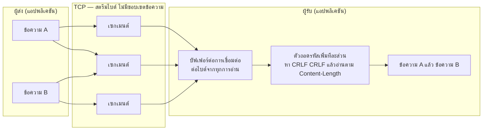
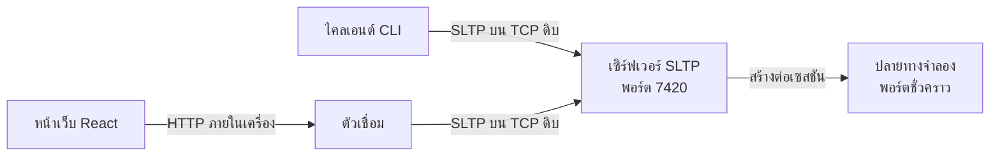

# โครงร่างการนำเสนอ SocketLens TCP

**รายวิชา** 01418351 Computer Communications and Cloud Computing Principles มหาวิทยาลัยเกษตรศาสตร์
**งานที่ได้รับมอบหมาย** โครงงานที่ 1 การเขียนโปรแกรมซ็อกเก็ต (Project 1: Socket Programming)
**เวลาที่จัดสรร** 15 นาที (นำเสนอ 12 นาที + ถามตอบ 3 นาที)
**รูปแบบ** สไลด์ประกอบการสาธิตสด
**บทสาธิตแบบละเอียดพร้อมคำสั่งที่ต้องพิมพ์** อยู่ใน [demo-script-th.md](demo-script-th.md)

> **สิ่งที่นำเสนอคือโพรโทคอล ไม่ใช่ซอฟต์แวร์**
>
> ผลงานหลักของโครงงานนี้คือ **SLTP** — ไวยากรณ์ข้อความ กลไกกำหนดขอบเขต การจับคู่คำขอกับคำตอบ
> ความหมายของรหัสสถานะ และพฤติกรรมเมื่อเกิดความผิดพลาด
> ส่วน CLI เซิร์ฟเวอร์ ตัวเชื่อม และหน้าเว็บ เป็น **เครื่องมือที่ใช้พิสูจน์ว่าโพรโทคอลทำงานถูกต้อง**
> เท่านั้น ทุกครั้งที่สาธิตความสามารถหนึ่ง ต้องบอกให้ได้ว่ามันพิสูจน์แนวคิดใดของโพรโทคอล
>
> **ห้ามใช้เวลาไปกับความสวยงามของหน้าเว็บ ประสบการณ์ผู้ใช้ หรือความสามารถของโปรแกรม
> ที่ไม่ใช่ส่วนหนึ่งของโพรโทคอล** เพราะไม่ได้คะแนนและกินเวลาที่ควรใช้อธิบายเครือข่าย

---

## ภาพรวมการจัดสรรเวลา

| ช่วง | เนื้อหา                                   | เวลา | สะสม  |
| ---- | ----------------------------------------- | ---- | ----- |
| 1    | ปัญหาขอบเขตข้อความของ TCP                 | 1:15 | 1:15  |
| 2    | ข้อกำหนดและการออกแบบ SLTP                 | 2:00 | 3:15  |
| 3    | อะไรทำให้ SLTP ต่างจากโพรโทคอลอื่น        | 1:30 | 4:45  |
| 4    | **สาธิตสด**                               | 3:15 | 8:00  |
| 5    | สิ่งที่โพรโทคอลยอมแลก และหลักฐานจากการวัด | 1:15 | 9:15  |
| 6    | **หลักฐานจากการจับแพ็กเก็ต**              | 2:15 | 11:30 |
| 7    | สรุปและข้อจำกัด                           | 0:30 | 12:00 |
| 8    | ถามตอบ                                    | 3:00 | 15:00 |

**ลำดับการเล่าเรื่อง** เจ็ดช่วงแรกเรียงตามลำดับที่ผู้ฟังต้องเข้าใจ คือ (1) TCP สร้างปัญหาอะไร
กับขอบเขตข้อความ (2) SLTP แก้ด้วยวิธีใด (3) อะไรทำให้โครงงานนี้ต่างจากงานอื่น
(4) หลักฐานจากการรันจริงและชุดทดสอบ (5) ผลการวัดและสิ่งที่ยอมแลก
(6) หลักฐานอิสระจากการจับแพ็กเก็ต (7) สรุปและข้อจำกัด

**หลักการจัดเวลา** ช่วงที่ 4 และ 6 คือหัวใจของการนำเสนอและต้องได้เวลาเต็ม หากช่วง 1 ถึง 3
ล่าช้า ให้ตัดเนื้อหาช่วง 3 ลง ไม่ใช่ตัดสองช่วงนั้น

**หมายเหตุเรื่องการปรับเวลา** ฉบับก่อนหน้าไม่มีช่วงจับแพ็กเก็ต เวลาที่เพิ่มขึ้น 2:15 นาที
มาจากการลดช่วง 1 ถึง 3 ลงรวม 1:15 นาที และลดช่วงสาธิตลง 1:15 นาที โดยตัดการสาธิต
ส่วนติดต่อกราฟิกออก (กล่าวถึงสั้น ๆ แทน) ยอดรวมยังคงเป็น 15 นาทีเท่าเดิม

---

## ช่วงที่ 1 — ปัญหาขอบเขตข้อความของ TCP (1:15)

### สไลด์ 1 — ชื่อเรื่อง

> **SocketLens TCP**
> เครื่องมือออกแบบ จำลอง ทดสอบ และตรวจสอบโปรโตคอลชั้นแอปพลิเคชันบนสตรีมไบต์ของ TCP
> โปรโตคอลที่ออกแบบเอง: SLTP — SocketLens Testing Protocol เวอร์ชัน 1.0
> Natthakit Jantawong

### สไลด์ 2 — โค้ดที่ดูเหมือนถูก

แสดงโค้ดนี้บนสไลด์และถามผู้ฟังว่ามีอะไรผิด

```js
socket.on('data', (chunk) => {
  const message = JSON.parse(chunk.toString());
  handle(message);
});
```

**สิ่งที่ต้องพูด**

"โค้ดสามบรรทัดนี้อยู่ในโปรเจกต์จำนวนมาก มันทำงานได้ตอนทดสอบบนเครื่องตัวเอง แล้วไปพังในระบบจริง
เพราะมันตั้งสมมติฐานสามข้อที่ TCP ไม่เคยรับประกันไว้เลย

หนึ่ง — เขียนหนึ่งครั้ง จะเกิดเหตุการณ์ data หนึ่งครั้ง
สอง — เหตุการณ์ data หนึ่งครั้ง จะได้ข้อความสมบูรณ์หนึ่งข้อความ
สาม — เหตุการณ์ data หนึ่งครั้ง จะได้ข้อความเพียงข้อความเดียว

ทั้งสามข้อผิดหมด และวันนี้ผมจะทำให้เห็นด้วยตาว่ามันผิดอย่างไร"

### สไลด์ 3 — ประโยคหลักของงาน

> **TCP เป็นสตรีมไบต์ที่เชื่อถือได้และรักษาลำดับ**
> **แต่ไม่รักษาขอบเขตของข้อความระดับแอปพลิเคชัน**

ประโยคนี้คือแกนของทั้งงาน ควรกล่าวซ้ำอีกครั้งในตอนสรุป

**ภาพที่ควรใช้ — ผู้ส่ง → สตรีมไบต์ → ตัวถอดรหัส**



**วิธีนำเสนอภาพนี้ — เปิดเผยทีละขั้น สามจังหวะ**

| จังหวะ | เปิดเผยอะไร          | พูดว่า                                                                |
| ------ | -------------------- | --------------------------------------------------------------------- |
| 1      | เฉพาะกล่องผู้ส่ง     | "แอปพลิเคชันคิดว่าตัวเองส่งข้อความสองข้อความ"                         |
| 2      | เพิ่มแถบ TCP ตรงกลาง | "แต่สิ่งที่วิ่งบนสายคือไบต์ต่อเนื่อง ไม่มีเครื่องหมายบอกขอบเขต"       |
| 3      | เพิ่มกล่องผู้รับ     | "ผู้รับจึงต้องมีบัฟเฟอร์และตัวถอดรหัส เพื่อประกอบขอบเขตกลับขึ้นมาเอง" |

**จุดที่ต้องชี้ให้เห็นในภาพ** เซกเมนต์กลางบรรจุ **ท้ายของข้อความ A กับหัวของข้อความ B**
อยู่ด้วยกัน โค้ดที่อ่านครั้งเดียวแล้วตีความทันทีแยกสองส่วนนี้ออกจากกันไม่ได้
เพราะในชั้นนั้นไม่มีอะไรให้แยก

การเปิดเผยทีละขั้นมีไว้เพื่อให้เข้าใจพฤติกรรมของ TCP ไม่ใช่เพื่อความสวยงาม
เอฟเฟกต์ที่ไม่ได้ช่วยอธิบายแนวคิดเครือข่ายให้ตัดออกทั้งหมด

---

## ช่วงที่ 2 — ข้อกำหนดและการออกแบบ SLTP (2:00)

### สไลด์ 4 — ข้อกำหนดที่โพรโทคอลต้องทำให้ได้

> ก่อนจะออกแบบรูปแบบข้อความ ต้องตอบให้ได้ก่อนว่า **โพรโทคอลนี้ต้องรับประกันอะไร**

| ข้อกำหนด                                                                        | รหัส  |
| ------------------------------------------------------------------------------- | ----- |
| วิ่งบน TCP ดิบด้วย `node:net` ห้ามมี HTTP ในเส้นทางของ SLTP                     | FR-1  |
| ข้อความมีบรรทัดเริ่มต้น ส่วนหัว ตัวคั่นสี่ไบต์ และเนื้อความตามความยาว           | FR-2  |
| ถอดรหัสแบบเพิ่มทีละส่วน รับไบต์เท่าใดก็ได้ คืนข้อความ 0, 1 หรือหลายข้อความ      | FR-3  |
| หนึ่งการเชื่อมต่อมีตัวถอดรหัสหนึ่งตัว ห้ามใช้ร่วมกัน                            | FR-4  |
| นับความยาวเนื้อความเป็น **ไบต์ UTF-8** ไม่ใช่จำนวนอักขระ                        | FR-5  |
| ปฏิเสธการกำหนดขอบเขตที่ผิด พร้อมเหตุผลที่โปรแกรมอ่านได้ และบอกว่าร้ายแรงหรือไม่ | FR-6  |
| บังคับขีดจำกัดขนาด และแยกกรณี "เกินขนาด" ออกจาก "รูปแบบผิด"                     | FR-8  |
| ไม่มีส่วนใดสมมติว่าการอ่านหนึ่งครั้งได้หนึ่งข้อความ                             | NFR-1 |
| การกำหนดขอบเขตมีที่เดียว ทุกไคลเอนต์ใช้ร่วมกัน ห้ามเขียนซ้ำ                     | NFR-2 |

**ประโยคที่ต้องพูด**

"ข้อกำหนดเก้าข้อนี้เป็นตัวกำหนดการออกแบบทั้งหมดที่จะเล่าต่อจากนี้ ทุกอย่างในสไลด์ถัดไป
ไม่ใช่การเลือกตามใจ แต่เป็นผลจากข้อกำหนดข้อใดข้อหนึ่งข้างต้น
และข้อที่สำคัญที่สุดคือ FR-3 กับ NFR-1 — **ห้ามสมมติว่าอ่านหนึ่งครั้งได้หนึ่งข้อความ**
เพราะ TCP ไม่เคยรับประกันเรื่องนั้น"

ข้อกำหนดฉบับเต็มอยู่ใน [requirements.md](requirements.md)

### สไลด์ 5 — โครงสร้างข้อความ

```
บรรทัดเริ่มต้น CRLF
ส่วนหัว CRLF ...
CRLF
เนื้อความ
```

คำขอ

```
SLTP/1.0 PING\r\n
Request-ID: req-1\r\n
\r\n
```

คำตอบ

```
SLTP/1.0 200 OK\r\n
Request-ID: req-1\r\n
Content-Type: application/json; charset=utf-8\r\n
Content-Length: 18\r\n
\r\n
{"message":"pong"}
```

**สิ่งที่ต้องพูด (10 วินาที ห้ามข้าม)**

"สังเกต `Request-ID: req-1` ปรากฏทั้งสองฝั่ง SLTP บังคับให้ทุกคำตอบส่งค่านี้กลับมา
ผลคือคำขอหลายรายการค้างอยู่บนการเชื่อมต่อเดียวกันได้ และคำตอบกลับมาไม่ตรงลำดับก็ยังจับคู่ถูก
HTTP/1.1 ไม่มีสิ่งนี้ จึงต้องอาศัยลำดับของคำตอบบนการเชื่อมต่อแทน"

### สไลด์ 6 — กลไกกำหนดขอบเขตสองชั้น

| ชั้น | กลไก               | บอกอะไร             |
| ---- | ------------------ | ------------------- |
| 1    | ตัวคั่น `\r\n\r\n` | ส่วนหัวจบตรงไหน     |
| 2    | `Content-Length`   | เนื้อความยาวกี่ไบต์ |

"สองชั้นนี้รวมกันทำให้ผู้รับคำนวณจุดสิ้นสุดของข้อความได้แน่นอน ไม่ต้องเดา"

### สไลด์ 7 — สไลด์ที่สำคัญที่สุดของช่วงนี้

> `Content-Length` คือ **ความยาวหน่วยไบต์แบบ UTF-8** ไม่ใช่จำนวนอักขระ

```
{"message":"pong","note":"ตอบกลับ"}

35 อักขระ  แต่  49 ไบต์
```

**สิ่งที่ต้องพูด**

"อักษรไทยเจ็ดตัวในคำว่า ตอบกลับ ใช้ตัวละ 3 ไบต์ รวม 21 ไบต์ บวกอักขระ ASCII อีก 28 ตัว ได้ 49 ไบต์

ถ้าเผลอใช้ `str.length` ซึ่งได้ 35 ผู้รับจะอ่านเนื้อความขาดไป 14 ไบต์ แล้ว 14 ไบต์ที่เหลือ
จะถูกตีความว่าเป็นจุดเริ่มต้นของข้อความถัดไป สตรีมทั้งเส้นจะเสียหายต่อเนื่องไปไม่มีที่สิ้นสุด

ในภาษาไทยข้อผิดพลาดนี้เห็นได้ทันที ในภาษาอังกฤษล้วนมันจะซ่อนตัวอยู่จนกว่าจะมีคนพิมพ์อีโมจิเข้ามา"

### สไลด์ 8 — ปฏิบัติการและรหัสสถานะ

**ทะเบียนมี 13 ปฏิบัติการ แต่บนเวทีพูดถึงเพียงหกรายการที่เล่าเรื่องได้ครบวงจร**
ไม่ต้องไล่ทั้งหมด เพราะกินเวลาและไม่เพิ่มความเข้าใจ

| ปฏิบัติการ       | ทำอะไร                                             |
| ---------------- | -------------------------------------------------- |
| `PING`           | ตรวจว่ามีชีวิต และรับเนื้อความได้ ใช้ในการสาธิต    |
| `CREATE_SESSION` | เปิดปลายทางจำลองเป็นพอร์ต TCP จริงของเซสชันนั้น    |
| `ADD_RULE`       | ตั้งกฎว่าจะตอบอะไร ด้วยความหน่วงหรือการแบ่งอย่างไร |
| `RUN_TEST`       | รันสถานการณ์บน TCP จริง แล้วตอบ 210 หรือ 211       |
| `GET_RESULT`     | คืนไบต์จริง จำนวนการเขียน จำนวนการอ่าน             |
| `CLOSE_SESSION`  | ปิดเซสชันและหยุดปลายทางจำลอง                       |

หกรายการนี้ครอบคลุมวงจรชีวิตทั้งหมด ที่เหลืออีกเจ็ดรายการเป็นการอ่านและแก้ไขข้อมูล
(`SERVER_INFO`, `GET_SESSION`, `LIST_SESSIONS`, `UPDATE_RULE`, `DELETE_RULE`,
`LIST_RULES`, `LIST_RESULTS`) — ระบุว่ามีอยู่ในทะเบียน แล้วผ่านไป

**23 รหัสสถานะ** แบ่งเป็นสามกลุ่ม

| กลุ่ม                 | ตัวอย่าง                                                                                                  |
| --------------------- | --------------------------------------------------------------------------------------------------------- |
| 2xx สำเร็จ            | 200 OK · 201 SESSION CREATED · **210 TEST PASSED** · **211 TEST FAILED** · 212 RULE ADDED                 |
| 4xx ผิดที่ไคลเอนต์    | 400 BAD REQUEST · 404 SESSION NOT FOUND · 408 TEST TIMEOUT · 413 MESSAGE TOO LARGE · 422 INVALID SCENARIO |
| 5xx ผิดที่เซิร์ฟเวอร์ | 500 INTERNAL SERVER ERROR · 503 SERVER UNAVAILABLE                                                        |

**ต้องพูดประโยคนี้** "รหัสเหล่านี้เป็นรหัสของ SLTP ผมนิยามความหมายและบริบทของทุกรหัสเอง
ไม่ใช่การหยิบรหัส HTTP มาใช้"

> **เตรียมคำตอบไว้ล่วงหน้า ไม่ต้องทำเป็นสไลด์** — คำถามนี้ถูกถามแทบทุกครั้ง
> ให้ตอบสด ๆ เมื่อถูกถาม เพื่อไม่ให้เสียเวลาบนเวที
>
> **ทำไม 211 TEST FAILED จึงเป็น 2xx**
> "เพราะรหัสสถานะอธิบายผลของคำขอ SLTP ไม่ได้อธิบายผลของการทดสอบ
>
> เมื่อส่ง RUN_TEST แล้วเซิร์ฟเวอร์รันสถานการณ์นั้นได้ เก็บผลได้ และตอบกลับครบถ้วน
> คำขอ SLTP นั้นสำเร็จโดยสมบูรณ์ การที่ผลเปรียบเทียบไม่ตรงเป้าเป็นเนื้อหาของคำตอบ ไม่ใช่ความล้มเหลวของโปรโตคอล
>
> เหมือนการวัดที่ได้ค่าไม่ตรงเป้า — การวัดสำเร็จ ค่าที่ได้เป็นอีกเรื่อง
>
> ส่วนกรณีที่สถานการณ์เขียนผิดจนรันไม่ได้เลย นั่นคือ 422 INVALID SCENARIO ซึ่งอยู่ใน 4xx"

### สไลด์ 9 — การล้มเหลวอย่างปลอดภัย

| ประเภท    | เกณฑ์                        | การกระทำ                                                |
| --------- | ---------------------------- | ------------------------------------------------------- |
| กู้คืนได้ | ยังหาจุดเริ่มข้อความถัดไปได้ | ตอบข้อผิดพลาด **เปิดการเชื่อมต่อไว้**                   |
| ร้ายแรง   | หาจุดเริ่มข้อความถัดไปไม่ได้ | ตอบข้อผิดพลาด + `Connection: close` **ปิดการเชื่อมต่อ** |

"ถ้า `Content-Length` ใช้การไม่ได้ ผมไม่รู้ว่าเนื้อความจบตรงไหน จึงไม่รู้ว่าข้อความถัดไปเริ่มตรงไหน
ถ้าเดาแล้วเดาผิด ไบต์ของเนื้อความจะถูกอ่านเป็นบรรทัดเริ่มต้นใหม่ เกิดข้อผิดพลาดต่อเนื่องไม่จบ
สภาวะนี้เรียกว่า decoder poisoning การปิดการเชื่อมต่อเป็นทางเลือกเดียวที่ตรงไปตรงมา"

---

## ช่วงที่ 3 — อะไรทำให้ SLTP ต่างจากโพรโทคอลอื่น (1:30)

### สไลด์ 10 — โปรแกรมมีไว้พิสูจน์อะไรของโพรโทคอล

> **โปรแกรมทั้งชุดคือเครื่องมือทดสอบโพรโทคอล ไม่ใช่ผลงานหลักในตัวเอง**
> ทุกความสามารถในตารางนี้มีอยู่เพื่อพิสูจน์พฤติกรรมของ SLTP หนึ่งข้อ

| ที่สาธิต                            | พิสูจน์แนวคิดใดของโพรโทคอล                            |
| ----------------------------------- | ----------------------------------------------------- |
| `PING` พร้อม `--raw`                | ไวยากรณ์คำขอ-คำตอบ และความหมายของรหัสสถานะ            |
| `CREATE_SESSION`                    | ความหมายของสถานะและเซสชันในโพรโทคอล                   |
| `ADD_RULE`                          | การกำหนดพฤติกรรมของปลายทางเพื่อทดสอบโพรโทคอล          |
| `RUN_TEST` → `210` หรือ `211`       | ความหมายของการควบคุมการทดสอบผ่านโพรโทคอล              |
| บังคับแบ่งข้อความหลายการเขียน       | การกำหนดขอบเขตข้อความถูกต้องบนสตรีมไบต์ของ TCP (FR-3) |
| บังคับรวมหลายข้อความในการเขียนเดียว | TCP ไม่รักษาขอบเขตข้อความระดับแอปพลิเคชัน             |
| `Content-Length` ที่ใช้การไม่ได้    | การตรวจสอบการกำหนดขอบเขตอย่างเข้มงวด (FR-6, FR-7)     |
| ตัดการเชื่อมต่อกลางเนื้อความ        | พฤติกรรมเมื่อข้อความไม่สมบูรณ์                        |
| `Request-ID`                        | การจับคู่คำขอกับคำตอบโดยไม่พึ่งลำดับ                  |
| ชุดทดสอบอัตโนมัติ 612 ข้อ           | ความถูกต้องของโพรโทคอลที่ขอบเขตของกรณีต่าง ๆ          |
| Wireshark                           | SLTP ปรากฏบนสตรีม TCP จริงอย่างไร                     |

**ประโยคที่ต้องพูด**

"ผมเขียน CLI เซิร์ฟเวอร์ ตัวเชื่อม และหน้าเว็บ แต่สิ่งที่ผมส่งเป็นผลงานคือ **โพรโทคอล**
โปรแกรมเหล่านั้นคือเครื่องมือที่ทำให้พิสูจน์ได้ว่าโพรโทคอลทำงานถูกต้อง
ถ้าไม่มีเครื่องมือ ผมก็อ้างได้แค่ว่าตัวถอดรหัสถูก แต่พิสูจน์ไม่ได้"

### สไลด์ 11 — สถาปัตยกรรม



**ประโยคที่ต้องพูดให้ชัด**

"ทั้ง `node:net` เท่านั้น ไม่มี HTTP ไม่มี Express ไม่มี WebSocket ในเส้นทางของ SLTP
ตัวเชื่อมมีเพราะเบราว์เซอร์เปิดซ็อกเก็ต TCP เองไม่ได้ — CLI ซึ่งเป็นไคลเอนต์หลักไม่ผ่านตัวเชื่อมเลย

และข้อสำคัญคือ **การกำหนดขอบเขตข้อความถูกเขียนไว้ที่เดียว** ทุกกล่องในภาพนี้เรียกใช้ตัวถอดรหัส
ตัวเดียวกัน ไม่มีไคลเอนต์ใดเขียนซ้ำ (NFR-2) ถ้ามีสามที่ ก็จะมีพฤติกรรมสามแบบ
และคำว่า 'โพรโทคอลเดียว' จะไม่เป็นความจริง"

### สไลด์ 12 — เหตุใดปลายทางจำลองต้องเป็นพอร์ต TCP จริง

"ทุกเซสชันเปิดพอร์ต TCP จริงที่ระบบปฏิบัติการจัดสรรให้ ผมเลือกทำแบบนี้เพราะถ้าจำลองในหน่วยความจำ
การแบ่งข้อความจะเป็นแค่การแกล้งทำ แต่เมื่อเป็นซ็อกเก็ตจริง การเรียก `write()` เจ็ดครั้งคือเจ็ดครั้งจริง
และปลายทางก็ต้องประกอบข้อความคืนจากไบต์ที่ทยอยมาถึงจริง"

---

### สไลด์ 13 — จุดเด่นที่แท้จริงของงานนี้

> **จุดเด่นของ SLTP ไม่ใช่ความเร็ว และไม่ใช่ความสามารถที่มาก**
> **แต่คือชั้นการกำหนดขอบเขตข้อความที่ตรวจสอบได้ทั้งหมด และความล้มเหลวที่สร้างซ้ำได้ตามสั่ง**

"โปรโตคอลบนสตรีมทุกตัวต้องแก้ปัญหาขอบเขตข้อความ แต่แทบไม่มีตัวไหนให้เรา **มองเห็น**
การแก้ปัญหานั้น และแทบไม่มีตัวไหนให้เรา **สั่งให้เกิดกรณียาก ๆ** ได้ตามต้องการ
เครื่องมือนี้ทำให้นักพัฒนาพูดได้ว่า 'ส่งข้อความนี้ด้วยการเขียนเจ็ดครั้ง ตัดตรงกลางตัวคั่น CRLF
แล้วบอกผมว่าปลายทางได้อะไร' — แล้วได้คำตอบเป็นไบต์จริง จำนวนการเขียน จำนวนการอ่าน
และจำนวนข้อความที่ประกอบได้"

## ช่วงที่ 4 — สาธิตสด — หลักฐานจากการรันจริง (3:15)

> เตรียมเทอร์มินัลไว้ก่อนขึ้นเวที รายละเอียดคำสั่งทั้งหมดอยู่ใน [demo-script-th.md](demo-script-th.md)

### สาธิต 1 — PING และ CREATE_SESSION (0:30)

แสดงล็อกที่พิมพ์ไบต์จริงทั้งสองทิศทาง

**สิ่งที่ต้องชี้ให้ดู**

- หัวข้อ `[CLIENT -> SERVER]` และ `[SERVER -> CLIENT]`
- `Request-ID` ในคำตอบเท่ากับในคำขอ
- `201 SESSION CREATED` พร้อมพอร์ตของปลายทางจำลอง

### สาธิต 2 — การแบ่งข้อความ (1:00) ⭐ สำคัญที่สุด

รันตัวอย่างที่ 5 สถานการณ์ `seven-fragments` ซึ่งส่งข้อความ 134 ไบต์ด้วยการเขียนของแอปพลิเคชัน
7 ครั้ง (การสาธิตด้วย Wireshark ในช่วงที่ 6 เป็นสถานการณ์ต่างหากที่เขียนหกครั้ง — อย่าสลับตัวเลข)

**สิ่งที่ต้องชี้ให้ดู**

- `sentSegmentCount: 7` — เขียนเจ็ดครั้ง (ฟิลด์นี้นับการเขียนของแอปพลิเคชัน ไม่ใช่เซกเมนต์ TCP)
- `responseCount: 1` — ปลายทางประกอบได้หนึ่งข้อความ
- ตำแหน่งการตัดที่จงใจให้ยาก โดยเฉพาะ **การตัดระหว่าง CR กับ LF**

**ประโยคปิด** "ผมตัดกลางตัวคั่นบรรทัด ตัดระหว่าง CR กับ LF ตัดหนึ่งไบต์ก่อนตัวคั่นส่วนหัวจะจบ
ตัวถอดรหัสยังประกอบได้ถูกต้อง แล้วอีกสถานการณ์หนึ่งผมส่งทีละหนึ่งไบต์ 134 ครั้ง ผลเหมือนกัน"

### สาธิต 3 — การรวมข้อความ (0:45) ⭐ สำคัญที่สุด

รันตัวอย่างที่ 6

**สิ่งที่ต้องชี้ให้ดู**

- `sentSegmentCount: 1` — เขียนครั้งเดียว
- `responseCount: 2` — ได้สองคำตอบ

**ประโยคปิด** "เขียนครั้งเดียว ได้สองคำตอบ นี่พิสูจน์ว่าปลายทางแยกข้อความด้วย `Content-Length`
ไม่ใช่ด้วยขอบเขตของแพ็กเก็ต ถ้าเขียนโค้ดแบบสไลด์ที่สองไว้ ข้อความที่สองจะหายไปเงียบ ๆ"

### สาธิต 4 — การทดสอบผ่านและไม่ผ่าน (0:30)

รันตัวอย่างที่ 3 แล้วตัวอย่างที่ 4

**สิ่งที่ต้องชี้ให้ดู**

- ตัวอย่าง 3 → `210 TEST PASSED`
- ตัวอย่าง 4 → `211 TEST FAILED` พร้อมรายการข้อที่ไม่ตรง 2 ข้อ

### สาธิต 5 — ความผิดพลาดและการหมดเวลา (0:30)

รันตัวอย่างที่ 8 แล้วตัวอย่างที่ 9

**สิ่งที่ต้องชี้ให้ดู**

- ตัวอย่าง 8 → หน่วง 2500 ms กับ timeout 500 ms → หมดเวลาตามที่คาดหวัง
- ตัวอย่าง 9 → `Content-Length: abc` → `400 BAD REQUEST` + `Reason: invalid-content-length` + `Connection: close`
- **เซิร์ฟเวอร์ยังทำงานอยู่** — สถานการณ์ถัดไปในตัวอย่างเดียวกันรันต่อได้

> **ส่วนติดต่อกราฟิกไม่ต้องสาธิตแยก** หากมีเวลาเหลือให้เปิดค้างไว้บนหน้าจอที่สองและกล่าวเพียงว่า
> "หนึ่งบรรทัดในไทม์ไลน์คือหนึ่งข้อความ SLTP ที่ประกอบสำเร็จ ไม่ใช่หนึ่งแพ็กเก็ต และไม่ใช่หนึ่งการเขียน"
> เวลาที่เคยใช้กับส่วนนี้ถูกย้ายไปช่วงที่ 6 ซึ่งให้หลักฐานที่หนักแน่นกว่า

---

## ช่วงที่ 5 — สิ่งที่โพรโทคอลยอมแลก และหลักฐานจากการวัด (1:15)

### สไลด์ 14 — ระดับของการทดสอบ (0:20)

| ระดับ                  | ขอบเขต                                                              |
| ---------------------- | ------------------------------------------------------------------- |
| หน่วยของโปรโตคอล       | ตัวเข้ารหัส ตัวถอดรหัส ตัวตรวจสอบ — กรณีการกำหนดขอบเขตที่ยากทั้งหมด |
| หน่วยของโดเมนหลัก      | การจับคู่กฎ ลำดับของกฎ การประเมินผลคาดหวัง                          |
| บูรณาการของเซิร์ฟเวอร์ | ซ็อกเก็ต TCP จริง วงจรชีวิตเซสชัน ความทนทาน                         |
| ไคลเอนต์ CLI           | การแจงตัวเลือก การจัดรูปแบบผลลัพธ์                                  |
| ตรวจสอบตัวอย่าง        | รันตัวอย่างทั้ง 11 ชุดกับเซิร์ฟเวอร์จริง                            |

> ตัวอย่างในเอกสารถูกตรวจสอบโดยอัตโนมัติ ถ้าเอกสารกับโปรแกรมไม่ตรงกันเมื่อใด
> `npm run examples` จะจบด้วยข้อผิดพลาดทันที

ตัวเลขที่รันได้จริงอยู่ใน [test-results.md](test-results.md) — อ้างอิงจากไฟล์นั้น ไม่ควรจำตัวเลขมาพูดเอง

### สไลด์ 15 — สิ่งที่ SLTP ยอมแลก และหลักฐานจากการวัด (0:55)

> **สไลด์นี้ไม่ใช่สไลด์อวดความเร็ว** เป็นสไลด์อธิบาย **การตัดสินใจเชิงออกแบบ**
> ว่า SLTP เลือกความเข้มงวดในการตรวจสอบ แล้วจ่ายราคาเป็นอัตราส่งผ่าน
> วิชานี้เป็นวิชาเครือข่าย ประเด็นคือเหตุผลของการออกแบบ ไม่ใช่ตัวเลขที่สูงกว่า

วัดจริงด้วย `npm run benchmark` ไม่ใช่การคาดเดา วัดบน Windows, Node v26.5.1,
AMD Ryzen 7 7840HS, loopback, การเชื่อมต่อเดียวที่ใช้ซ้ำ ส่งทีละคำขอ
2000 รอบหลังอุ่นเครื่อง 500 รอบ วัด 10 รอบ รายงานเป็นค่ามัธยฐาน

| ขนาดเพย์โหลด | SLTP/1.0 (`node:net`) | HTTP/1.1 เขียนเอง (`node:net`) | HTTP/1.1 (`node:http`) |
| ------------ | --------------------- | ------------------------------ | ---------------------- |
| ว่าง         | 27,458 req/s          | **33,134 req/s**               | 12,387 req/s           |
| 128 B        | 23,501 req/s          | **30,221 req/s**               | 10,681 req/s           |
| 16 KiB       | 6,565 req/s           | **11,980 req/s**               | 6,581 req/s            |

**ข้อสรุปที่ต้องพูดตรง ๆ ไม่ต้องเลี่ยง**

> **SLTP ไม่ได้เร็วกว่า HTTP/1.1 — ช้ากว่า 1.21 ถึง 1.82 เท่า (มัธยฐาน)**
> **และแพ้ 39 จาก 40 รอบที่เทียบกันเป็นคู่**

"ผมวัดสามแบบ ไม่ใช่สองแบบ เพราะถ้าเทียบ SLTP กับ `node:http` เพียงอย่างเดียวจะได้ผลที่
ดูดีแต่ไม่ยุติธรรม — `node:http` เป็นสแตกใช้งานทั่วไปที่สร้างอ็อบเจ็กต์สตรีมทุกคำขอ
ผมจึงเขียนตัวอ่าน HTTP/1.1 แบบมินิมอลขึ้นมาอีกตัวให้เทียบกันตรง ๆ แล้วผลคือ **ของผมช้ากว่า**

สาเหตุไม่ใช่วิธีกำหนดขอบเขต เพราะโปรแกรมทั้งสองที่นำมาวัดใช้วิธีที่เทียบเคียงกันได้
คือบล็อกส่วนหัวคั่นด้วย CRLF และอ่านความยาวเนื้อความจาก `Content-Length`
ไม่ได้หมายความว่าทั้งสองเป็นโพรโทคอลที่เหมือนกัน เพราะความหมายของข้อความและวิธีส่งเนื้อความต่างกัน
สาเหตุคือตัวถอดรหัสของ SLTP **ตรวจสอบมากกว่า** — ตรวจชื่อและค่าของทุก
ส่วนหัวตามไวยากรณ์ ปฏิเสธส่วนหัวที่ห้ามซ้ำ บังคับขีดจำกัดสี่อย่าง และตรวจโทเคนปฏิบัติการ
กับทะเบียน ความเข้มงวดนี้คือสิ่งที่เครื่องมือวินิจฉัยบั๊กต้องมี และนี่คือราคาที่จ่าย"

**ตัวเลขที่ต้องเตรียมตอบ** ความแปรปรวนแบบต่ำสุด-สูงสุดสูงถึง 53.9% จึงไม่ตัดสินด้วยขนาดผลต่าง
แต่ใช้ paired sign test เทียบรายรอบ ที่ 16 KiB ระหว่าง SLTP กับ `node:http` สรุปว่า
**ไม่มีผู้ชนะที่คงเส้นคงวา** (4 จาก 10 รอบ, p = 0.754) และผลบน loopback ทำนายผลบน LAN หรือ WAN ไม่ได้

**ห้ามพูดเกินจริงเรื่อง `node:http`** ตัวเลขที่ SLTP ชนะ `node:http` เป็นการเทียบกับ
**สแตกใช้งานทั่วไปของไลบรารีหนึ่ง** ไม่ใช่การเทียบกับโพรโทคอล HTTP/1.1 และใช้อ้างว่า
"SLTP เร็วกว่า HTTP" ไม่ได้เลย ถ้าถูกถามเรื่องความเร็ว ให้ตอบด้วยผลของ HTTP/1.1 เขียนเอง
ซึ่งเป็นการเทียบที่ยุติธรรม และผลคือ SLTP ช้ากว่า

**ประโยคปิดสไลด์นี้ — ต้องกลับมาที่โพรโทคอล**

"ที่วัดมาทั้งหมดยืนยันว่าจุดเด่นของ SLTP ไม่ใช่ความเร็ว จุดเด่นคือ **ตรวจสอบได้ เข้มงวด
และสร้างความล้มเหลวซ้ำได้ตามสั่ง** ความช้าที่เห็นคือราคาของความเข้มงวดนั้น
โพรโทคอลที่ยอมรับ `Content-Length: -5` จะเร็วกว่านี้ และใช้วินิจฉัยบั๊กไม่ได้เลย"

รายละเอียดทั้งหมดอยู่ใน [evaluation.md](evaluation.md) และวิธีการวัดอยู่ใน
[../benchmarks/README.md](../benchmarks/README.md)

---

## ช่วงที่ 6 — หลักฐานจากการจับแพ็กเก็ตด้วย Wireshark (2:15)

> ขั้นตอนละเอียดทั้งหมดอยู่ใน [wireshark-capture.md](wireshark-capture.md)
> **ต้องเปิดการจับแพ็กเก็ตไว้ก่อนขึ้นเวที** และต้องติดตั้ง Npcap โดยเลือก "Support loopback traffic"
> ไว้แล้ว มิฉะนั้นจะไม่เห็นทราฟฟิกของ 127.0.0.1 เลย

### สไลด์ 16 — เหตุใดต้องจับแพ็กเก็ต

> ชุดทดสอบอัตโนมัติพิสูจน์ว่า **ตัวถอดรหัส** ทำงานถูกต้องเมื่อได้รับข้อมูลเป็นชิ้น ๆ ตามที่กำหนด
> แต่พิสูจน์ไม่ได้ว่า **ระบบปฏิบัติการ** ส่งอะไรออกไปบนสายจริง ๆ
> การจับแพ็กเก็ตคือหลักฐานอิสระที่เติมช่องว่างนี้

"สิ่งที่ผมจะแสดงต่อไปนี้ไม่ได้มาจากล็อกของโปรแกรมตัวเอง แต่มาจากเครื่องมือภายนอก
ที่ไม่รู้จักโปรโตคอลของผมเลย"

### การสาธิต — ลำดับ 6 ขั้น (1:45)

ใช้ `npm run wireshark:demo` ซึ่งพิมพ์พอร์ตปลายทางฝั่งเครื่องเราและตัวกรองที่พร้อมคัดลอก
ไปวางใน Wireshark ทันที

| ขั้น | คำสั่งหรือการกระทำ                                                  | ประโยคที่ต้องพูด                                                                                                               |
| ---- | ------------------------------------------------------------------- | ------------------------------------------------------------------------------------------------------------------------------ |
| 1    | ชี้ที่ตัวกรอง `tcp.port == 7420` ที่ตั้งไว้แล้ว                     | "TCP จริงบน loopback พอร์ต 7420 ไม่มี HTTP อยู่ที่ใดเลย"                                                                       |
| 2    | `npm run wireshark:demo -- --scenario ping`                         | "หนึ่งคำขอ หนึ่งคำตอบ"                                                                                                         |
| 3    | คลิกขวา → Follow → TCP Stream                                       | "`SLTP/1.0 PING` — บรรทัดเริ่มต้นของเราเอง ไม่มีเมท็อด ไม่มีพาธ ไม่มี `Host`"                                                  |
| 4    | ชี้ที่ `Request-ID` แล้ว `Content-Length` แล้วบรรทัดสถานะของคำตอบ   | "รหัสเดียวกันทั้งสองทาง คำตอบจึงกลับมาไม่ตามลำดับได้ และความยาวนับเป็นไบต์"                                                    |
| 5    | `--scenario fragmentation` แล้วใส่ตัวกรอง `tcp.len > 0` นับเซกเมนต์ | "สถานการณ์ `fragmentation` ของตัวสร้างทราฟฟิกเรียก `write()` 6 ครั้ง แต่จำนวนเซกเมนต์ที่เห็นเป็นเรื่องที่ระบบปฏิบัติการตัดสิน" |
| 6    | `--scenario coalescing` แล้ว Follow TCP Stream                      | "เขียนครั้งเดียว ได้สองข้อความ ไม่มีตัวคั่นระหว่างกัน มีแต่ `Content-Length`"                                                  |

### สไลด์ 17 — ประโยคสำคัญที่สุดของช่วงนี้ (0:30)

> **การเขียน 1 ครั้ง ≠ เซกเมนต์ TCP 1 เซกเมนต์ ≠ ข้อความ 1 ข้อความ**
>
> เป็นตัวเลขสามตัวที่ต่างกัน และ Wireshark ทำให้เห็นว่าต่างกันจริง

"ในสถานการณ์ `fragmentation` ของตัวสร้างทราฟฟิก Wireshark โปรแกรมเรียก `socket.write()`
**หกครั้ง** (คนละสถานการณ์กับตัวอย่างที่ 5 ซึ่งเขียนเจ็ดครั้ง) — นั่นเป็นข้อเท็จจริงของ
โปรแกรม ส่วนจำนวนเซกเมนต์ TCP ที่บรรจุไบต์เหล่านั้นเป็นการตัดสินใจของระบบปฏิบัติการ
ขึ้นกับอัลกอริทึมของ Nagle หน้าต่างความคับคั่ง และ MTU ของเส้นทาง
บน loopback ของ Windows ค่า MSS ใหญ่มาก ข้อความทั้งข้อความจึงใส่ในเซกเมนต์เดียวได้สบาย
สิ่งที่ทำให้การเขียนหกครั้งไม่ถูกรวมเข้าด้วยกันคือการหน่วง 30 มิลลิวินาทีระหว่างการเขียน
แต่ไม่ว่าจะได้กี่เซกเมนต์ ปลายทางประกอบได้ **หนึ่งข้อความ** เสมอ"

**ต้องระวังไม่พูดผิด** อย่าพูดว่า "เขียนหกครั้งคือหกแพ็กเก็ต" เพราะไม่จริง
และกรรมการที่รู้เรื่อง TCP จะจับได้ทันที ให้พูดว่า "เขียนหกครั้ง" เสมอ
และอย่าสลับตัวเลขของสองการสาธิต — ตัวอย่างที่ 5 คือเจ็ดครั้ง สถานการณ์ `fragmentation`
ของตัวสร้างทราฟฟิกคือหกครั้ง

### สิ่งที่การจับแพ็กเก็ตพิสูจน์และไม่พิสูจน์

| พิสูจน์ได้                                   | พิสูจน์ไม่ได้                                                       |
| -------------------------------------------- | ------------------------------------------------------------------- |
| เป็น TCP จริง มีการจับมือสามทางจริง          | ตัวถอดรหัสถูกต้องหรือไม่ — นั่นคือหน้าที่ของชุดทดสอบ 55 ข้อ         |
| ไบต์บนสายคือข้อความ SLTP ตามที่โปรแกรมรายงาน | โปรแกรมได้รับข้อมูลเป็นกี่ `data` event — Wireshark เห็นแต่เซกเมนต์ |
| ขอบเขตการเขียนกับขอบเขตเซกเมนต์เป็นสองเรื่อง | พฤติกรรมบนเครือข่ายจริง — loopback มี MSS ใหญ่และไม่มีการสูญหาย     |
| `Content-Length` ตรงกับจำนวนไบต์จริง         | ประสิทธิภาพ — การจับแพ็กเก็ตรบกวนการจับเวลา                         |

---

## ช่วงที่ 7 — สรุปและข้อจำกัด (0:30)

### สไลด์ 18 — ข้อจำกัดที่ยอมรับไว้อย่างชัดเจน

| ข้อจำกัด                | เหตุผล                                                |
| ----------------------- | ----------------------------------------------------- |
| เก็บข้อมูลในหน่วยความจำ | เป็นเครื่องมือทดสอบ ไม่ใช่ระบบเก็บบันทึก              |
| ไม่มีระบบยืนยันตัวตน    | ทำงานบน loopback บนเครื่องนักพัฒนาเอง                 |
| รองรับเฉพาะ TCP         | เป็นการเลือกโดยเจตนา เพราะ TCP คือสิ่งที่ต้องการศึกษา |

"สามข้อนี้เป็นการตัดสินใจ ไม่ใช่สิ่งที่มองข้าม และข้อสรุปเชิงปฏิบัติคือต้องไม่นำระบบนี้ไปเปิดรับ
การเชื่อมต่อจากเครือข่ายที่ไม่น่าเชื่อถือ"

### สไลด์ 19 — การพัฒนาต่อ

- เก็บข้อมูลถาวรลงฐานข้อมูล
- **รองรับ UDP เพื่อการเปรียบเทียบ** ให้เห็นความต่างของดาตาแกรมกับสตรีมอย่างชัดเจน
- รองรับ QUIC เพื่อศึกษาการกำหนดขอบเขตบนโปรโตคอลหลายสตรีม
- ปลั๊กอินไวยากรณ์ ให้ผู้ใช้กำหนดรูปแบบข้อความของตนเอง

### สไลด์ 20 — สรุป

> **TCP เป็นสตรีมไบต์ที่เชื่อถือได้และรักษาลำดับ**
> **แต่ไม่รักษาขอบเขตของข้อความระดับแอปพลิเคชัน**
>
> วันนี้เห็นแล้วว่าข้อความหนึ่งข้อความส่งด้วยการเขียนเจ็ดครั้งได้ (ตัวอย่างที่ 5)
> และสองข้อความส่งด้วยการเขียนครั้งเดียวได้ (ตัวอย่างที่ 6)
> ตัวถอดรหัสที่ถูกต้องต้องรับมือได้ทั้งสองกรณี

---

## ช่วงที่ 8 — ถามตอบ (3:00)

แนวคำตอบของคำถามที่คาดว่าจะถูกถามอยู่ใน [anticipated-questions-th.md](anticipated-questions-th.md)
ควรอ่านซ้ำก่อนขึ้นนำเสนอ คำถามที่มีโอกาสถูกถามสูงสุดสามข้อ

1. ทำไมไม่ใช้ UDP
2. ทำไม 211 TEST FAILED เป็น 2xx
3. ตัวเชื่อมใช้ HTTP ถือว่าผิดเงื่อนไขหรือไม่
4. **SLTP เร็วกว่า HTTP ไหม** — ตอบว่าไม่ ช้ากว่า 1.2–1.8 เท่า และอธิบายว่าเพราะตรวจสอบมากกว่า
5. **ถ้า HTTP เร็วกว่าแล้วทำ SLTP ไปทำไม** — เพราะถ้าใช้ HTTP จะไม่เหลือหัวข้อให้ศึกษา
6. **การเขียน 1 ครั้งเท่ากับ 1 แพ็กเก็ตไหม** — ไม่ และ Wireshark แสดงให้เห็นแล้ว

---

## สิ่งที่ผู้ฟังต้องเข้าใจเมื่อจบการนำเสนอ

ตารางนี้ไม่ต้องพูดบนเวที ใช้ตรวจสอบตัวเองว่าโครงร่างครอบคลุมสิบข้อนี้ครบ
ถ้าซ้อมแล้วข้อใดยังไม่ชัด ให้แก้สไลด์ที่ระบุไว้ ไม่ใช่เพิ่มเวลา

| #   | ผู้ฟังต้องเข้าใจว่า                                                        | ส่งมอบที่                     |
| --- | -------------------------------------------------------------------------- | ----------------------------- |
| 1   | SLTP แก้ปัญหาอะไร                                                          | ช่วง 1, สไลด์ 1–3             |
| 2   | โพรโทคอลต้องทำอะไรได้บ้าง (ข้อกำหนด)                                       | ช่วง 2, สไลด์ 4               |
| 3   | กำหนดขอบเขตข้อความอย่างไร (`\r\n\r\n` + `Content-Length` นับเป็นไบต์)      | ช่วง 2, สไลด์ 6–7             |
| 4   | จับคู่คำขอกับคำตอบอย่างไร (`Request-ID` ไม่ขึ้นกับลำดับ)                   | สไลด์ 5 และ 10, ช่วง 6 ขั้น 4 |
| 5   | รหัสสถานะและความหมายของข้อผิดพลาด (รวม `211` เป็น 2xx และทะเบียน `Reason`) | ช่วง 2, สไลด์ 8–9             |
| 6   | TCP เป็นสตรีมไบต์ จึงไม่รักษาขอบเขตข้อความ                                 | ช่วง 1 สไลด์ 3 + ช่วง 6       |
| 7   | รับมือข้อความที่ถูกแบ่ง รวมกัน ไม่สมบูรณ์ และผิดรูปแบบอย่างไร              | ช่วง 4 ขั้น 3–6               |
| 8   | การนำไปสร้างจริงพิสูจน์ความถูกต้องอย่างไร (ชุดทดสอบและตัวอย่าง)            | สไลด์ 10, ช่วง 4, สไลด์ 14    |
| 9   | Wireshark แสดงอะไร และไม่ได้แสดงอะไร                                       | ช่วง 6, สไลด์ 16–17           |
| 10  | สิ่งที่ยอมแลกเมื่อเทียบกับ HTTP/1.1                                        | ช่วง 5, สไลด์ 15              |

ข้อ 6, 7 และ 9 คือแกนของวิชาเครือข่าย หากเวลาไม่พอ ให้ตัดข้อ 10 ก่อน แล้วจึงข้อ 2

---

## รายการตรวจสอบก่อนขึ้นนำเสนอ

- [ ] `npm run build` สำเร็จ
- [ ] เซิร์ฟเวอร์เริ่มทำงานได้ และพอร์ต 7420 ว่างอยู่
- [ ] ตัวเชื่อมและหน้าเว็บเปิดได้
- [ ] `npm run examples` รันผ่านครบทุกตัวอย่าง
- [ ] `npm run benchmark` รันได้ และจำตัวเลขสำคัญสามตัวได้ (27,458 / 33,134 / 12,387 req/s ที่เพย์โหลดว่าง เป็นค่ามัธยฐาน)
- [ ] **ติดตั้ง Npcap โดยเลือก "Support loopback traffic" แล้ว**
- [ ] **เปิด Wireshark เห็น "Adapter for loopback traffic capture" ในรายการอินเทอร์เฟซ**
- [ ] **ทดสอบ `npm run wireshark:demo -- --scenario ping` แล้วเห็นแพ็กเก็ตใน Wireshark จริง**
- [ ] **บันทึกไฟล์ `.pcapng` สำรองไว้แล้ว เผื่อการจับแพ็กเก็ตสดล้มเหลว**
- [ ] ตั้งตัวกรอง `tcp.port == 7420` ไว้ล่วงหน้า
- [ ] ขนาดตัวอักษรในเทอร์มินัลใหญ่พอให้คนแถวหลังอ่านได้ และขยายแบบอักษรใน Wireshark ด้วย (Ctrl +)
- [ ] ปิดการแจ้งเตือนทั้งหมดบนเครื่อง
- [ ] เตรียมภาพหน้าจอสำรองไว้ เผื่อการสาธิตสดล้มเหลว — รายการที่ควรถ่ายอยู่ใน [wireshark-capture.md](wireshark-capture.md) หัวข้อที่ 10
- [ ] ซ้อมช่วงสาธิตและช่วงจับแพ็กเก็ตอย่างน้อยสองรอบเพื่อคุมเวลา

## แผนสำรองเมื่อการสาธิตล้มเหลว

หากเซิร์ฟเวอร์ไม่ทำงานบนเวที ให้เปลี่ยนไปใช้ภาพหน้าจอที่เตรียมไว้ พร้อมกล่าวว่า
"ผมเตรียมผลการรันไว้แล้ว และผลนี้ตรวจสอบซ้ำได้ด้วยคำสั่ง `npm run examples`"
อย่าใช้เวลาแก้ปัญหาบนเวทีเกิน 30 วินาที เพราะจะกินเวลาช่วงอื่นทั้งหมด

**หากการจับแพ็กเก็ตสดล้มเหลว** ให้เปิดไฟล์ `.pcapng` ที่บันทึกไว้ล่วงหน้าด้วย File → Open
ทุกขั้นตอนในช่วงที่ 6 ทำได้เหมือนกันหมดบนไฟล์ที่บันทึกไว้ และนี่ควรเป็นแผนหลักหากต้อง
นำเสนอบนเครื่องของคนอื่น หากเปิดไฟล์ไม่ได้ด้วย ให้ใช้
`npm run cli -- run --operation PING --fragment 12,8,40 --raw`
ซึ่งพิมพ์ไบต์จริงทั้งสองทิศทางพร้อมจำนวนการเขียน จำนวนการอ่าน และจำนวนข้อความที่ประกอบได้
เป็นการให้เหตุผลเดียวกันโดยไม่ต้องใช้การจับแพ็กเก็ต
