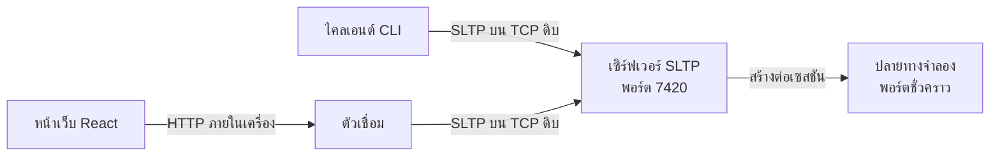

# โครงร่างการนำเสนอ SocketLens TCP

**รายวิชา** 01418351 Computer Communications and Cloud Computing Principles มหาวิทยาลัยเกษตรศาสตร์
**งานที่ได้รับมอบหมาย** โครงงานที่ 1 การเขียนโปรแกรมซ็อกเก็ต (Project 1: Socket Programming)
**เวลาที่จัดสรร** 15 นาที (นำเสนอ 12 นาที + ถามตอบ 3 นาที)
**รูปแบบ** สไลด์ประกอบการสาธิตสด
**บทสาธิตแบบละเอียดพร้อมคำสั่งที่ต้องพิมพ์** อยู่ใน [demo-script-th.md](demo-script-th.md)

---

## ภาพรวมการจัดสรรเวลา

| ช่วง | เนื้อหา                       | เวลา | สะสม  |
| ---- | ----------------------------- | ---- | ----- |
| 1    | เปิดเรื่อง — ปัญหาที่พบจริง   | 1:30 | 1:30  |
| 2    | แนะนำเครื่องมือและสถาปัตยกรรม | 2:00 | 3:30  |
| 3    | การออกแบบโปรโตคอล SLTP        | 2:30 | 6:00  |
| 4    | **สาธิตสด**                   | 4:30 | 10:30 |
| 5    | การทดสอบและผลลัพธ์            | 1:00 | 11:30 |
| 6    | ข้อจำกัดและการพัฒนาต่อ        | 0:30 | 12:00 |
| 7    | ถามตอบ                        | 3:00 | 15:00 |

**หลักการจัดเวลา** ช่วงสาธิตคือช่วงที่สำคัญที่สุดและต้องได้เวลาเต็ม หากช่วง 1 ถึง 3 ล่าช้า
ให้ตัดเนื้อหาช่วง 3 ลง ไม่ใช่ตัดช่วงสาธิต

---

## ช่วงที่ 1 — เปิดเรื่อง (1:30)

### สไลด์ 1 — ชื่อเรื่อง

> **SocketLens TCP**
> เครื่องมือออกแบบ จำลอง ทดสอบ และตรวจสอบโปรโตคอลชั้นแอปพลิเคชันบนสตรีมไบต์ของ TCP
> โปรโตคอลที่ออกแบบเอง: SLTP — SocketLens Testing Protocol เวอร์ชัน 1.0
> Natthakit Jantawong

### สไลด์ 2 — โค้ดที่ดูเหมือนถูก

แสดงโค้ดนี้บนสไลด์และถามผู้ฟังว่ามีอะไรผิด

```js
socket.on('data', (chunk) => {
  const message = JSON.parse(chunk.toString());
  handle(message);
});
```

**สิ่งที่ต้องพูด**

"โค้ดสามบรรทัดนี้อยู่ในโปรเจกต์จำนวนมาก มันทำงานได้ตอนทดสอบบนเครื่องตัวเอง แล้วไปพังในระบบจริง
เพราะมันตั้งสมมติฐานสามข้อที่ TCP ไม่เคยรับประกันไว้เลย

หนึ่ง — เขียนหนึ่งครั้ง จะเกิดเหตุการณ์ data หนึ่งครั้ง
สอง — เหตุการณ์ data หนึ่งครั้ง จะได้ข้อความสมบูรณ์หนึ่งข้อความ
สาม — เหตุการณ์ data หนึ่งครั้ง จะได้ข้อความเพียงข้อความเดียว

ทั้งสามข้อผิดหมด และวันนี้ผมจะทำให้เห็นด้วยตาว่ามันผิดอย่างไร"

### สไลด์ 3 — ประโยคหลักของงาน

> **TCP เป็นสตรีมไบต์ที่เชื่อถือได้และรักษาลำดับ**
> **แต่ไม่รักษาขอบเขตของข้อความระดับแอปพลิเคชัน**

ประโยคนี้คือแกนของทั้งงาน ควรกล่าวซ้ำอีกครั้งในตอนสรุป

---

## ช่วงที่ 2 — เครื่องมือและสถาปัตยกรรม (2:00)

### สไลด์ 4 — เครื่องมือนี้ทำอะไร

| ความสามารถ                              | ประโยชน์                                |
| --------------------------------------- | --------------------------------------- |
| สร้างเซสชันทดสอบที่แยกจากกัน            | ทดสอบหลายชุดพร้อมกันโดยไม่รบกวนกัน      |
| กำหนดกฎจำลองการตอบกลับ                  | ทดสอบได้โดยไม่ต้องมีระบบปลายทางจริง     |
| **บังคับให้ข้อความถูกแบ่งเป็นหลายส่วน** | ทำให้บั๊กของตัวถอดรหัสปรากฏทันที        |
| **บังคับให้หลายข้อความมาพร้อมกัน**      | ทดสอบว่าโปรแกรมแยกข้อความถูกต้องหรือไม่ |
| ใส่ความหน่วงและทดสอบการหมดเวลา          | ทดสอบพฤติกรรมเมื่อปลายทางช้า            |
| ส่งข้อความผิดรูปแบบ                     | ทดสอบว่าโปรแกรมล้มเหลวอย่างปลอดภัย      |
| เปรียบเทียบผลคาดหวังกับผลจริง           | ได้ผลผ่านหรือไม่ผ่านที่ชัดเจน           |

### สไลด์ 5 — สถาปัตยกรรม



**ประโยคที่ต้องพูดให้ชัด**

"ทั้ง `node:net` เท่านั้น ไม่มี HTTP ไม่มี Express ไม่มี WebSocket ในเส้นทางของ SLTP
ตัวเชื่อมมีเพราะเบราว์เซอร์เปิดซ็อกเก็ต TCP เองไม่ได้ — CLI ซึ่งเป็นไคลเอนต์หลักไม่ผ่านตัวเชื่อมเลย"

### สไลด์ 6 — เหตุใดปลายทางจำลองต้องเป็นพอร์ต TCP จริง

"ทุกเซสชันเปิดพอร์ต TCP จริงที่ระบบปฏิบัติการจัดสรรให้ ผมเลือกทำแบบนี้เพราะถ้าจำลองในหน่วยความจำ
การแบ่งข้อความจะเป็นแค่การแกล้งทำ แต่เมื่อเป็นซ็อกเก็ตจริง การเรียก `write()` เจ็ดครั้งคือเจ็ดครั้งจริง
และปลายทางก็ต้องประกอบข้อความคืนจากไบต์ที่ทยอยมาถึงจริง"

---

## ช่วงที่ 3 — การออกแบบโปรโตคอล SLTP (2:30)

### สไลด์ 7 — โครงสร้างข้อความ

```
บรรทัดเริ่มต้น CRLF
ส่วนหัว CRLF ...
CRLF
เนื้อความ
```

คำขอ

```
SLTP/1.0 PING\r\n
Request-ID: req-1\r\n
\r\n
```

คำตอบ

```
SLTP/1.0 200 OK\r\n
Request-ID: req-1\r\n
Content-Type: application/json; charset=utf-8\r\n
Content-Length: 18\r\n
\r\n
{"message":"pong"}
```

### สไลด์ 8 — กลไกกำหนดขอบเขตสองชั้น

| ชั้น | กลไก               | บอกอะไร             |
| ---- | ------------------ | ------------------- |
| 1    | ตัวคั่น `\r\n\r\n` | ส่วนหัวจบตรงไหน     |
| 2    | `Content-Length`   | เนื้อความยาวกี่ไบต์ |

"สองชั้นนี้รวมกันทำให้ผู้รับคำนวณจุดสิ้นสุดของข้อความได้แน่นอน ไม่ต้องเดา"

### สไลด์ 9 — สไลด์ที่สำคัญที่สุดของช่วงนี้

> `Content-Length` คือ **ความยาวหน่วยไบต์แบบ UTF-8** ไม่ใช่จำนวนอักขระ

```
{"message":"pong","note":"ตอบกลับ"}

35 อักขระ  แต่  49 ไบต์
```

**สิ่งที่ต้องพูด**

"อักษรไทยเจ็ดตัวในคำว่า ตอบกลับ ใช้ตัวละ 3 ไบต์ รวม 21 ไบต์ บวกอักขระ ASCII อีก 28 ตัว ได้ 49 ไบต์

ถ้าเผลอใช้ `str.length` ซึ่งได้ 35 ผู้รับจะอ่านเนื้อความขาดไป 14 ไบต์ แล้ว 14 ไบต์ที่เหลือ
จะถูกตีความว่าเป็นจุดเริ่มต้นของข้อความถัดไป สตรีมทั้งเส้นจะเสียหายต่อเนื่องไปไม่มีที่สิ้นสุด

ในภาษาไทยข้อผิดพลาดนี้เห็นได้ทันที ในภาษาอังกฤษล้วนมันจะซ่อนตัวอยู่จนกว่าจะมีคนพิมพ์อีโมจิเข้ามา"

### สไลด์ 10 — ปฏิบัติการและรหัสสถานะ

**13 ปฏิบัติการ** — PING, SERVER_INFO, CREATE_SESSION, GET_SESSION, LIST_SESSIONS,
ADD_RULE, UPDATE_RULE, DELETE_RULE, LIST_RULES, RUN_TEST, GET_RESULT, LIST_RESULTS, CLOSE_SESSION

**23 รหัสสถานะ** แบ่งเป็นสามกลุ่ม

| กลุ่ม                 | ตัวอย่าง                                                                                                  |
| --------------------- | --------------------------------------------------------------------------------------------------------- |
| 2xx สำเร็จ            | 200 OK · 201 SESSION CREATED · **210 TEST PASSED** · **211 TEST FAILED** · 212 RULE ADDED                 |
| 4xx ผิดที่ไคลเอนต์    | 400 BAD REQUEST · 404 SESSION NOT FOUND · 408 TEST TIMEOUT · 413 MESSAGE TOO LARGE · 422 INVALID SCENARIO |
| 5xx ผิดที่เซิร์ฟเวอร์ | 500 INTERNAL SERVER ERROR · 503 SERVER UNAVAILABLE                                                        |

**ต้องพูดประโยคนี้** "รหัสเหล่านี้เป็นรหัสของ SLTP ผมนิยามความหมายและบริบทของทุกรหัสเอง
ไม่ใช่การหยิบรหัส HTTP มาใช้"

### สไลด์ 11 — คำถามที่กรรมการมักถาม เตรียมตอบไว้ล่วงหน้า

> **ทำไม 211 TEST FAILED จึงเป็น 2xx**

"เพราะรหัสสถานะอธิบายผลของคำขอ SLTP ไม่ได้อธิบายผลของการทดสอบ

เมื่อส่ง RUN_TEST แล้วเซิร์ฟเวอร์รันสถานการณ์นั้นได้ เก็บผลได้ และตอบกลับครบถ้วน
คำขอ SLTP นั้นสำเร็จโดยสมบูรณ์ การที่ผลเปรียบเทียบไม่ตรงเป้าเป็นเนื้อหาของคำตอบ ไม่ใช่ความล้มเหลวของโปรโตคอล

เหมือนการวัดที่ได้ค่าไม่ตรงเป้า — การวัดสำเร็จ ค่าที่ได้เป็นอีกเรื่อง

ส่วนกรณีที่สถานการณ์เขียนผิดจนรันไม่ได้เลย นั่นคือ 422 INVALID SCENARIO ซึ่งอยู่ใน 4xx"

### สไลด์ 12 — การล้มเหลวอย่างปลอดภัย

| ประเภท    | เกณฑ์                        | การกระทำ                                                |
| --------- | ---------------------------- | ------------------------------------------------------- |
| กู้คืนได้ | ยังหาจุดเริ่มข้อความถัดไปได้ | ตอบข้อผิดพลาด **เปิดการเชื่อมต่อไว้**                   |
| ร้ายแรง   | หาจุดเริ่มข้อความถัดไปไม่ได้ | ตอบข้อผิดพลาด + `Connection: close` **ปิดการเชื่อมต่อ** |

"ถ้า `Content-Length` ใช้การไม่ได้ ผมไม่รู้ว่าเนื้อความจบตรงไหน จึงไม่รู้ว่าข้อความถัดไปเริ่มตรงไหน
ถ้าเดาแล้วเดาผิด ไบต์ของเนื้อความจะถูกอ่านเป็นบรรทัดเริ่มต้นใหม่ เกิดข้อผิดพลาดต่อเนื่องไม่จบ
สภาวะนี้เรียกว่า decoder poisoning การปิดการเชื่อมต่อเป็นทางเลือกเดียวที่ตรงไปตรงมา"

---

## ช่วงที่ 4 — สาธิตสด (4:30)

> เตรียมเทอร์มินัลไว้ก่อนขึ้นเวที รายละเอียดคำสั่งทั้งหมดอยู่ใน [demo-script-th.md](demo-script-th.md)

### สาธิต 1 — PING และ CREATE_SESSION (0:45)

แสดงล็อกที่พิมพ์ไบต์จริงทั้งสองทิศทาง

**สิ่งที่ต้องชี้ให้ดู**

- หัวข้อ `[CLIENT -> SERVER]` และ `[SERVER -> CLIENT]`
- `Request-ID` ในคำตอบเท่ากับในคำขอ
- `201 SESSION CREATED` พร้อมพอร์ตของปลายทางจำลอง

### สาธิต 2 — การแบ่งข้อความ (1:15) ⭐ สำคัญที่สุด

รันตัวอย่างที่ 5 ซึ่งส่งข้อความ 134 ไบต์ด้วยการเขียน 7 ครั้ง

**สิ่งที่ต้องชี้ให้ดู**

- `sentSegmentCount: 7` — เขียนเจ็ดครั้ง
- `responseCount: 1` — ปลายทางประกอบได้หนึ่งข้อความ
- ตำแหน่งการตัดที่จงใจให้ยาก โดยเฉพาะ **การตัดระหว่าง CR กับ LF**

**ประโยคปิด** "ผมตัดกลางตัวคั่นบรรทัด ตัดระหว่าง CR กับ LF ตัดหนึ่งไบต์ก่อนตัวคั่นส่วนหัวจะจบ
ตัวถอดรหัสยังประกอบได้ถูกต้อง แล้วอีกสถานการณ์หนึ่งผมส่งทีละหนึ่งไบต์ 134 ครั้ง ผลเหมือนกัน"

### สาธิต 3 — การรวมข้อความ (0:45) ⭐ สำคัญที่สุด

รันตัวอย่างที่ 6

**สิ่งที่ต้องชี้ให้ดู**

- `sentSegmentCount: 1` — เขียนครั้งเดียว
- `responseCount: 2` — ได้สองคำตอบ

**ประโยคปิด** "เขียนครั้งเดียว ได้สองคำตอบ นี่พิสูจน์ว่าปลายทางแยกข้อความด้วย `Content-Length`
ไม่ใช่ด้วยขอบเขตของแพ็กเก็ต ถ้าเขียนโค้ดแบบสไลด์ที่สองไว้ ข้อความที่สองจะหายไปเงียบ ๆ"

### สาธิต 4 — การทดสอบผ่านและไม่ผ่าน (0:45)

รันตัวอย่างที่ 3 แล้วตัวอย่างที่ 4

**สิ่งที่ต้องชี้ให้ดู**

- ตัวอย่าง 3 → `210 TEST PASSED`
- ตัวอย่าง 4 → `211 TEST FAILED` พร้อมรายการข้อที่ไม่ตรง 2 ข้อ

### สาธิต 5 — ความผิดพลาดและการหมดเวลา (0:40)

รันตัวอย่างที่ 8 แล้วตัวอย่างที่ 9

**สิ่งที่ต้องชี้ให้ดู**

- ตัวอย่าง 8 → หน่วง 2500 ms กับ timeout 500 ms → หมดเวลาตามที่คาดหวัง
- ตัวอย่าง 9 → `Content-Length: abc` → `400 BAD REQUEST` + `Reason: invalid-content-length` + `Connection: close`
- **เซิร์ฟเวอร์ยังทำงานอยู่** — สถานการณ์ถัดไปในตัวอย่างเดียวกันรันต่อได้

### สาธิต 6 — ส่วนติดต่อกราฟิก (0:20)

เปิดหน้าเว็บและชี้ให้เห็นแผงทั้งสาม พร้อมไทม์ไลน์ที่แสดงข้อความทุกข้อความและตัวตรวจสอบไบต์ดิบ

**ประโยคที่ต้องพูด** "หนึ่งบรรทัดในไทม์ไลน์คือหนึ่งข้อความ SLTP ที่ประกอบสำเร็จ ไม่ใช่หนึ่งแพ็กเก็ต
และไม่ใช่หนึ่งการเขียน"

---

## ช่วงที่ 5 — การทดสอบและผลลัพธ์ (1:00)

### สไลด์ 13 — ระดับของการทดสอบ

| ระดับ                  | ขอบเขต                                                              |
| ---------------------- | ------------------------------------------------------------------- |
| หน่วยของโปรโตคอล       | ตัวเข้ารหัส ตัวถอดรหัส ตัวตรวจสอบ — กรณีการกำหนดขอบเขตที่ยากทั้งหมด |
| หน่วยของโดเมนหลัก      | การจับคู่กฎ ลำดับของกฎ การประเมินผลคาดหวัง                          |
| บูรณาการของเซิร์ฟเวอร์ | ซ็อกเก็ต TCP จริง วงจรชีวิตเซสชัน ความทนทาน                         |
| ไคลเอนต์ CLI           | การแจงตัวเลือก การจัดรูปแบบผลลัพธ์                                  |
| ตรวจสอบตัวอย่าง        | รันตัวอย่างทั้ง 11 ชุดกับเซิร์ฟเวอร์จริง                            |

### สไลด์ 14 — จุดที่ควรเน้น

> ตัวอย่างในเอกสารถูกตรวจสอบโดยอัตโนมัติ

"สคริปต์ตรวจสอบจะเปิดเซิร์ฟเวอร์ของตัวเอง รันทุกสถานการณ์ และเทียบผลกับที่เอกสารอ้างไว้
ถ้าเอกสารกับโปรแกรมไม่ตรงกันเมื่อใด สคริปต์จะจบด้วยข้อผิดพลาดทันที เอกสารจึงไม่มีทางล้าสมัยเงียบ ๆ"

ตัวเลขที่รันได้จริงอยู่ใน [test-results.md](test-results.md) — อ้างอิงจากไฟล์นั้น ไม่ควรจำตัวเลขมาพูดเอง

---

## ช่วงที่ 6 — ข้อจำกัดและการพัฒนาต่อ (0:30)

### สไลด์ 15 — ข้อจำกัดที่ยอมรับไว้อย่างชัดเจน

| ข้อจำกัด                | เหตุผล                                                |
| ----------------------- | ----------------------------------------------------- |
| เก็บข้อมูลในหน่วยความจำ | เป็นเครื่องมือทดสอบ ไม่ใช่ระบบเก็บบันทึก              |
| ไม่มีระบบยืนยันตัวตน    | ทำงานบน loopback บนเครื่องนักพัฒนาเอง                 |
| รองรับเฉพาะ TCP         | เป็นการเลือกโดยเจตนา เพราะ TCP คือสิ่งที่ต้องการศึกษา |

"สามข้อนี้เป็นการตัดสินใจ ไม่ใช่สิ่งที่มองข้าม และข้อสรุปเชิงปฏิบัติคือต้องไม่นำระบบนี้ไปเปิดรับ
การเชื่อมต่อจากเครือข่ายที่ไม่น่าเชื่อถือ"

### สไลด์ 16 — การพัฒนาต่อ

- เก็บข้อมูลถาวรลงฐานข้อมูล
- **รองรับ UDP เพื่อการเปรียบเทียบ** ให้เห็นความต่างของดาตาแกรมกับสตรีมอย่างชัดเจน
- รองรับ QUIC เพื่อศึกษาการกำหนดขอบเขตบนโปรโตคอลหลายสตรีม
- ปลั๊กอินไวยากรณ์ ให้ผู้ใช้กำหนดรูปแบบข้อความของตนเอง

### สไลด์ 17 — สรุป

> **TCP เป็นสตรีมไบต์ที่เชื่อถือได้และรักษาลำดับ**
> **แต่ไม่รักษาขอบเขตของข้อความระดับแอปพลิเคชัน**
>
> วันนี้เห็นแล้วว่าข้อความหนึ่งข้อความส่งด้วยการเขียนเจ็ดครั้งได้
> และสองข้อความส่งด้วยการเขียนครั้งเดียวได้
> ตัวถอดรหัสที่ถูกต้องต้องรับมือได้ทั้งสองกรณี

---

## ช่วงที่ 7 — ถามตอบ (3:00)

แนวคำตอบของคำถามที่คาดว่าจะถูกถามอยู่ใน [anticipated-questions-th.md](anticipated-questions-th.md)
ควรอ่านซ้ำก่อนขึ้นนำเสนอ คำถามที่มีโอกาสถูกถามสูงสุดสามข้อ

1. ทำไมไม่ใช้ UDP
2. ทำไม 211 TEST FAILED เป็น 2xx
3. ตัวเชื่อมใช้ HTTP ถือว่าผิดเงื่อนไขหรือไม่

---

## รายการตรวจสอบก่อนขึ้นนำเสนอ

- [ ] `npm run build` สำเร็จ
- [ ] เซิร์ฟเวอร์เริ่มทำงานได้ และพอร์ต 7420 ว่างอยู่
- [ ] ตัวเชื่อมและหน้าเว็บเปิดได้
- [ ] `npm run examples` รันผ่านครบทุกตัวอย่าง
- [ ] ขนาดตัวอักษรในเทอร์มินัลใหญ่พอให้คนแถวหลังอ่านได้
- [ ] ปิดการแจ้งเตือนทั้งหมดบนเครื่อง
- [ ] เตรียมภาพหน้าจอสำรองไว้ เผื่อการสาธิตสดล้มเหลว
- [ ] ซ้อมช่วงสาธิตอย่างน้อยสองรอบเพื่อคุมเวลา

## แผนสำรองเมื่อการสาธิตล้มเหลว

หากเซิร์ฟเวอร์ไม่ทำงานบนเวที ให้เปลี่ยนไปใช้ภาพหน้าจอที่เตรียมไว้ พร้อมกล่าวว่า
"ผมเตรียมผลการรันไว้แล้ว และผลนี้ตรวจสอบซ้ำได้ด้วยคำสั่ง `npm run examples`"
อย่าใช้เวลาแก้ปัญหาบนเวทีเกิน 30 วินาที เพราะจะกินเวลาช่วงอื่นทั้งหมด
