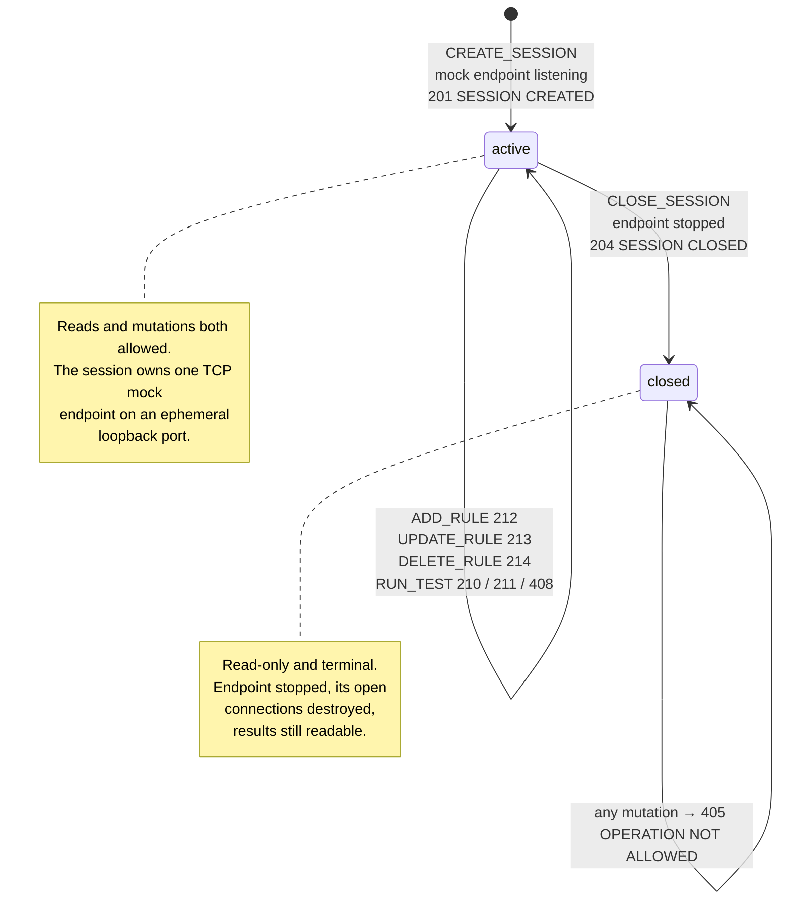

# SLTP/1.0 — Protocol Specification

**SocketLens Testing Protocol, version 1.0.** Specification version 0.1.0.

This document is the normative wire format for SLTP/1.0 as implemented by
`packages/protocol`. It satisfies FR-1 to FR-17 of
[`docs/requirements.md`](./requirements.md). Where this document and the implementation
disagree, one of the two is a defect; neither is permitted to drift, per NFR-28.

Companion documents:

| Document                                              | Contents                                                                                         |
| ----------------------------------------------------- | ------------------------------------------------------------------------------------------------ |
| [`docs/status-codes.md`](./status-codes.md)           | The full status registry: every code with its meaning, permitted context, and connection effect. |
| [`docs/protocol-examples.md`](./protocol-examples.md) | Worked byte-level examples, including fragmentation, coalescing, and malformed input.            |
| [`docs/architecture.md`](./architecture.md)           | How the implementation is arranged and why.                                                      |
| [`docs/requirements.md`](./requirements.md)           | The requirements this specification realises.                                                    |

---

## 1. Abstract

SLTP is a text-based, CRLF-delimited, `Content-Length`-framed request/response protocol
carried directly over a single TCP connection. A message consists of a start line, zero or
more header fields, a blank line, and an optional body whose length is declared in octets.

SLTP exists to make the framing problem visible. TCP delivers a reliable, ordered stream of
bytes and preserves no application message boundaries whatsoever; a correct SLTP
implementation must therefore buffer per connection and frame incrementally. The protocol
is deliberately small enough to be read in full, and deliberately strict enough that every
ambiguity a stream protocol can produce is either forbidden by the grammar or assigned a
specific numbered failure.

SLTP is not HTTP and is never layered on HTTP. Its numeric status codes occupy familiar
ranges because familiarity aids debugging, but their meanings are defined here and only
here. Several codes — `210 TEST PASSED`, `211 TEST FAILED`, `410 NO MATCHING RULE`, and the
rule-mutation codes — have no HTTP counterpart at all. An implementation MUST NOT infer
HTTP semantics for any SLTP code.

---

## 2. Scope and conformance

This specification defines:

- the octet-level framing of an SLTP message;
- the request and response start lines;
- the header field grammar, the reserved header names, and their multiplicity;
- body framing by `Content-Length`;
- the closed registry of 13 operations and 23 status codes;
- the order in which a receiver validates a request;
- the classification of every failure as fatal or recoverable for the connection;
- the resource limits a conformant implementation enforces.

It does not define the JSON schemas of operation bodies (see
[`docs/architecture.md`](./architecture.md) §4 and the exported TypeScript types in
`packages/core/src/models.ts`), the local HTTP surface of the browser bridge, or any
persistence format.

### 2.1 Conformance classes

| Class        | Obligation                                                                                                                                                                                     |
| ------------ | ---------------------------------------------------------------------------------------------------------------------------------------------------------------------------------------------- |
| **Sender**   | MUST emit only messages permitted by §6 through §10. It MUST compute `Content-Length` itself and MUST NOT rely on a peer to correct it.                                                        |
| **Receiver** | MUST frame incrementally per connection (§4), MUST reject every fault named in §16 with the reason and status given there, and MUST NOT attempt to resynchronise a stream after a fatal fault. |
| **Server**   | A receiver that additionally implements the operation registry (§11), the status registry (§12), and the validation order (§15).                                                               |
| **Client**   | A sender that additionally correlates responses by `Request-ID` (§9.4) rather than by arrival order.                                                                                           |

A conformant implementation MUST implement all of SLTP/1.0. There are no optional
features and no negotiated extensions in this version.

### 2.2 Reference implementation

`packages/protocol` is the single reference implementation. The control server, the
per-session mock endpoints, the CLI, the bridge, and the test suite all encode and decode
through it (NFR-2). The registries in §11 and §12 are the tables in
`packages/protocol/src/operations.ts` and `packages/protocol/src/status.ts`.

---

## 3. Terminology

The key words **MUST**, **MUST NOT**, **REQUIRED**, **SHOULD**, **SHOULD NOT**, and **MAY**
are to be interpreted as described in RFC 2119.

| Term                   | Meaning in this specification                                                                                                                                              |
| ---------------------- | -------------------------------------------------------------------------------------------------------------------------------------------------------------------------- |
| **MUST**, **REQUIRED** | An absolute requirement. An implementation that does not satisfy it is not conformant.                                                                                     |
| **MUST NOT**           | An absolute prohibition.                                                                                                                                                   |
| **SHOULD**             | There may exist valid reasons in particular circumstances to ignore the item, but the full implications must be understood and weighed before choosing a different course. |
| **SHOULD NOT**         | There may exist valid reasons in particular circumstances when the behaviour is acceptable, but the full implications should be understood first.                          |
| **MAY**                | Truly optional. An implementation that omits the item MUST interoperate with one that includes it, and vice versa.                                                         |

Protocol vocabulary:

| Term                  | Meaning                                                                                                              |
| --------------------- | -------------------------------------------------------------------------------------------------------------------- |
| **Octet**             | An eight-bit byte on the wire. All lengths in this specification are counted in octets.                              |
| **Message**           | One complete SLTP request or response: header block, delimiter, and body.                                            |
| **Header block**      | The start line and all header field lines, excluding the terminating blank line.                                     |
| **Delimiter**         | The four octets `CR LF CR LF` that terminate the header block.                                                       |
| **Framing**           | Determining where one message ends and the next begins within a byte stream.                                         |
| **Fatal fault**       | A fault after which the position of the next message boundary is unknowable, so the connection MUST be closed (§16). |
| **Recoverable fault** | A fault detected after the message was correctly framed. The connection stays usable.                                |
| **Control server**    | The SLTP server on the control port. Owns sessions, rules, results, and test execution.                              |
| **Mock endpoint**     | A per-session TCP listener that answers SLTP requests from that session's mock rules.                                |
| **Session**           | A container for mock rules and test results, owning exactly one mock endpoint.                                       |
| **Identifier**        | A `Request-ID` or `Session-ID` value, matching the grammar in §9.5.                                                  |

---

## 4. Transport assumptions

SLTP assumes exactly one property of its transport: **a reliable, ordered, bidirectional
stream of octets.** TCP provides this. SLTP requires nothing else, and MUST NOT be
carried over a transport that does not provide it — in particular not over a datagram
transport, because the framing model below has no mechanism for loss or reordering.

The central premise of this protocol, and of the tool that implements it, is the property
TCP does **not** provide:

> **TCP does not preserve application message boundaries.**
> One `write` is not one read. One read is not one message.

Every one of the following is a legal delivery of the same two SLTP messages, and a
conformant receiver MUST handle all of them identically:

| Delivery                                                                  | What the receiver observes                                           |
| ------------------------------------------------------------------------- | -------------------------------------------------------------------- |
| Both messages in one read                                                 | One chunk containing two complete messages.                          |
| Each message in one read                                                  | Two chunks, one message each.                                        |
| First message split in six                                                | Five reads yielding nothing, then one completing the message.        |
| A read ending inside the start line                                       | A partial token that must be retained, not parsed.                   |
| A read ending between the two `CRLF` pairs of the delimiter               | A delimiter that straddles a chunk boundary and must still be found. |
| A read ending inside a multi-octet UTF-8 character in the body            | Octets that must not be decoded as text until the rest arrive.       |
| A read containing one complete message and the first 3 octets of the next | One message emitted, three octets retained.                          |

Consequently:

- **R-4.1** A receiver MUST accumulate received octets in a per-connection buffer and
  repeatedly attempt to extract complete messages from it, retaining any trailing partial
  octets for the next read.
- **R-4.2** A receiver MUST be able to return zero, one, or many messages from a single
  read.
- **R-4.3** Each TCP connection MUST own exactly one framing state. Framing state MUST NOT
  be shared between connections; two connections are two independent streams, and
  interleaving them corrupts both.
- **R-4.4** A receiver MUST perform all framing decisions on octets, and MUST decode a body
  to text only once every declared octet of that body is present. This is what makes a
  multi-octet character split across TCP segments harmless.
- **R-4.5** A receiver MUST NOT infer a message boundary from the arrival of a read, from a
  timing gap, or from the absence of further data. The only boundaries are the delimiter
  and the `Content-Length` octet count.
- **R-4.6** A receiver MUST bound the memory it will accumulate while waiting for a
  boundary (§19), because a peer may never send one.
- **R-4.7** When the stream ends with octets still buffered, the receiver MUST report a
  truncated message rather than discard the remainder silently.

SLTP does not multiplex, and it does not require a response to precede the next request.
Several requests MAY be outstanding on one connection at once; see §18.

---

## 5. Character encoding

- **R-5.1** The header block MUST be encoded in US-ASCII. Every octet of a start line,
  field name, and field value is a single-octet US-ASCII character.
- **R-5.2** Field values MUST consist only of horizontal tab (`0x09`) and printable
  US-ASCII (`0x20`–`0x7E`). A value MAY be empty.
- **R-5.3** A reason phrase MUST consist only of printable US-ASCII (`0x20`–`0x7E`) and
  MUST NOT be empty.
- **R-5.4** The body MUST be interpreted as UTF-8. Any Unicode content a message needs to
  carry belongs in the body, never in a header value.
- **R-5.5** `Content-Length` MUST count UTF-8 octets, never characters and never
  UTF-16 code units. See §10.
- **R-5.6** A body containing a UTF-8 sequence split across TCP segments MUST be
  reassembled before being decoded (R-4.4). An implementation MUST NOT decode a partial
  body, because doing so introduces replacement characters that the sender never wrote.
- **R-5.7** There is no transfer encoding, no content encoding, no compression, and no
  charset negotiation in SLTP/1.0. Structured bodies use
  `Content-Type: application/json; charset=utf-8`; opaque text bodies use
  `text/plain; charset=utf-8`.

---

## 6. Message grammar

The following productions use ABNF (RFC 5234). Terminals are octet values.

```abnf
message        = start-line CRLF
                 *( header-field CRLF )
                 CRLF
                 [ body ]

start-line     = request-line / status-line
request-line   = version SP operation
status-line    = version SP status-code SP reason-phrase

version        = %s"SLTP/1.0"          ; exact, case-sensitive
operation      = upper *31( upper / DIGIT / "_" )
status-code    = 3DIGIT                ; numeric value 100-599
reason-phrase  = 1*printable

header-field   = field-name ":" OWS field-value OWS
field-name     = 1*( ALPHA / DIGIT / "-" / "_" )
field-value    = *( HTAB / printable )

body           = *OCTET                ; exactly Content-Length octets, UTF-8

printable      = %x20-7E               ; SP through ~
upper          = %x41-5A               ; A-Z
OWS            = *( SP / HTAB )        ; removed before the value is validated
CRLF           = %x0D %x0A
SP             = %x20
HTAB           = %x09
```

Constraints the grammar cannot express:

- **R-6.1** Line endings MUST be `CRLF`. A bare `CR` (`0x0D` not followed by `0x0A`) or a
  bare `LF` (`0x0A` not preceded by `0x0D`) anywhere in the header block is a framing
  fault, reported as `bare-carriage-return` or `bare-line-feed` respectively. Line
  boundaries would otherwise be ambiguous. Inside the body, `CR` and `LF` are ordinary data
  and are never inspected.
- **R-6.2** The header block MUST be terminated by the four-octet delimiter `CRLF CRLF` —
  that is, by a blank line. A receiver MUST locate this delimiter on octets, and MUST
  tolerate a delimiter that straddles a read boundary.
- **R-6.3** A `CRLF CRLF` sequence _inside_ a body is data, not a delimiter. Because the
  body is framed by octet count, the receiver never searches it.
- **R-6.4** Obsolete line folding is forbidden. A header field line MUST NOT begin with
  `SP` or `HTAB`; such a line is reported as `obsolete-line-folding`.
- **R-6.5** A header field line MUST contain a colon, and that colon MUST NOT be the first
  octet of the line. A line with no colon, or beginning with one, is reported as
  `malformed-header-line`.
- **R-6.6** Whitespace between the colon and the value, and any trailing whitespace, is
  removed before the value is validated and before it is compared. SLTP values never carry
  meaning in surrounding whitespace.
- **R-6.7** The start line MUST NOT be empty; an empty first line is reported as
  `empty-start-line`.
- **R-6.8** The body is present if and only if `Content-Length` declares a non-zero octet
  count (§10).

A minimal complete request, with `CRLF` shown explicitly:

```
SLTP/1.0 PING<CR><LF>
Request-ID: req-1<CR><LF>
<CR><LF>
```

That is 36 octets in total: a 13-octet start line, a 17-octet header field line, three
`CRLF` pairs, and no body.

---

## 7. Request start line

```abnf
request-line = version SP operation
```

- **R-7.1** The version token MUST be exactly `SLTP/1.0`. Comparison is byte-for-byte and
  case-sensitive. Any other token is reported as `unsupported-protocol-version`
  (`400 BAD REQUEST`, fatal). There is no version negotiation in SLTP/1.0; see §21.
- **R-7.2** The version and the operation MUST be separated by exactly one `SP`.
- **R-7.3** The operation token MUST match `[A-Z][A-Z0-9_]{0,31}`: an uppercase letter
  followed by up to 31 further uppercase letters, digits, or underscores. A token that
  fails this grammar is reported as `invalid-operation-token` (`400`, fatal). Note that
  this is a _syntactic_ check: `TELEPORT` is a valid token.
- **R-7.4** A request start line MUST NOT carry anything after the operation token. A
  second `SP` is reported as `malformed-start-line` (`400`, fatal).
- **R-7.5** A receiver distinguishes the two start-line shapes by the first octet of the
  token following the version: a decimal digit introduces a status line, anything else an
  operation. A sender MUST NOT define an operation token beginning with a digit; R-7.3
  already forbids it.
- **R-7.6** A receiver expecting requests that receives a status line MUST report
  `unexpected-message-kind` (`400`, fatal), and vice versa. A control server accepts
  requests only; a client accepts responses only.
- **R-7.7** An operation token that is syntactically valid but absent from the registry in
  §11 is a _semantic_ fault, not a framing fault: it is reported as `unknown-operation`
  (`501 OPERATION NOT SUPPORTED`) and the connection stays open.

Examples of valid request start lines:

```
SLTP/1.0 PING
SLTP/1.0 CREATE_SESSION
SLTP/1.0 RUN_TEST
```

Examples that MUST be rejected:

| Start line            | Reason code                    | Status |
| --------------------- | ------------------------------ | ------ |
| `SLTP/2.0 PING`       | `unsupported-protocol-version` | 400    |
| `SLTP/1.0`            | `malformed-start-line`         | 400    |
| `SLTP/1.0 ping`       | `invalid-operation-token`      | 400    |
| `SLTP/1.0 PING EXTRA` | `malformed-start-line`         | 400    |
| `` (empty first line) | `empty-start-line`             | 400    |

---

## 8. Response start line

```abnf
status-line = version SP status-code SP reason-phrase
```

- **R-8.1** The version token MUST be exactly `SLTP/1.0` (R-7.1).
- **R-8.2** The status code MUST be exactly three decimal digits, and its numeric value
  MUST lie in `100`–`599`. Anything else is reported as `invalid-status-code` (`400`,
  fatal). A two-digit code such as `20` and an out-of-range code such as `099` are both
  rejected.
- **R-8.3** A reason phrase MUST be present. Its absence is reported as
  `missing-status-phrase` (`400`, fatal).
- **R-8.4** The reason phrase MUST consist only of printable US-ASCII, and MAY contain
  spaces. `SESSION CREATED` is one phrase, not a phrase plus a trailing token; everything
  after the second `SP` on the line is the phrase. A phrase with any other octet is
  reported as `invalid-status-phrase` (`400`, fatal).
- **R-8.5** A sender SHOULD emit the canonical uppercase phrase registered for the code in
  §12. A receiver MUST NOT derive meaning from the phrase; the code is normative and the
  phrase is for humans.
- **R-8.6** A receiver MUST accept any code in `100`–`599`, including codes this version
  does not register, so that a future code does not break framing. Its _meaning_ is
  undefined, but its framing is not.

Examples of valid response start lines:

```
SLTP/1.0 200 OK
SLTP/1.0 201 SESSION CREATED
SLTP/1.0 413 MESSAGE TOO LARGE
```

---

## 9. Header fields

### 9.1 Naming and case

- **R-9.1** A field name MUST match `[A-Za-z0-9_-]+`. A name containing a space, a colon,
  or any other octet is reported as `invalid-header-name` (`400`, fatal).
- **R-9.2** Field names are case-insensitive. `request-id`, `Request-ID`, and `REQUEST-ID`
  are the same field, and a receiver MUST compare names case-insensitively.
- **R-9.3** A sender SHOULD emit the canonical casing registered in §9.6 for reserved
  names, and SHOULD title-case each hyphen-separated segment of an extension name, so that
  `x-trace-id` is emitted as `X-Trace-Id`. This is a readability convention for captured
  traffic and carries no protocol meaning.
- **R-9.4** Field values are compared case-sensitively unless a particular field says
  otherwise. No field in SLTP/1.0 says otherwise.

### 9.2 Ordering

- **R-9.5** Field order is not significant. A receiver MUST NOT require a particular order.
- **R-9.6** A receiver MUST nevertheless preserve the order in which fields arrived, and
  MUST make that order available to inspection tooling. Reordering a captured message
  destroys evidence about what the peer actually sent.
- **R-9.7** Where a repeatable field appears more than once, the relative order of its
  values MUST be preserved.

### 9.3 Single-valued and repeatable fields

- **R-9.8** The following fields are **single-valued**. A second occurrence of any of them
  MUST be rejected as `duplicate-header` (`400`, fatal):
  `Content-Length`, `Content-Type`, `Request-ID`, `Session-ID`.
- **R-9.9** A duplicate of a single-valued field MUST NOT be resolved by a precedence rule
  such as first-wins or last-wins. Two `Content-Length` values make the message boundary
  ambiguous, and two `Session-ID` values make routing ambiguous; guessing is worse than
  refusing.
- **R-9.10** Every other field, including all extension fields, MAY appear more than once.
  A receiver MUST retain each occurrence in wire order (R-9.7). A receiver that collapses
  a repeated field to a single value MUST do so only for display, never for framing.

### 9.4 Correlation

- **R-9.11** Every request MUST carry exactly one `Request-ID`. Its absence is reported as
  `missing-request-id` (`400`, recoverable).
- **R-9.12** Every response MUST echo the `Request-ID` of the request that caused it. A
  response generated before any request could be identified — for example a `503` written
  on a refused connection — MAY omit it.
- **R-9.13** A client MUST correlate responses to requests by `Request-ID`, never by
  arrival order. SLTP does not promise that a slow operation's response precedes a fast
  one's on the same connection (§18).
- **R-9.14** A client MUST generate a `Request-ID` that is unique among its outstanding
  requests on that connection. Reusing an identifier while the first is still outstanding
  makes correlation ambiguous, and a receiver is not required to detect it.

### 9.5 Identifier grammar

- **R-9.15** A `Request-ID` and a `Session-ID` MUST each match:

  ```abnf
  identifier = 1*64( ALPHA / DIGIT / "." / "_" / ":" / "-" )
  ```

  equivalently `^[A-Za-z0-9._:-]{1,64}$`. A value that fails this grammar is reported as
  `invalid-request-id` or `invalid-session-id` (`400`, recoverable).

- **R-9.16** The grammar excludes `SP`, so `Request-ID: has spaces` is invalid. It also
  bounds the length at 64 octets, so an identifier cannot be used to smuggle a payload
  into the header block.

### 9.6 Reserved header fields

The following names are reserved by SLTP/1.0. A sender MUST NOT use a reserved name for any
other purpose.

| Field             | Direction         | Multiplicity | Meaning                                                                                                                                                                                                                                                                         |
| ----------------- | ----------------- | ------------ | ------------------------------------------------------------------------------------------------------------------------------------------------------------------------------------------------------------------------------------------------------------------------------- |
| `Request-ID`      | request, response | single       | Client-generated correlation identifier. REQUIRED on every request (R-9.11); echoed on every response (R-9.12).                                                                                                                                                                 |
| `Session-ID`      | request, response | single       | Session scope. REQUIRED on session-scoped operations (§11). Echoed on `201 SESSION CREATED`.                                                                                                                                                                                    |
| `Content-Length`  | both              | single       | UTF-8 octet length of the body (§10).                                                                                                                                                                                                                                           |
| `Content-Type`    | both              | single       | Media type of the body. `application/json; charset=utf-8` for structured bodies, `text/plain; charset=utf-8` for opaque text.                                                                                                                                                   |
| `Timestamp`       | both              | repeatable   | ISO 8601 instant at which the sender serialised the message. Informational; a receiver MUST NOT use it for timing decisions.                                                                                                                                                    |
| `Connection`      | both              | repeatable   | `close` states that the sender will end the connection after this exchange. Emitted by a server alongside a fatal fault or a `503` on a refused connection. In v0.1 a server does not act on a client-supplied `Connection: close`; a client that wants to close simply closes. |
| `Response-Delay`  | request           | repeatable   | Milliseconds a mock endpoint is asked to wait before replying, used to provoke timeouts deliberately. Bounded by §19.                                                                                                                                                           |
| `Matched-Rule-ID` | response          | repeatable   | Identifier of the mock rule that produced this response, or of the rule a mutation affected.                                                                                                                                                                                    |
| `Result-ID`       | response          | repeatable   | Identifier of a stored test result.                                                                                                                                                                                                                                             |
| `Reason`          | response          | repeatable   | Machine-readable reason code from the taxonomy in §16, accompanying an error status.                                                                                                                                                                                            |
| `Server`          | response          | repeatable   | Product token of the responding server, e.g. `SocketLens-TCP/0.1.0`.                                                                                                                                                                                                            |
| `Retry-After`     | response          | repeatable   | Milliseconds to wait before retrying, sent with `429 TOO MANY REQUESTS`. Milliseconds, not seconds.                                                                                                                                                                             |

- **R-9.17** Extension fields MAY be used freely. A receiver MUST ignore a field it does not
  recognise rather than reject the message: an unknown _field_ is not a framing fault.
- **R-9.18** An extension field SHOULD be named with an `X-` prefix to avoid colliding with
  a name a future SLTP version reserves.

---

## 10. Body framing and `Content-Length`

### 10.1 Framing rule

- **R-10.1** The body begins immediately after the four-octet delimiter and consists of
  exactly the number of octets declared by `Content-Length`. There is no terminator, no
  sentinel, and no chunked mode.
- **R-10.2** When `Content-Length` is absent, the body length is zero. Its absence is
  unambiguous precisely because SLTP has no chunked transfer mode, so a receiver MUST NOT
  treat a missing `Content-Length` as "read until close".
- **R-10.3** `Content-Length: 0` MUST be accepted and is equivalent to omitting the field.
  A sender SHOULD omit the field when there is no body; the reference encoder omits it.
- **R-10.4** A receiver MUST NOT emit a message until every declared body octet has
  arrived. Octets beyond the declared length belong to the next message and MUST be
  retained for it.
- **R-10.5** A sender MUST compute `Content-Length` itself, from the octets it is about to
  write. It MUST NOT copy a value supplied by a caller or read from another message.

### 10.2 Octet length, not string length

- **R-10.6** `Content-Length` is the **UTF-8 octet length** of the body. It is not the
  JavaScript string length, not the character count, and not the UTF-16 code-unit count.
  The reference encoder computes it with `Buffer.byteLength(body, 'utf8')` and **discards
  any value the caller supplied**, precisely so that this class of bug cannot reach the
  wire.
- **R-10.7** A receiver MUST frame on the declared octet count and MUST decode the body to
  text only after all of those octets are present (R-4.4).

The difference is observable with a single accented character. The body

```
{"message":"café"}
```

is 18 characters but **19 octets**, because `é` is `C3 A9` in UTF-8. The correct message is:

```
SLTP/1.0 200 OK
Request-ID: req-4
Content-Type: application/json; charset=utf-8
Content-Length: 19

{"message":"café"}
```

A sender that wrote `Content-Length: 18` here would leave one octet — the second half of
`é` — in the stream. The receiver would frame a 18-octet body ending mid-character and
would then try to parse `}` as the start line of the next message. The stream is
desynchronised from that point on, which is exactly why R-10.6 is absolute.

### 10.3 Value grammar

- **R-10.8** A `Content-Length` value MUST match `^\d+$`: one or more ASCII decimal digits,
  with no sign, no decimal point, no exponent, no radix prefix, and no internal separator.
  Surrounding whitespace has already been removed by R-6.6.

  | Value         | Accepted | Reason code                                      |
  | ------------- | -------- | ------------------------------------------------ |
  | `0`           | yes      | —                                                |
  | `19`          | yes      | —                                                |
  | `-1`          | no       | `negative-content-length`                        |
  | `+1`          | no       | `invalid-content-length`                         |
  | `1.5`         | no       | `invalid-content-length`                         |
  | `0x10`        | no       | `invalid-content-length`                         |
  | `1e3`         | no       | `invalid-content-length`                         |
  | `abc`         | no       | `invalid-content-length`                         |
  | ` 12` / `12 ` | yes      | whitespace is stripped before validation (R-6.6) |

- **R-10.9** A negative value MUST be reported distinctly as `negative-content-length`
  rather than folded into the generic grammar failure, because "the sender computed a
  negative length" and "the sender wrote something that is not a number" are different
  bugs and a debugger should not conflate them. Both are `400 BAD REQUEST` and both are
  fatal.
- **R-10.10** The numeric value MUST be a safe integer — no greater than
  `Number.MAX_SAFE_INTEGER` (9 007 199 254 740 991). A larger value is reported as
  `content-length-too-large` (`413 MESSAGE TOO LARGE`, fatal). A length that cannot be
  represented exactly cannot be framed against.
- **R-10.11** The numeric value MUST NOT exceed the configured maximum message size (§19).
  A larger value is reported as `content-length-too-large` (`413`, fatal) at the moment the
  header block is parsed, before any body octet is buffered. A receiver MUST NOT allocate
  or await a body it has already decided to refuse.
- **R-10.12** Every `Content-Length` fault is fatal for the connection. The declared length
  is the only thing that says where the next message starts, so once it is untrustworthy
  there is no boundary left to resynchronise to (§16).
- **R-10.13** `Content-Length` is single-valued (R-9.8). Two occurrences are
  `duplicate-header`, not a reconciliation problem.

### 10.4 Body content

- **R-10.14** A body MAY be any sequence of octets valid as UTF-8. Whether a body is
  permitted, required, or forbidden for a given operation is defined in §11.
- **R-10.15** Where an operation takes a structured body, that body MUST be a single JSON
  value, and MUST be a JSON **object** at the top level. A body that does not parse is
  `invalid-json-body` (`400`, recoverable); a body that parses but is an array, a string,
  or `null` at the top level is `invalid-body-shape` (`422 INVALID SCENARIO`, recoverable).
- **R-10.16** A structured body SHOULD carry `Content-Type: application/json;
charset=utf-8`. A receiver MUST NOT require the field in order to parse the body: the
  operation registry already determines whether a body is structured.

---

## 11. Request operations

SLTP/1.0 defines a **closed registry** of 13 operations. A token outside this registry is
answered `501 OPERATION NOT SUPPORTED` (R-7.7).

Body column: **forbidden** — a body MUST NOT be present; **optional** — a body MAY be
present; **required** — a body MUST be present and MUST be a JSON object.

| Operation        | Session-ID   | Body      | Target                 | Success statuses | Purpose                                                                           |
| ---------------- | ------------ | --------- | ---------------------- | ---------------- | --------------------------------------------------------------------------------- |
| `PING`           | not required | optional  | control, mock endpoint | 200              | Liveness probe. Returns server time, uptime, and any `echo` value supplied.       |
| `SERVER_INFO`    | not required | forbidden | control                | 200              | Reports protocol version, configured limits, capabilities, and current counts.    |
| `CREATE_SESSION` | not required | optional  | control                | 201              | Creates an isolated session and starts its dedicated TCP mock endpoint.           |
| `GET_SESSION`    | **required** | forbidden | control                | 200              | Returns one session, including its mock endpoint host and port.                   |
| `LIST_SESSIONS`  | not required | forbidden | control                | 200              | Returns every session known to the server.                                        |
| `ADD_RULE`       | **required** | required  | control                | 212              | Stores a mock response rule in the session.                                       |
| `UPDATE_RULE`    | **required** | required  | control                | 213              | Replaces the mutable fields of an existing mock rule.                             |
| `DELETE_RULE`    | **required** | required  | control                | 214              | Removes a mock rule from the session.                                             |
| `LIST_RULES`     | **required** | forbidden | control                | 200              | Returns the session rules in the exact order the matcher evaluates them (§13.3).  |
| `RUN_TEST`       | **required** | required  | control                | 210, 211, (202)  | Executes a scenario over a real TCP connection and compares expected with actual. |
| `GET_RESULT`     | **required** | required  | control                | 200              | Returns one stored test result in full.                                           |
| `LIST_RESULTS`   | **required** | forbidden | control                | 200              | Returns a summary of every stored result in the session.                          |
| `CLOSE_SESSION`  | **required** | forbidden | control                | 204              | Closes the session and shuts down its mock endpoint. Results stay readable.       |

- **R-11.1** A request for a session-scoped operation MUST carry a `Session-ID`. Its
  absence is `missing-session-id` (`400`, recoverable).
- **R-11.2** A `Session-ID` on an operation that does not require one MUST still satisfy the
  identifier grammar if present (R-9.15). It is otherwise ignored.
- **R-11.3** A body on an operation whose body is forbidden is `unexpected-body` (`400`,
  recoverable). A missing body on an operation whose body is required is `missing-body`
  (`400`, recoverable).
- **R-11.4** `RUN_TEST` answers `210 TEST PASSED` when every assertion held,
  `408 TEST TIMEOUT` when the scenario timed out and a timeout was not the declared
  expectation, and `211 TEST FAILED` otherwise. A failing assertion is a reported result,
  not a transport error.
- **R-11.5** `202 TEST ACCEPTED` is **reserved but unreachable in v0.1**. Asynchronous test
  execution is not implemented; `RUN_TEST` is always synchronous. See
  [`docs/requirements.md`](./requirements.md) §4.3.
- **R-11.6** A **mock endpoint** relaxes two rules, because its TCP port already identifies
  the session: it MUST NOT require a `Session-ID`, and it MUST accept operation tokens the
  registry does not define, so that a mock can stand in for a peer speaking a different
  protocol. Every other rule in this specification applies unchanged.
- **R-11.7** Sending a control operation to a mock endpoint, or an operation to a context
  that forbids it, is answered `405 OPERATION NOT ALLOWED`.

Two short examples. A session-scoped request with no body:

```
SLTP/1.0 LIST_RULES
Request-ID: req-9
Session-ID: ses-1

```

A request with a structured body. The body is 24 octets:

```
SLTP/1.0 CREATE_SESSION
Request-ID: req-2
Content-Type: application/json; charset=utf-8
Content-Length: 24

{"name":"checkout mock"}
```

---

## 12. Response status registry

SLTP/1.0 registers **23 status codes** in three classes, distinguished by the leading digit:
`2xx` success, `4xx` client error, `5xx` server error. The table below is the index; the
normative meaning, permitted context, and connection effect of each code are in
[`docs/status-codes.md`](./status-codes.md).

| Code | Phrase                    | Class        | Sent when                                                                                       |
| ---- | ------------------------- | ------------ | ----------------------------------------------------------------------------------------------- |
| 200  | `OK`                      | success      | The operation succeeded; requested data is in the body.                                         |
| 201  | `SESSION CREATED`         | success      | `CREATE_SESSION` succeeded.                                                                     |
| 202  | `TEST ACCEPTED`           | success      | Reserved for asynchronous `RUN_TEST`; unreachable in v0.1 (R-11.5).                             |
| 204  | `SESSION CLOSED`          | success      | `CLOSE_SESSION` succeeded. Unlike HTTP 204, an SLTP 204 MAY carry a body.                       |
| 210  | `TEST PASSED`             | success      | A scenario executed and every assertion held.                                                   |
| 211  | `TEST FAILED`             | success      | A scenario executed correctly but at least one assertion did not hold.                          |
| 212  | `RULE ADDED`              | success      | `ADD_RULE` succeeded.                                                                           |
| 213  | `RULE UPDATED`            | success      | `UPDATE_RULE` succeeded.                                                                        |
| 214  | `RULE DELETED`            | success      | `DELETE_RULE` succeeded.                                                                        |
| 400  | `BAD REQUEST`             | client error | Framing, header, or body fault. `Reason` carries the machine-readable code.                     |
| 404  | `SESSION NOT FOUND`       | client error | The `Session-ID` is well-formed but no such session exists.                                     |
| 405  | `OPERATION NOT ALLOWED`   | client error | The operation is recognised but forbidden in this context, e.g. a mutation on a closed session. |
| 406  | `RULE NOT FOUND`          | client error | No rule with the requested identifier exists in the session.                                    |
| 407  | `RESULT NOT FOUND`        | client error | No stored result with the requested identifier exists in the session.                           |
| 408  | `TEST TIMEOUT`            | client error | A scenario received no complete response within its timeout, and no timeout was expected.       |
| 409  | `RULE CONFLICT`           | client error | A duplicate rule id, a duplicate rule name, or an identical match at the same priority.         |
| 410  | `NO MATCHING RULE`        | client error | A mock endpoint received a well-formed request that no enabled rule matched.                    |
| 413  | `MESSAGE TOO LARGE`       | client error | A declared or observed size exceeded a limit in §19. Always closes the connection.              |
| 422  | `INVALID SCENARIO`        | client error | The JSON parsed but the scenario or rule it describes is semantically invalid.                  |
| 429  | `TOO MANY REQUESTS`       | client error | The connection exceeded its rate allowance. `Retry-After` gives the delay in milliseconds.      |
| 500  | `INTERNAL SERVER ERROR`   | server error | An unexpected fault while handling a valid request. The server stays available.                 |
| 501  | `OPERATION NOT SUPPORTED` | server error | The start line was well-formed but the operation is not registered.                             |
| 503  | `SERVER UNAVAILABLE`      | server error | The server is shutting down, or a capacity limit is exhausted.                                  |

- **R-12.1** `210 TEST PASSED` and `211 TEST FAILED` are both `2xx`. A test that fails its
  assertions is a _successful_ SLTP exchange reporting an unsuccessful test. Conflating the
  two would make it impossible to distinguish "the tool worked and the test failed" from
  "the tool broke".
- **R-12.2** A `4xx` code attributes the fault to the request; a `5xx` code attributes it to
  the server. `501` is `5xx` because an unregistered operation is a statement about what
  this server implements.
- **R-12.3** A sender MUST use the registered phrase for a registered code. A receiver
  encountering an unregistered code MUST classify it by its leading digit and MUST NOT fail
  to frame it (R-8.6).
- **R-12.4** The connection effect of a response is determined by the _reason_ that produced
  it (§16), not by its status code. `400 BAD REQUEST` closes the connection when it reports
  a framing fault and leaves it open when it reports a missing `Request-ID`. A server that
  is about to close SHOULD say so with `Connection: close` rather than leave the peer to
  infer it from the FIN.

---

## 13. Session state model

### 13.1 Sessions

A **session** is an isolated container for mock rules and test results. Creating one starts
a dedicated TCP mock endpoint on an OS-assigned ephemeral loopback port; that port is
reported in the `201 SESSION CREATED` body and by `GET_SESSION`.

- **R-13.1** A session has exactly two states, `active` and `closed`. There is no paused,
  draining, or suspended state.
- **R-13.2** `CREATE_SESSION` MUST start the mock endpoint and confirm it is listening
  _before_ announcing the session, because the response carries the port a scenario will
  connect to. If the endpoint cannot start, no session is created.
- **R-13.3** `CLOSE_SESSION` MUST stop the endpoint, destroy its open connections, and move
  the session to `closed`. The session record MUST be retained so that results recorded
  before the close remain readable.
- **R-13.4** A closed session is read-only. `GET_SESSION`, `LIST_RULES`, `GET_RESULT`, and
  `LIST_RESULTS` continue to answer `200`. Any mutation — `ADD_RULE`, `UPDATE_RULE`,
  `DELETE_RULE`, `RUN_TEST`, or a second `CLOSE_SESSION` — MUST be answered `405 OPERATION
NOT ALLOWED`.
- **R-13.5** A `Session-ID` that is well-formed but unknown MUST be answered `404 SESSION
NOT FOUND`, never `400`. The request was valid; the referent does not exist.
- **R-13.6** Session state lives in the server process only. Nothing is persisted; a
  restart discards every session, rule, and result.



### 13.2 Connections versus sessions

- **R-13.7** A session is **not** a connection. Sessions are named by `Session-ID` and
  survive the connection that created them; a connection carries no implicit session.
- **R-13.8** One connection MAY address any number of sessions, and one session MAY be
  addressed from any number of connections. Every session-scoped request therefore names
  its session explicitly.
- **R-13.9** Closing a connection MUST NOT close a session, and closing a session MUST NOT
  close the control connection that asked for it.

### 13.3 Rule evaluation order

- **R-13.10** A mock endpoint MUST evaluate a session's rules in a total, deterministic
  order: **priority descending, then insertion sequence ascending.** Higher priority is
  considered first; among equal priorities, the rule added first is considered first.
- **R-13.11** The **first enabled rule whose match specification is satisfied produces the
  response, and evaluation stops.** No later rule is consulted, and no rule "merges" into
  another.
- **R-13.12** A disabled rule MUST be skipped without being considered a match.
- **R-13.13** When no enabled rule matches, the endpoint MUST answer `410 NO MATCHING RULE`
  and SHOULD report how many rules were evaluated.
- **R-13.14** The evaluation order MUST be reported to clients rather than left implicit:
  `LIST_RULES` returns the rules in exactly the order the matcher will consider them.
- **R-13.15** Because ties are broken by insertion sequence, a _new_ rule that would match
  exactly the same requests as an existing enabled rule at the same priority MUST be
  refused with `409 RULE CONFLICT`. Silently resolving the ambiguity by insertion order
  would make the mock's behaviour depend on the order in which the user happened to type,
  which is precisely what a debugging tool must not do.
- **R-13.16** Ordering MUST NOT depend on object iteration order, hashing, or timing
  (NFR-3).

---

## 14. Connection lifecycle

```mermaid
sequenceDiagram
    autonumber
    participant C as Client
    participant S as SLTP server

    C->>S: TCP SYN — connect to 127.0.0.1:7420
    S-->>C: accepted; server creates one decoder for this connection
    Note over S: A connection past the cap, or one arriving<br/>during shutdown, is answered 503 SERVER<br/>UNAVAILABLE and then closed.

    C->>S: SLTP/1.0 PING (Request-ID: req-1)
    S-->>C: SLTP/1.0 200 OK (Request-ID: req-1)

    C->>S: SLTP/1.0 RUN_TEST (Request-ID: req-2) — slow
    C->>S: SLTP/1.0 PING (Request-ID: req-3) — fast
    Note over C,S: Both are in flight. Responses are correlated by<br/>Request-ID, so req-3 may be answered first.
    S-->>C: SLTP/1.0 200 OK (Request-ID: req-3)
    S-->>C: SLTP/1.0 210 TEST PASSED (Request-ID: req-2)

    C->>S: malformed octets — bare LF in the header block
    S-->>C: SLTP/1.0 400 BAD REQUEST (Reason: bare-line-feed, Connection: close)
    Note over S: Fatal fault: the next message boundary is<br/>unknowable, so the decoder stops and the<br/>server half-closes.
    S->>C: FIN
```

- **R-14.1** A connection carries a single SLTP conversation. It MUST be reusable for any
  number of exchanges; SLTP has no notion of a one-request connection.
- **R-14.2** A server MUST create framing state on accept and destroy it on close, and MUST
  NOT reuse it for another connection (R-4.3).
- **R-14.3** Either party MAY close the connection at any time. A closing party SHOULD
  half-close first, and SHOULD force the socket shut only if the peer does not complete the
  handshake within a bounded time. The reference implementation waits 1000 ms.
- **R-14.4** On close, a receiver MUST report any retained partial octets as
  `truncated-message` (`400`, fatal) rather than discard them (R-4.7). A close on an exact
  message boundary MUST report nothing.
- **R-14.5** When a connection closes with requests still outstanding, a client MUST settle
  every one of them with an error, and that error MUST distinguish "the peer closed" from
  "this side closed", and MUST report a truncated message if one was in flight. A request
  left permanently unsettled is a defect.
- **R-14.6** A server MUST enforce a maximum number of simultaneous connections and MUST
  answer `503 SERVER UNAVAILABLE` beyond it (§19).
- **R-14.7** During graceful shutdown a server MUST stop accepting connections, MUST answer
  any request still arriving with `503 SERVER UNAVAILABLE` and `Reason:
server-shutting-down`, MUST allow in-flight handlers a bounded grace period to finish,
  MUST close every session mock endpoint, and only then destroy remaining sockets.
- **R-14.8** A fault on one connection MUST affect only that connection. A malformed,
  oversized, or abruptly disconnected peer MUST NOT terminate the process, disturb another
  connection, or corrupt shared state (NFR-5).
- **R-14.9** A server MUST NOT throw a handler exception into the transport. A handler that
  fails MUST be reported as `500 INTERNAL SERVER ERROR` on that connection, and the
  connection MUST stay usable.
- **R-14.10** When a response asks the connection to close but requests are still in
  flight, the close MUST be deferred until the last in-flight handler completes. A response
  MUST NOT be truncated by the close of its own connection.

---

## 15. Validation order

A request may carry several faults at once. A receiver MUST report them in a fixed order,
so that the same message always produces the same status. Without a fixed order, an
implementation detail such as map iteration order becomes observable protocol behaviour
(NFR-3).

Framing and syntax are settled first, by the rules in §6 through §10: a message that cannot
be framed never reaches validation. Validation then proceeds in exactly this order:

| Step | Check                                                                                   | Fault on failure                   | Status  |
| ---- | --------------------------------------------------------------------------------------- | ---------------------------------- | ------- |
| 1    | `Request-ID` is present                                                                 | `missing-request-id`               | 400     |
| 1a   | `Request-ID` matches the identifier grammar (R-9.15)                                    | `invalid-request-id`               | 400     |
| 2    | The operation token is in the registry (§11)                                            | `unknown-operation`                | **501** |
| 3    | Body presence matches the operation: a body is present if required, absent if forbidden | `missing-body` / `unexpected-body` | 400     |
| 4    | `Session-ID` is present when the operation is session-scoped                            | `missing-session-id`               | 400     |
| 4a   | `Session-ID` matches the identifier grammar, whether or not it was required             | `invalid-session-id`               | 400     |
| 5    | The body parses as JSON, when a body is present                                         | `invalid-json-body`                | 400     |

- **R-15.1** These steps MUST be evaluated in this order and MUST short-circuit at the
  first failure.
- **R-15.2** The following consequences are normative, and are covered directly by
  `tests/protocol/validate.test.ts`:
  - A **missing `Request-ID`** is reported **before** an unknown operation. A request with
    no `Request-ID` and an unregistered operation is answered `400`, not `501`: without a
    correlation identifier the response cannot be attributed to the request at all, so that
    is the more fundamental fault.
  - An **unknown operation** is reported **before** a missing `Session-ID`. Session scope is
    a property of a registered operation; an unregistered token has no scope to check. Such
    a request is answered `501`, not `400`.
  - A **missing `Session-ID`** is reported **before** an invalid JSON body. Scope is checked
    before content, because a body cannot be meaningfully interpreted outside the scope it
    applies to.
- **R-15.3** Step 3 sits between the registry check and the scope check, because body
  presence is declared by the registry entry. An `ADD_RULE` request with a `Request-ID`, no
  `Session-ID`, and no body is therefore answered `missing-body`, not `missing-session-id`.
- **R-15.4** Steps that require server state — does the session exist, is it closed, is the
  rule name unique, does the result exist — are **not** protocol-level validation and run
  after all five steps above. They produce `404`, `405`, `406`, `407`, `409`, or `422`.
- **R-15.5** Admission control runs _before_ step 1, because it does not depend on the
  content of the request: a connection arriving during shutdown is answered `503`, and a
  request over its rate allowance is answered `429` with `Retry-After`.
- **R-15.6** A mock endpoint applies the same order with two registry-derived relaxations
  (R-11.6): step 2 accepts unregistered tokens, and step 4 does not require a `Session-ID`.

The complete order, end to end:

```
framing (§6-§10)  →  503 shutdown  →  429 rate limit  →  1 Request-ID
                  →  2 operation registry  →  3 body presence
                  →  4 session scope  →  5 JSON parse
                  →  server state (404 / 405 / 406 / 407 / 409 / 422)
                  →  handler (200 / 201 / 204 / 210 / 211 / 212 / 213 / 214)
```

---

## 16. Error handling

### 16.1 Fatal versus recoverable

Every fault carries a stable machine-readable reason code, a status, and a **fatality**
flag. The distinction is the single most important error-handling rule in SLTP:

> A fault is **fatal** when it makes the position of the next message boundary unknowable.
> A fatal fault MUST close the connection. Every other fault leaves the stream correctly
> framed, so the connection stays open.

- **R-16.1** A receiver MUST classify every fault as fatal or recoverable, and MUST use the
  classification below.
- **R-16.2** On a fatal fault a receiver SHOULD write one error response carrying the
  `Reason` header and `Connection: close`, MUST then stop consuming the stream, and MUST
  close the connection.
- **R-16.3** After a fatal fault a receiver MUST NOT attempt to resynchronise by scanning
  forward for something that looks like a start line. There is no way to distinguish a real
  start line from those octets appearing inside a body, so resynchronisation would silently
  invent messages the peer never sent. The reference decoder marks the stream poisoned and
  discards every subsequent octet, even a perfectly well-formed message.
- **R-16.4** On a recoverable fault a receiver MUST write the error response and MUST
  continue reading. The peer MAY send further requests on the same connection, and they
  MUST be processed normally.
- **R-16.5** Fatality is a property of the **reason**, not of the status code (R-12.4).

### 16.2 Fatal reasons

All of these are detected during framing, before or while the message boundary is being
established. Every one MUST close the connection.

| Reason code                    | Status  | Detected when                                                                                           |
| ------------------------------ | ------- | ------------------------------------------------------------------------------------------------------- |
| `empty-start-line`             | 400     | The first line of a message is empty.                                                                   |
| `malformed-start-line`         | 400     | No `SP` after the version, no token after the version, or trailing content after a request's operation. |
| `unsupported-protocol-version` | 400     | The version token is not exactly `SLTP/1.0`.                                                            |
| `invalid-operation-token`      | 400     | The operation token fails `[A-Z][A-Z0-9_]{0,31}`.                                                       |
| `invalid-status-code`          | 400     | Not exactly three digits, or outside 100–599.                                                           |
| `missing-status-phrase`        | 400     | A status line carries no reason phrase.                                                                 |
| `invalid-status-phrase`        | 400     | The phrase contains an octet outside `0x20`–`0x7E`.                                                     |
| `bare-line-feed`               | 400     | A bare `LF` appears in the header block.                                                                |
| `bare-carriage-return`         | 400     | A bare `CR` appears in the header block.                                                                |
| `obsolete-line-folding`        | 400     | A header line begins with `SP` or `HTAB`.                                                               |
| `malformed-header-line`        | 400     | A header line has no colon, or begins with one.                                                         |
| `invalid-header-name`          | 400     | A field name fails `[A-Za-z0-9_-]+`.                                                                    |
| `invalid-header-value`         | 400     | A field value contains an octet outside `HTAB` and `0x20`–`0x7E`.                                       |
| `duplicate-header`             | 400     | A single-valued field (R-9.8) appears twice.                                                            |
| `invalid-content-length`       | 400     | The value fails `^\d+$`.                                                                                |
| `negative-content-length`      | 400     | The value begins with `-`.                                                                              |
| `content-length-too-large`     | **413** | The value is not a safe integer, or exceeds the maximum message size.                                   |
| `start-line-too-large`         | **413** | The start line exceeds its octet limit.                                                                 |
| `header-block-too-large`       | **413** | The header block exceeds its octet limit, with or without a delimiter.                                  |
| `too-many-headers`             | **413** | The header count exceeds its limit.                                                                     |
| `message-too-large`            | **413** | Header block plus delimiter plus declared body exceeds the message limit.                               |
| `truncated-message`            | 400     | The stream ended with octets of an incomplete message buffered.                                         |
| `unexpected-message-kind`      | 400     | A response arrived where a request was expected, or vice versa.                                         |

- **R-16.6** Every size fault maps to `413 MESSAGE TOO LARGE` and is fatal, because the
  remaining octets of an oversized message cannot be safely skipped: the receiver refused to
  read the length that would tell it how many there are.
- **R-16.7** A duplicate single-valued header is fatal even when the two values agree. The
  fault is the ambiguity, not the disagreement.
- **R-16.8** `truncated-message` is reported at stream end, not on a timer. A slow peer is
  not a truncated message.

### 16.3 Recoverable reasons

All of these are detected after the message was correctly framed. The connection stays open.

| Reason code             | Status  | Meaning                                                                      |
| ----------------------- | ------- | ---------------------------------------------------------------------------- |
| `missing-request-id`    | 400     | A request carried no `Request-ID`.                                           |
| `invalid-request-id`    | 400     | The `Request-ID` fails the identifier grammar.                               |
| `missing-session-id`    | 400     | A session-scoped operation carried no `Session-ID`.                          |
| `invalid-session-id`    | 400     | The `Session-ID` fails the identifier grammar.                               |
| `unexpected-body`       | 400     | A body was framed for an operation that forbids one.                         |
| `missing-body`          | 400     | An operation that requires a body received none.                             |
| `invalid-json-body`     | 400     | The body is not valid JSON.                                                  |
| `invalid-body-shape`    | **422** | The body parsed but is not a JSON object at the top level.                   |
| `unknown-operation`     | **501** | The token is well-formed but not registered.                                 |
| `rate-limited`          | **429** | The connection exceeded its request allowance. `Retry-After` accompanies it. |
| `server-shutting-down`  | **503** | The server is no longer accepting requests.                                  |
| `session-limit-reached` | **503** | `CREATE_SESSION` was refused at the session cap.                             |

### 16.4 Error response shape

- **R-16.9** An error response MUST carry the status and phrase from §12, and SHOULD carry
  the `Reason` header with the machine-readable code from §16.2 or §16.3.
- **R-16.10** An error response SHOULD carry a JSON body containing at least a human-
  readable `error` string and, where one exists, the `reason` code. Error text SHOULD state
  what was wrong and what to do about it, and SHOULD name the offending value.
- **R-16.11** An error response MUST echo the `Request-ID` when one was recoverable from the
  request. A framing fault may make this impossible; the field is then omitted (R-9.12).

A recoverable-fault response. The body below is 114 octets:

```
SLTP/1.0 400 BAD REQUEST
Request-ID: req-6
Server: SocketLens-TCP/0.1.0
Reason: missing-session-id
Content-Type: application/json; charset=utf-8
Content-Length: 114

{"error":"Operation LIST_RULES is session-scoped and requires a Session-ID header.","reason":"missing-session-id"}
```

The connection remains open, and the client may retry with a `Session-ID`.

---

## 17. Timeout behaviour

SLTP places no timeout in the protocol itself: there is no keep-alive, no ping interval,
and no deadline field on the wire. Timeouts are a local policy of each party.

- **R-17.1** A client SHOULD apply a per-request timeout and MUST settle the request when it
  expires. The reference client's default is **5000 ms**, overridable per request.
- **R-17.2** A timeout is a _client-side_ event. It MUST NOT be reported as an SLTP status,
  because no response arrived to carry one. `408 TEST TIMEOUT` is different: it reports the
  timeout of a _scenario's_ exchange with its target, inside a successful control exchange.
- **R-17.3** A client MUST NOT close a connection merely because one request timed out.
  Other requests may still be in flight on it (§18).
- **R-17.4** A response arriving after its request timed out MUST be discarded and SHOULD be
  logged. It MUST NOT be delivered to a caller that has already been told the request
  failed, and it MUST NOT be matched to a different request.
- **R-17.5** A receiver MUST NOT time out a partially received message on the grounds that
  a boundary has not yet arrived. Bounding a slow or hostile peer is the job of the size
  limits in §19, which fail deterministically on octet count rather than on the clock.
- **R-17.6** A server MUST NOT impose an idle timeout on an otherwise well-behaved
  connection in v0.1. An idle connection consumes only its buffer, which R-4.6 already
  bounds.
- **R-17.7** A mock rule MAY declare a delay before its first response octet, and MAY
  declare a delay between response fragments, so that a client's timeout handling can be
  exercised deliberately. Both are bounded by §19.
- **R-17.8** A scenario MAY declare `timeout` as its **expected** outcome. When it does, the
  absence of a complete response before the deadline is a pass (`210 TEST PASSED`); when it
  does not, that same absence is `408 TEST TIMEOUT`. A scenario MUST NOT declare both an
  expected timeout and an expected status code; the combination is refused as `422 INVALID
SCENARIO`.
- **R-17.9** Every timeout MUST release its timer on every exit path, and a pending timer
  MUST NOT keep a process alive on its own.

---

## 18. Concurrency behaviour

- **R-18.1** A client MAY have several requests outstanding on one connection at once. SLTP
  does not require the responses to arrive in request order.
- **R-18.2** A server MAY dispatch requests received on one connection concurrently, so a
  slow `RUN_TEST` does not block a `PING` that arrived behind it. The reference server does.
- **R-18.3** Because of R-18.1 and R-18.2, correlation MUST be by `Request-ID` (R-9.13). A
  client that assumes response order matches request order is incorrect, and the reference
  server will break it.
- **R-18.4** A server MUST write each response as one contiguous, ordered sequence of
  octets. Two responses MUST NOT be interleaved on the wire; a partially written response
  followed by another response is unframeable.
- **R-18.5** A mock endpoint MUST serialise the responses on one connection in the order the
  requests were framed, even when a rule declares a delay. A delayed reply MUST NOT overtake
  an earlier one, because doing so would make a rule's delay change the _order_ of the
  conversation rather than only its timing.
- **R-18.6** Framing state MUST NOT be shared between connections (R-4.3). Concurrency
  across connections is therefore unconstrained: connections are fully independent.
- **R-18.7** Server-side state that several connections touch — the session store, its rules
  and its results — MUST behave as if mutations were applied one at a time. Rule evaluation
  MUST read a consistent rule set, and MUST see an edit made through another connection on
  the next request rather than at some unspecified later time.
- **R-18.8** A server MUST apply admission control per connection, not globally, so that one
  busy client cannot exhaust another's allowance (§19).
- **R-18.9** A server MUST NOT allow a response to be truncated by the close of its own
  connection: a deferred close waits for in-flight handlers (R-14.10).

---

## 19. Size limits

Every accumulating structure is bounded, because a peer may never send a boundary and a
receiver must not grow without limit while waiting (R-4.6, NFR-9).

### 19.1 Framing limits

| Limit                     | Default                  | Applies to                                            | Fault when exceeded                                   |
| ------------------------- | ------------------------ | ----------------------------------------------------- | ----------------------------------------------------- |
| Maximum message size      | 1 048 576 octets (1 MiB) | Header block + delimiter + body                       | `message-too-large` / `content-length-too-large`, 413 |
| Maximum header block size | 16 384 octets            | Start line and header lines, excluding the blank line | `header-block-too-large`, 413                         |
| Maximum start line size   | 1 024 octets             | The start line alone                                  | `start-line-too-large`, 413                           |
| Maximum header count      | 64 fields                | Header field lines in one message                     | `too-many-headers`, 413                               |
| Identifier length         | 64 octets                | `Request-ID`, `Session-ID`                            | `invalid-request-id` / `invalid-session-id`, 400      |
| Operation token length    | 32 octets                | The operation token                                   | `invalid-operation-token`, 400                        |

- **R-19.1** These limits MUST be configurable. The defaults above MUST be the values used
  when no configuration is supplied, and MUST be reported by `SERVER_INFO` so a client can
  discover them without probing.
- **R-19.2** The header-block limit MUST be enforced **while** the block is accumulating,
  not only once a delimiter has been found. A peer that never sends a delimiter MUST be cut
  off at the limit.
- **R-19.3** A `Content-Length` above the message limit MUST be refused when the header
  block is parsed, before any body octet is buffered (R-10.11).
- **R-19.4** A message exactly at a limit MUST be accepted. The comparison is strictly
  greater-than.
- **R-19.5** Every over-limit condition MUST be reported distinctly from a malformed one:
  `413` and a size reason code, never a generic `400`.
- **R-19.6** Scanning for the delimiter MUST remain linear in the number of octets received.
  A search MUST resume from where the previous search ended, stepping back three octets so
  that a delimiter straddling a read boundary is still found. A message arriving one octet at
  a time MUST cost linear total work, not quadratic (NFR-10).
- **R-19.7** Memory retained for an idle connection MUST be proportional to the partial
  message in flight, not to the connection's history (NFR-11).

### 19.2 Server and scenario bounds

| Limit                            | Default                                 | Effect when exceeded                                       |
| -------------------------------- | --------------------------------------- | ---------------------------------------------------------- |
| Simultaneous control connections | 64                                      | `503 SERVER UNAVAILABLE`, then close                       |
| Per-connection request rate      | 120 burst, 60 requests/second sustained | `429 TOO MANY REQUESTS` with `Retry-After` in milliseconds |
| Concurrent sessions              | 32                                      | `503 SERVER UNAVAILABLE`, reason `session-limit-reached`   |
| Rules per session                | 128                                     | `422 INVALID SCENARIO`                                     |
| Stored results per session       | 200                                     | Oldest result evicted first                                |
| Artificial response delay        | 60 000 ms                               | `422 INVALID SCENARIO`                                     |
| Scenario timeout                 | 120 000 ms                              | `422 INVALID SCENARIO`                                     |
| Fragment count                   | 256                                     | `422 INVALID SCENARIO`                                     |

- **R-19.8** The rate limit is a token bucket held **per connection**, and MUST be
  disableable for local experimentation. Its purpose is to catch a runaway loop, not to
  throttle a user.
- **R-19.9** `Retry-After` is expressed in **milliseconds**, unlike its HTTP namesake.

### 19.3 Default endpoints

| Setting                | Default                                 |
| ---------------------- | --------------------------------------- |
| Control server host    | `127.0.0.1` (loopback only)             |
| Control server port    | `7420`                                  |
| Bridge host and port   | `127.0.0.1:7801`                        |
| Session mock endpoint  | `127.0.0.1`, OS-assigned ephemeral port |
| Client request timeout | 5000 ms                                 |

---

## 20. Security considerations

SLTP/1.0 is the wire protocol of a **local developer instrument**. Its security posture is
stated plainly here so that no one deploys it on the assumption that it has properties it
does not have.

### 20.1 Loopback binding

- **R-20.1** The control server binds `127.0.0.1` by default. Session mock endpoints bind
  loopback **unconditionally**, with no option to do otherwise.
- **R-20.2** The browser bridge MUST refuse to bind a routable interface outright, because
  it relays browser commands onto an unauthenticated TCP socket. It MUST also refuse
  cross-origin requests, so that a hostile page cannot drive the socket through the user's
  browser.
- **R-20.3** An operator MAY override the control server's bind address. Doing so exposes an
  unauthenticated protocol server to the network and is **NOT RECOMMENDED**. Anyone who can
  reach the port has full control of every session, rule, and test on it.

### 20.2 No authentication in v0.1

- **R-20.4** SLTP/1.0 defines **no authentication and no authorisation**. There is no
  credential field, no principal, no session ownership, and no notion of an identity. There
  is no header reserved for a credential, and adding one would require a protocol version
  change (§21).
- **R-20.5** Any party that can open a TCP connection to the control port is fully
  privileged on it. Access control is entirely the operating system's, exercised through the
  loopback binding of R-20.1.
- **R-20.6** SLTP/1.0 has **no transport security**. Everything — start lines, headers,
  bodies — travels as plain octets. Nothing secret should ever be placed in an SLTP message.
  There is no TLS support and none is planned for v0.1.
- **R-20.7** Because there is no authentication, a `Session-ID` is a name, not a capability.
  Knowing it confers nothing beyond what connecting to the port already confers, and it MUST
  NOT be treated as a secret or as a bearer token.

### 20.3 Development-endpoint restriction

- **R-20.8** `RUN_TEST` MUST refuse to open a connection to a non-loopback address unless
  that host was explicitly allowed by the operator when the server started. The permitted
  set is `127.0.0.1`, `localhost`, `::1`, plus whatever the operator added.
- **R-20.9** A refused target MUST be reported as a scenario error naming the target, and
  MUST NOT open a socket. The refusal happens before any connection attempt, so the tool
  cannot be used to determine whether a remote port is open.
- **R-20.10** This restriction exists specifically so that test execution cannot be
  repurposed as a network probe. An allowed host is a development endpoint the operator
  controls, deliberately named at start-up; it is not a general egress permission.

### 20.4 No scanning or offensive capability

- **R-20.11** SLTP and its implementation contain **no capability whose purpose is to
  attack, scan, probe, or intrude upon a third-party system.** There is no port scanner, no
  host discovery, no traffic capture beyond the connections the tool itself owns, no
  credential handling, no payload library, and no exploit of any kind.
- **R-20.12** The deliberately adversarial features — fragmenting a message across writes,
  coalescing two messages into one write, delaying a response, closing a connection
  mid-message, and injecting malformed octets — exist to test **the framing correctness of a
  peer you are developing**, over loopback, against a mock you configured yourself. They
  are bounded by §19 and confined by R-20.8.
- **R-20.13** Malformed-input injection is available only to the party that already owns the
  connection, and its worst outcome is a `400` and a closed connection. It grants no
  capability that writing octets to a socket does not already grant.

### 20.5 Resource exhaustion

- **R-20.14** The framing limits in §19.1 are the primary defence against a hostile or
  broken peer: a peer that never sends a delimiter, that declares an enormous
  `Content-Length`, or that sends unbounded headers is cut off deterministically on octet
  count.
- **R-20.15** A fault on one connection MUST NOT propagate (R-14.8). A client cannot take
  down the server by malforming input, by disconnecting mid-message, or by exhausting its
  own rate allowance.
- **R-20.16** Nothing is persisted. A restart discards all state, so there is no stored data
  to protect and no injection surface in a persistence layer (R-13.6).

---

## 21. Versioning and extensibility

### 21.1 The version token

- **R-21.1** Every start line begins with the version token, and in this version that token
  MUST be exactly `SLTP/1.0`. A receiver MUST compare it byte-for-byte.
- **R-21.2** There is **no version negotiation**. A receiver that sees any other token MUST
  answer `400 BAD REQUEST` with `Reason: unsupported-protocol-version`, MUST state the
  version it implements in the error text, and MUST close the connection. There is no
  downgrade, no upgrade handshake, and no `Upgrade`-style header.
- **R-21.3** The token is fatal-on-mismatch by design. A message whose version is unknown
  may be framed by rules the receiver does not have, so continuing to read the stream would
  be guesswork (R-16.3).

### 21.2 What a future version may change

- **R-21.4** A future `SLTP/1.x` MUST preserve the framing model of §6 and §10 — CRLF lines,
  a blank-line delimiter, and `Content-Length` framing in UTF-8 octets — so that a receiver
  can always find message boundaries. Changing the framing requires a new major version.
- **R-21.5** A minor version MAY register new operations, new status codes, and new reserved
  header names. It MUST NOT redefine a registered operation token, status code, or reason
  code; identifiers are never reused, only retired.
- **R-21.6** A major version MAY change anything, including the framing.

### 21.3 Extension points available now

- **R-21.7** **Extension header fields.** A sender MAY add any field whose name matches
  R-9.1. A receiver MUST ignore unrecognised fields (R-9.17), so an extension field never
  breaks interoperability. An `X-` prefix is recommended (R-9.18).
- **R-21.8** **Body fields.** A sender MAY add members to a JSON body. A receiver MUST
  ignore members it does not recognise, except where an operation explicitly validates its
  body strictly and reports `422 INVALID SCENARIO`.
- **R-21.9** **Mock endpoint operations.** A mock endpoint accepts operation tokens the
  registry does not define (R-11.6), which is how a mock stands in for a peer that speaks a
  different vocabulary. This is _not_ a general extension mechanism: the control server's
  registry stays closed, and an unregistered token there is `501`.
- **R-21.10** **Status codes.** A receiver MUST frame any code in 100–599 and classify it by
  its leading digit (R-8.6, R-12.3), so a future code is forward-compatible at the transport
  level even when its meaning is unknown.

### 21.4 What is deliberately not extensible

- **R-21.11** There is no plugin mechanism, no scripting hook, and no code-loading path.
  Mock rules and scenarios are **data**, validated against a fixed schema and never
  executed as code.
- **R-21.12** There is no transfer encoding, no content encoding, no chunked mode, and no
  trailer section. Adding any of them would introduce a second way to find a message
  boundary, and the single-boundary rule is what makes SLTP framing provable.
- **R-21.13** There is no capability negotiation on the wire. A client discovers what a
  server supports by asking: `SERVER_INFO` reports the protocol version, the configured
  limits, the operation registry, the status registry, and the capability list.

---

## 22. Traceability

| Section                  | Requirements                                    |
| ------------------------ | ----------------------------------------------- |
| §4 Transport assumptions | FR-3, FR-4, FR-5, FR-9, NFR-1, NFR-11           |
| §5 Character encoding    | FR-5                                            |
| §6 Message grammar       | FR-2, FR-7                                      |
| §7–§8 Start lines        | FR-2, FR-7                                      |
| §9 Header fields         | FR-7, FR-15                                     |
| §10 Body framing         | FR-2, FR-5, FR-7                                |
| §11 Operations           | FR-11, FR-12, FR-16, FR-29, FR-30, FR-52        |
| §12 Status registry      | FR-14, FR-16, FR-57, NFR-27                     |
| §13 Session state        | FR-27, FR-31, FR-33, FR-36, FR-38, NFR-3        |
| §14 Connection lifecycle | FR-19, FR-21, FR-22, FR-25, FR-26, NFR-5, NFR-7 |
| §15 Validation order     | FR-13, NFR-3                                    |
| §16 Error handling       | FR-6, FR-10, NFR-4, NFR-26                      |
| §17 Timeouts             | FR-40, FR-45, FR-53, NFR-6                      |
| §18 Concurrency          | FR-15, FR-19, FR-20, FR-41                      |
| §19 Size limits          | FR-8, FR-23, FR-24, FR-32, FR-45, NFR-9, NFR-10 |
| §20 Security             | FR-54, FR-72, NFR-12, NFR-13, NFR-14, NFR-16    |
| §21 Versioning           | FR-17, NFR-28                                   |
